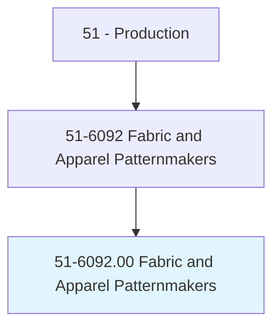
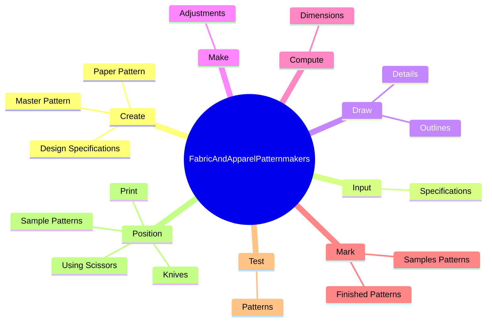
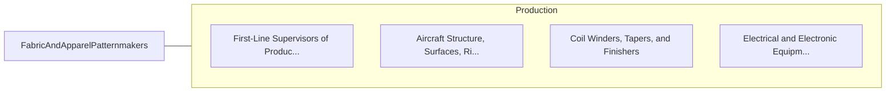

# Fabric and Apparel Patternmakers

> Draw and construct sets of precision master fabric patterns or layouts. May also mark and cut fabrics and apparel.

## Overview

Fabric and Apparel Patternmakers is an occupation within the Production category. Draw and construct sets of precision master fabric patterns or layouts. 

## Classification Hierarchy

## Key Statistics

| Metric | Value |
|--------|-------|
| SOC Code | 51-6092.00 |
| Category | [Production](/occupations/Production/index) |
| Task Count | 77 |
| Source | O*NET |

## Core Tasks

### create.MasterPattern

Fabric and Apparel Patternmakers create master pattern as part of their core responsibilities.

**Actions:**
- `create.MasterPattern.for.SizeWithinRange.of.GarmentSizes`
- `create.MasterPattern.for.UsingCharts`
- `create.MasterPattern.for.DraftingInstruments`
- `create.MasterPattern.for.Computers`

### input.Specifications

Fabric and Apparel Patternmakers input specifications as part of their core responsibilities.

**Actions:**
- `input.Specifications.into.Computers.to.assist.WithPatternDesignCutting`
- `input.Specifications.into.ComputersToPatternCutting`

### draw.Details

Fabric and Apparel Patternmakers draw details as part of their core responsibilities.

**Actions:**
- `draw.Details.on.OutlinedParts.to.indicate.WherePartsAreToBeJoined`
- `draw.Details.on.AsWellAsPositions.of.Pleats`
- `draw.Details.on.Pockets`
- `draw.Details.on.Buttonholes`

## Skills & Competencies

### Technical Skills
- **Machine Operation** - Advanced
- **Quality Control** - Advanced
- **Production Processes** - Advanced

### Soft Skills
- **Communication** - Essential
- **Problem Solving** - Essential
- **Critical Thinking** - Important
- **Teamwork** - Important
- **Adaptability** - Important

## Related Occupations

## Industries

This occupation is found across multiple industries. See [Industries](/industries) for sector-specific employment data.

## Career Progression

---

*Source: O*NET 51-6092.00 - ONETOccupation*
