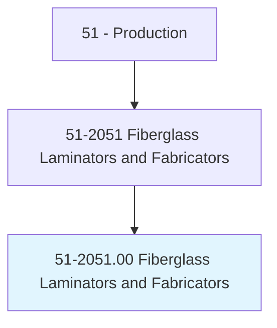
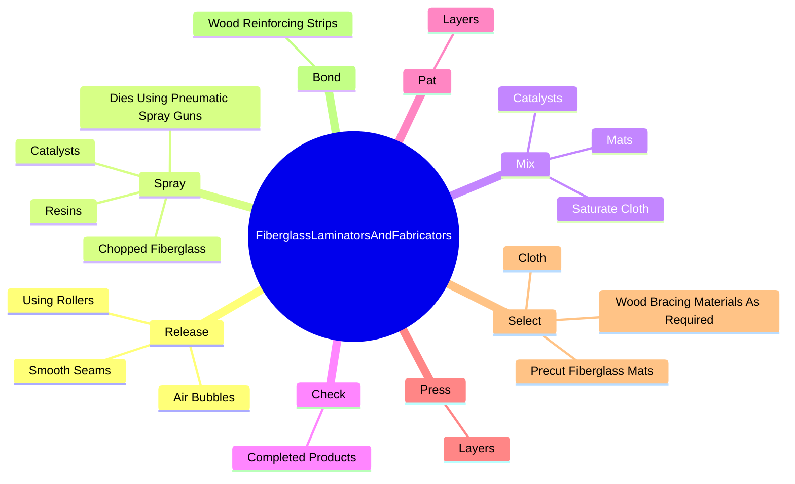
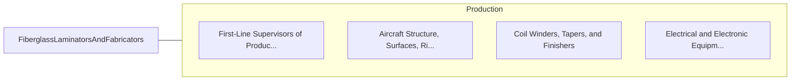

# Fiberglass Laminators and Fabricators

> Laminate layers of fiberglass on molds to form boat decks and hulls, bodies for golf carts, automobiles, or other products.

## Overview

Fiberglass Laminators and Fabricators is classified under Production (SOC 51). Laminate layers of fiberglass on molds to form boat decks and hulls, bodies for golf carts, automobiles, or other products.

## Classification Hierarchy

## Key Statistics

| Metric | Value |
|--------|-------|
| SOC Code | 51-2051.00 |
| Category | [Production](/occupations/Production/index) |
| Task Count | 78 |
| Source | O*NET |

## Core Tasks

### release.AirBubbles

Fiberglass Laminators and Fabricators release air bubbles as part of their core responsibilities.

**Actions:**
- `release.AirBubbles`
- `release.SmoothSeams`
- `release.UsingRollers`

### spray.ChoppedFiberglass

Fiberglass Laminators and Fabricators spray chopped fiberglass as part of their core responsibilities.

**Actions:**
- `spray.ChoppedFiberglass.with.ChopperAttachments`
- `spray.Resins.with.ChopperAttachments`
- `spray.Catalysts.onto.PreparedMoldsUsingPneumaticSprayGuns.with.ChopperAttachments`
- `spray.DiesUsingPneumaticSprayGuns.with.ChopperAttachments`

### mix.Catalysts

Fiberglass Laminators and Fabricators mix catalysts as part of their core responsibilities.

**Actions:**
- `mix.Catalysts.into.Resins.with.Mixtures`
- `mix.Catalysts.into.Resins.with.UsingBrushes`
- `mix.SaturateCloth.with.Mixtures`
- `mix.SaturateCloth.with.UsingBrushes`

## Skills & Competencies

### Technical Skills
- **Machine Operation** - Advanced
- **Quality Control** - Advanced
- **Production Processes** - Advanced

### Soft Skills
- **Communication** - Essential
- **Problem Solving** - Essential
- **Critical Thinking** - Important
- **Teamwork** - Important
- **Adaptability** - Important

## Related Occupations

## Industries

This occupation is found across multiple industries. See [Industries](/industries) for sector-specific employment data.

## Career Progression

---

*Source: O*NET 51-2051.00 - ONETOccupation*
