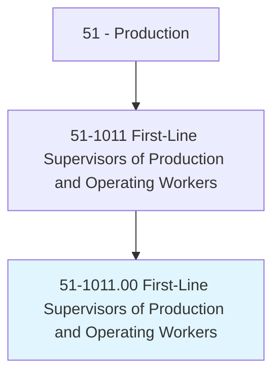
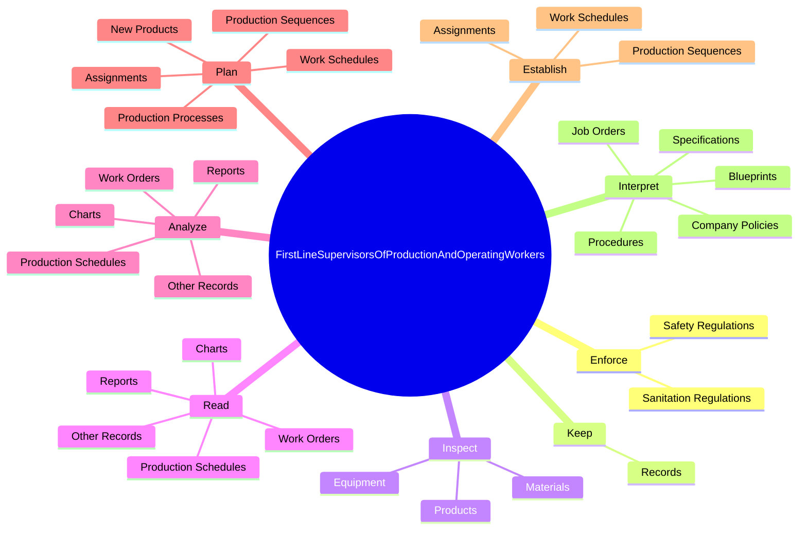
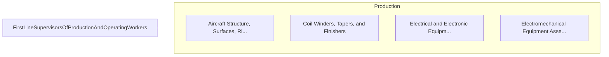

# First-Line Supervisors of Production and Operating Workers

> Directly supervise and coordinate the activities of production and operating workers, such as inspectors, precision workers, machine setters and operators, assemblers, fabricators, and plant and system operators. Excludes team or work leaders.

## Overview

First-Line Supervisors of Production and Operating Workers is an occupation within the Production category. Directly supervise and coordinate the activities of production and operating workers, such as inspectors, precision workers, machine setters and operators, assemblers, fabricators, and plant and system operators. 

## Classification Hierarchy

## Key Statistics

| Metric | Value |
|--------|-------|
| SOC Code | 51-1011.00 |
| Category | [Production](/occupations/Production/index) |
| Task Count | 117 |
| Source | O*NET |

## Core Tasks

### enforce.SafetyRegulations

First-Line Supervisors of Production and Operating Workers enforce safety regulations as part of their core responsibilities.

**Actions:**
- `enforce.SafetyRegulations`
- `enforce.SanitationRegulations`

### keep.Records

First-Line Supervisors of Production and Operating Workers keep records as part of their core responsibilities.

**Actions:**
- `keep.Records.of.EmployeesAttendanceWorked`
- `keep.Records.of.HoursWorked`

### inspect.Materials

First-Line Supervisors of Production and Operating Workers inspect materials as part of their core responsibilities.

**Actions:**
- `inspect.Materials.to.detect.Defects`
- `inspect.Materials.to.Malfunctions`
- `inspect.Products.to.detect.Defects`
- `inspect.Products.to.Malfunctions`

## Skills & Competencies

### Technical Skills
- **Machine Operation** - Advanced
- **Quality Control** - Advanced
- **Production Processes** - Advanced

### Soft Skills
- **Communication** - Essential
- **Problem Solving** - Essential
- **Critical Thinking** - Important
- **Teamwork** - Important
- **Adaptability** - Important

## Related Occupations

## Industries

This occupation is found across multiple industries. See [Industries](/industries) for sector-specific employment data.

## Career Progression

---

*Source: O*NET 51-1011.00 - ONETOccupation*
