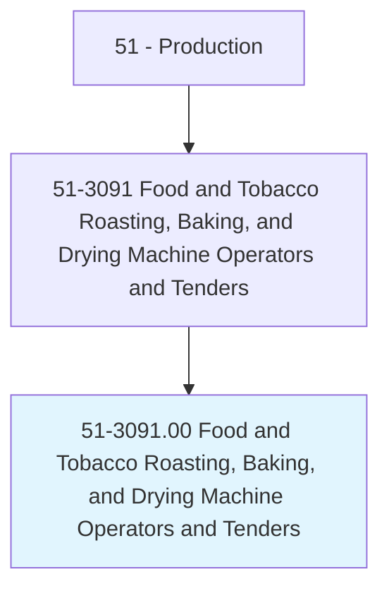
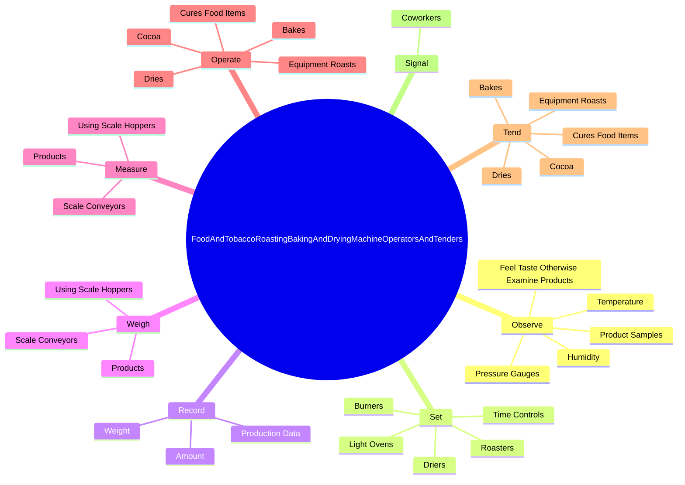

# Food and Tobacco Roasting, Baking, and Drying Machine Operators and Tenders

> Operate or tend food or tobacco roasting, baking, or drying equipment, including hearth ovens, kiln driers, roasters, char kilns, and vacuum drying equipment.

## Overview

Food and Tobacco Roasting, Baking, and Drying Machine Operators and Tenders is classified under Production (SOC 51). Operate or tend food or tobacco roasting, baking, or drying equipment, including hearth ovens, kiln driers, roasters, char kilns, and vacuum drying equipment.

## Classification Hierarchy

## Key Statistics

| Metric | Value |
|--------|-------|
| SOC Code | 51-3091.00 |
| Category | [Production](/occupations/Production) |
| Task Count | 118 |
| Source | O*NET |

## Core Tasks

### observe.FeelTasteOtherwiseExamineProducts

Food and Tobacco Roasting, Baking, and Drying Machine Operators and Tenders observe feel taste otherwise examine products as part of their core responsibilities.

**Actions:**
- `observe.FeelTasteOtherwiseExamineProducts.during.AfterProcessing.to.ensure.ConformanceToStandards`
- `observe.Temperature.to.maintain.PrescribedOperatingConditionsForSpecificStages`
- `observe.Humidity.to.maintain.PrescribedOperatingConditionsForSpecificStages`
- `observe.PressureGauges.to.maintain.PrescribedOperatingConditionsForSpecificStages`

### set.TimeControls

Food and Tobacco Roasting, Baking, and Drying Machine Operators and Tenders set time controls as part of their core responsibilities.

**Actions:**
- `set.TimeControls`
- `set.LightOvens`
- `set.Burners`
- `set.Driers`

### record.ProductionData

Food and Tobacco Roasting, Baking, and Drying Machine Operators and Tenders record production data as part of their core responsibilities.

**Actions:**
- `record.ProductionData.of.ProductProcessed`
- `record.ProductionData.of.Type.of.Product`
- `record.ProductionData.of.Time.of.Processing`
- `record.ProductionData.of.Temperature.of.Processing`

## Skills & Competencies

### Technical Skills
- **Machine Operation** - Advanced
- **Quality Control** - Advanced
- **Production Processes** - Advanced

### Soft Skills
- **Communication** - Essential
- **Problem Solving** - Essential
- **Critical Thinking** - Important
- **Teamwork** - Important
- **Adaptability** - Important

## Related Occupations

## Industries

This occupation is found across multiple industries. See [Industries](/industries) for sector-specific employment data.

## Career Progression

---

*Source: O*NET 51-3091.00 - ONETOccupation*
