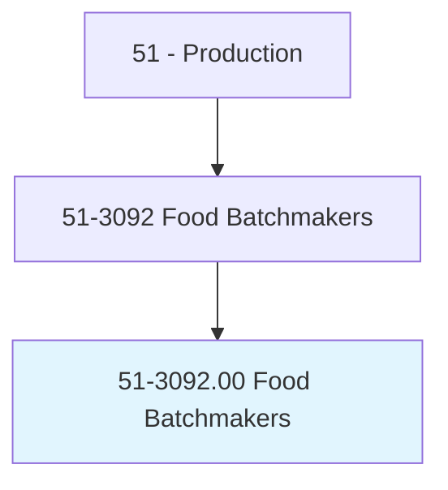
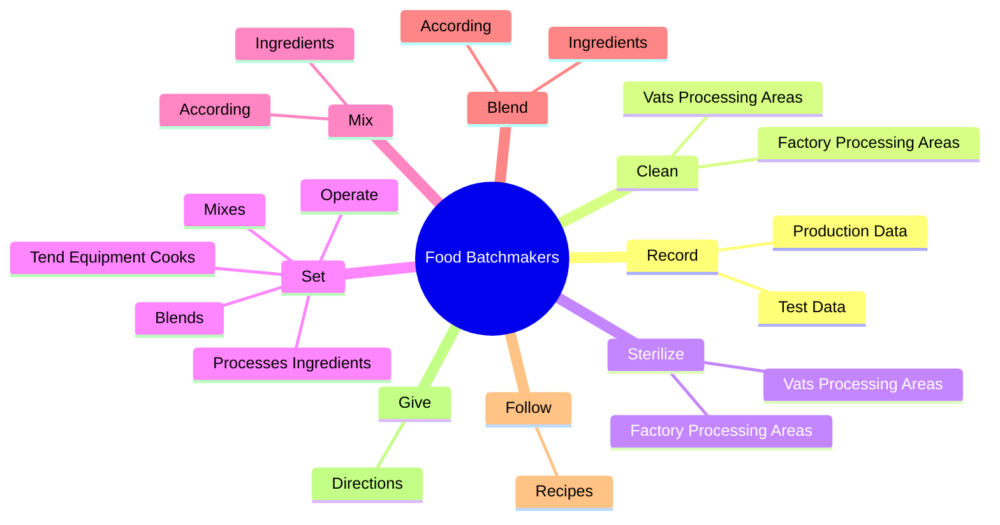

# Food Batchmakers

> Set up and operate equipment that mixes or blends ingredients used in the manufacturing of food products. Includes candy makers and cheese makers.

## Overview

Food Batchmakers is an occupation within the Production category. Set up and operate equipment that mixes or blends ingredients used in the manufacturing of food products. 

## Classification Hierarchy

## Key Statistics

| Metric | Value |
|--------|-------|
| SOC Code | 51-3092.00 |
| Category | [Production](/occupations/Production) |
| Task Count | 177 |
| Source | O*NET |

## Core Tasks

### record.ProductionData

Food Batchmakers record production data as part of their core responsibilities.

**Actions:**
- `record.ProductionData.for.FoodProductBatch`
- `record.ProductionData.for.IngredientsUsed`
- `record.ProductionData.for.Temperature`
- `record.ProductionData.for.TestResults`

### clean.VatsProcessingAreas

Food Batchmakers clean vats processing areas as part of their core responsibilities.

**Actions:**
- `clean.VatsProcessingAreas`
- `clean.FactoryProcessingAreas`

### sterilize.VatsProcessingAreas

Food Batchmakers sterilize vats processing areas as part of their core responsibilities.

**Actions:**
- `sterilize.VatsProcessingAreas`
- `sterilize.FactoryProcessingAreas`

## Skills & Competencies

### Technical Skills
- **Machine Operation** - Advanced
- **Quality Control** - Advanced
- **Production Processes** - Advanced

### Soft Skills
- **Communication** - Essential
- **Problem Solving** - Essential
- **Critical Thinking** - Important
- **Teamwork** - Important
- **Adaptability** - Important

## Related Occupations

## Industries

This occupation is found across multiple industries. See [Industries](/industries) for sector-specific employment data.

## Career Progression

---

*Source: O*NET 51-3092.00 - ONETOccupation*
