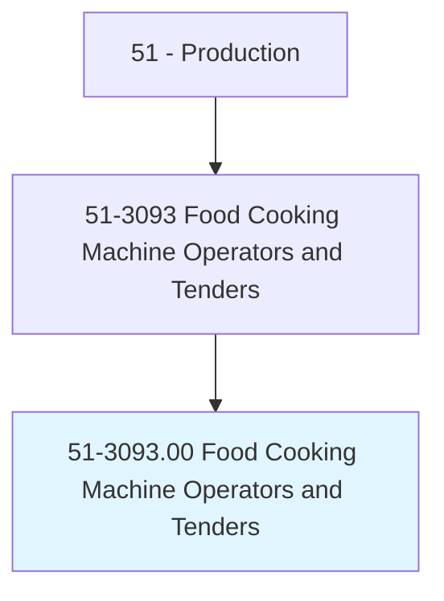
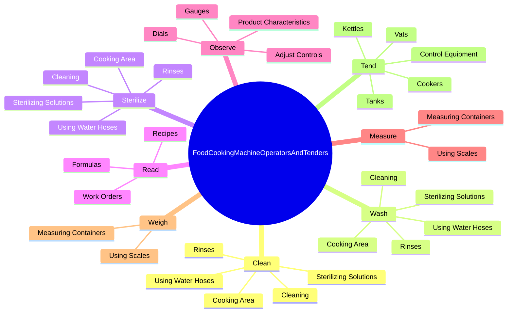

# Food Cooking Machine Operators and Tenders

> Operate or tend cooking equipment, such as steam cooking vats, deep fry cookers, pressure cookers, kettles, and boilers, to prepare food products.

## Overview

Food Cooking Machine Operators and Tenders is classified under Production (SOC 51). Operate or tend cooking equipment, such as steam cooking vats, deep fry cookers, pressure cookers, kettles, and boilers, to prepare food products.

## Classification Hierarchy

## Key Statistics

| Metric | Value |
|--------|-------|
| SOC Code | 51-3093.00 |
| Category | [Production](/occupations/Production/index) |
| Task Count | 127 |
| Source | O*NET |

## Core Tasks

### clean.CookingArea

Food Cooking Machine Operators and Tenders clean cooking area as part of their core responsibilities.

**Actions:**
- `clean.CookingArea`
- `clean.UsingWaterHoses`
- `clean.Cleaning`
- `clean.SterilizingSolutions`

### wash.CookingArea

Food Cooking Machine Operators and Tenders wash cooking area as part of their core responsibilities.

**Actions:**
- `wash.CookingArea`
- `wash.UsingWaterHoses`
- `wash.Cleaning`
- `wash.SterilizingSolutions`

### sterilize.CookingArea

Food Cooking Machine Operators and Tenders sterilize cooking area as part of their core responsibilities.

**Actions:**
- `sterilize.CookingArea`
- `sterilize.UsingWaterHoses`
- `sterilize.Cleaning`
- `sterilize.SterilizingSolutions`

## Skills & Competencies

### Technical Skills
- **Machine Operation** - Advanced
- **Quality Control** - Advanced
- **Production Processes** - Advanced

### Soft Skills
- **Communication** - Essential
- **Problem Solving** - Essential
- **Critical Thinking** - Important
- **Teamwork** - Important
- **Adaptability** - Important

## Related Occupations

## Industries

This occupation is found across multiple industries. See [Industries](/industries) for sector-specific employment data.

## Career Progression

---

*Source: O*NET 51-3093.00 - ONETOccupation*
