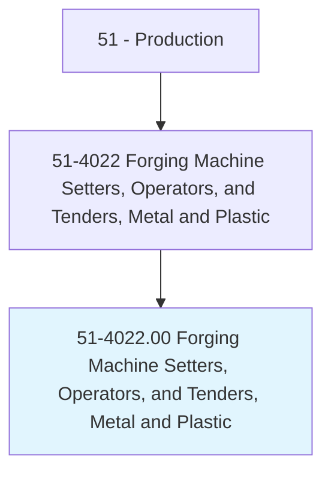
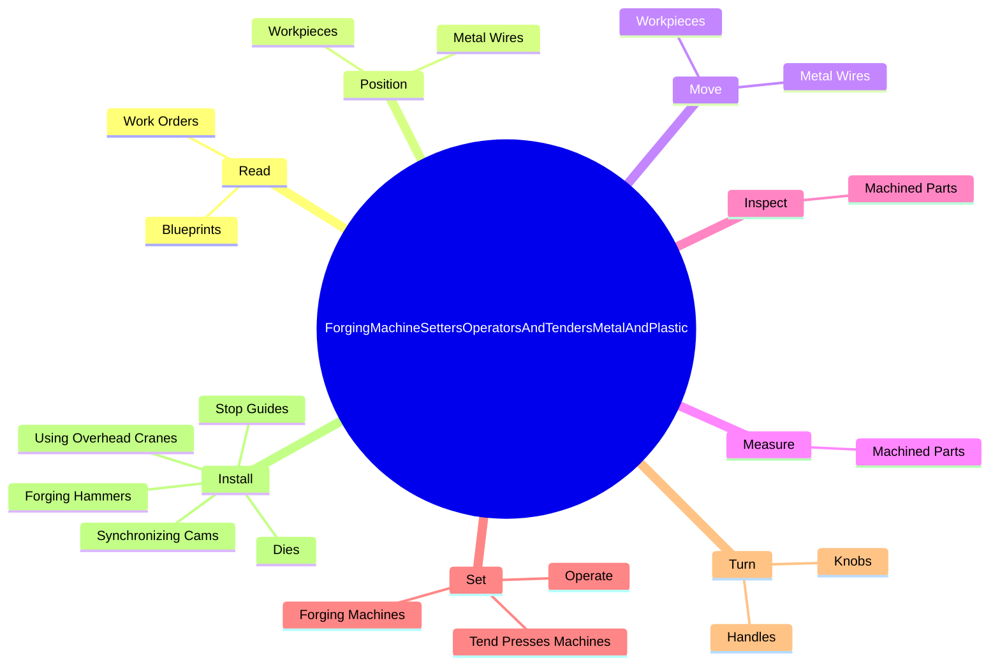

# Forging Machine Setters, Operators, and Tenders, Metal and Plastic

> Set up, operate, or tend forging machines to taper, shape, or form metal or plastic parts.

## Overview

Forging Machine Setters, Operators, and Tenders, Metal and Plastic is classified under Production (SOC 51). Set up, operate, or tend forging machines to taper, shape, or form metal or plastic parts.

## Classification Hierarchy

## Key Statistics

| Metric | Value |
|--------|-------|
| SOC Code | 51-4022.00 |
| Category | [Production](/occupations/Production) |
| Task Count | 78 |
| Source | O*NET |

## Core Tasks

### read.WorkOrders

Forging Machine Setters, Operators, and Tenders, Metal and Plastic read work orders as part of their core responsibilities.

**Actions:**
- `read.WorkOrders.to.determine.SpecifiedTolerances`
- `read.WorkOrders.to.sequences.OfOperationsForMachineSetup`
- `read.Blueprints.to.determine.SpecifiedTolerances`
- `read.Blueprints.to.sequences.OfOperationsForMachineSetup`

### position.MetalWires

Forging Machine Setters, Operators, and Tenders, Metal and Plastic position metal wires as part of their core responsibilities.

**Actions:**
- `position.MetalWires.through.Series.of.DiesCompress`
- `position.MetalWires.through.SeriesOfShapeStock.to.form.DieImpressions`
- `position.Workpieces.through.Series.of.DiesCompress`
- `position.Workpieces.through.SeriesOfShapeStock.to.form.DieImpressions`

### move.MetalWires

Forging Machine Setters, Operators, and Tenders, Metal and Plastic move metal wires as part of their core responsibilities.

**Actions:**
- `move.MetalWires.through.Series.of.DiesCompress`
- `move.MetalWires.through.SeriesOfShapeStock.to.form.DieImpressions`
- `move.Workpieces.through.Series.of.DiesCompress`
- `move.Workpieces.through.SeriesOfShapeStock.to.form.DieImpressions`

## Skills & Competencies

### Technical Skills
- **Machine Operation** - Advanced
- **Quality Control** - Advanced
- **Production Processes** - Advanced

### Soft Skills
- **Communication** - Essential
- **Problem Solving** - Essential
- **Critical Thinking** - Important
- **Teamwork** - Important
- **Adaptability** - Important

## Related Occupations

## Industries

This occupation is found across multiple industries. See [Industries](/industries) for sector-specific employment data.

## Career Progression

---

*Source: O*NET 51-4022.00 - ONETOccupation*
