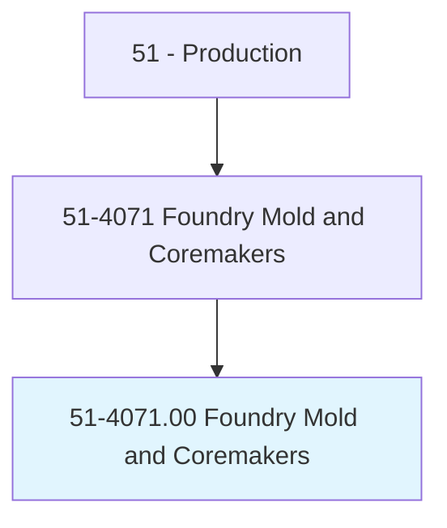
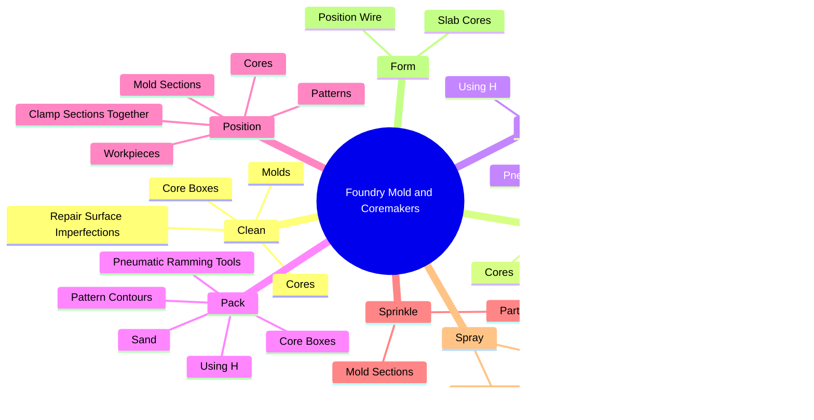
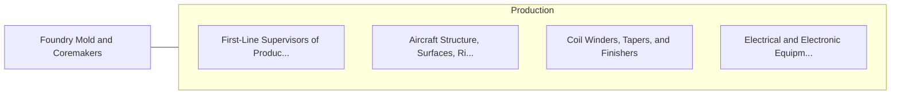

# Foundry Mold and Coremakers

> Make or form wax or sand cores or molds used in the production of metal castings in foundries.

## Overview

Foundry Mold and Coremakers is classified under Production (SOC 51). Make or form wax or sand cores or molds used in the production of metal castings in foundries.

## Classification Hierarchy

## Key Statistics

| Metric | Value |
|--------|-------|
| SOC Code | 51-4071.00 |
| Category | [Production](/occupations/Production) |
| Task Count | 72 |
| Source | O*NET |

## Core Tasks

### clean.Molds

Foundry Mold and Coremakers clean molds as part of their core responsibilities.

**Actions:**
- `clean.Molds`
- `clean.Cores`
- `clean.CoreBoxes`
- `clean.RepairSurfaceImperfections`

### smooth.Molds

Foundry Mold and Coremakers smooth molds as part of their core responsibilities.

**Actions:**
- `smooth.Molds`
- `smooth.Cores`
- `smooth.CoreBoxes`
- `smooth.RepairSurfaceImperfections`

### sift.Sand

Foundry Mold and Coremakers sift sand as part of their core responsibilities.

**Actions:**
- `sift.Sand.into.MoldSections`
- `sift.CoreBoxes`
- `sift.PatternContours`
- `sift.UsingH`

## Skills & Competencies

### Technical Skills
- **Machine Operation** - Advanced
- **Quality Control** - Advanced
- **Production Processes** - Advanced

### Soft Skills
- **Communication** - Essential
- **Problem Solving** - Essential
- **Critical Thinking** - Important
- **Teamwork** - Important
- **Adaptability** - Important

## Related Occupations

## Industries

This occupation is found across multiple industries. See [Industries](/industries) for sector-specific employment data.

## Career Progression

---

*Source: O*NET 51-4071.00 - ONETOccupation*
