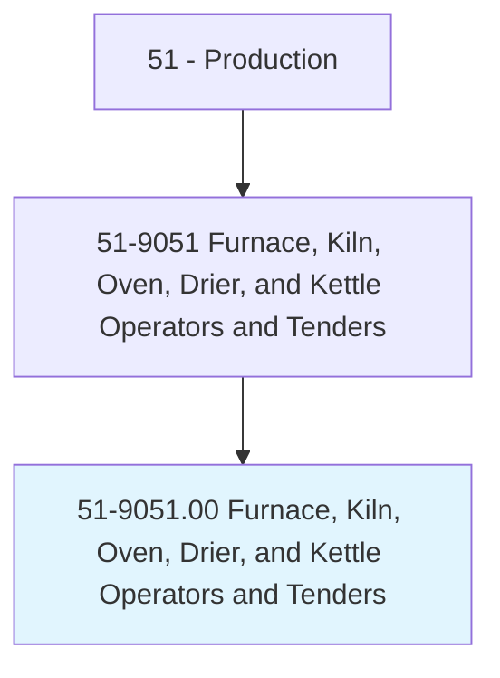
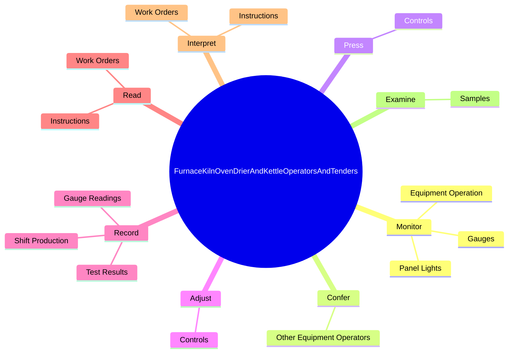
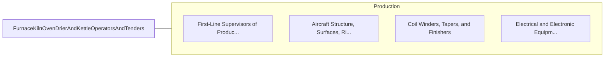

# Furnace, Kiln, Oven, Drier, and Kettle Operators and Tenders

> Operate or tend heating equipment other than basic metal, plastic, or food processing equipment. Includes activities such as annealing glass, drying lumber, curing rubber, removing moisture from materials, or boiling soap.

## Overview

Furnace, Kiln, Oven, Drier, and Kettle Operators and Tenders is an occupation within the Production category. Operate or tend heating equipment other than basic metal, plastic, or food processing equipment. 

## Classification Hierarchy

## Key Statistics

| Metric | Value |
|--------|-------|
| SOC Code | 51-9051.00 |
| Category | [Production](/occupations/Production) |
| Task Count | 102 |
| Source | O*NET |

## Core Tasks

### monitor.EquipmentOperation

Furnace, Kiln, Oven, Drier, and Kettle Operators and Tenders monitor equipment operation as part of their core responsibilities.

**Actions:**
- `monitor.EquipmentOperation.to.detect.DeviationsFromStandards`
- `monitor.Gauges.to.detect.DeviationsFromStandards`
- `monitor.PanelLights.to.detect.DeviationsFromStandards`

### confer.OtherEquipmentOperators

Furnace, Kiln, Oven, Drier, and Kettle Operators and Tenders confer other equipment operators as part of their core responsibilities.

**Actions:**
- `confer.OtherEquipmentOperators.to.report.EquipmentMalfunctionsResolveProductionProblems`
- `confer.OtherEquipmentOperators.to.ToResolveProductionProblems`

### press.Controls

Furnace, Kiln, Oven, Drier, and Kettle Operators and Tenders press controls as part of their core responsibilities.

**Actions:**
- `press.Controls.to.activate`
- `press.Controls.to.set`
- `press.Controls.to.regulate.EquipmentAccordingToSpecifications`

## Skills & Competencies

### Technical Skills
- **Machine Operation** - Advanced
- **Quality Control** - Advanced
- **Production Processes** - Advanced

### Soft Skills
- **Communication** - Essential
- **Problem Solving** - Essential
- **Critical Thinking** - Important
- **Teamwork** - Important
- **Adaptability** - Important

## Related Occupations

## Industries

This occupation is found across multiple industries. See [Industries](/industries) for sector-specific employment data.

## Career Progression

---

*Source: O*NET 51-9051.00 - ONETOccupation*
