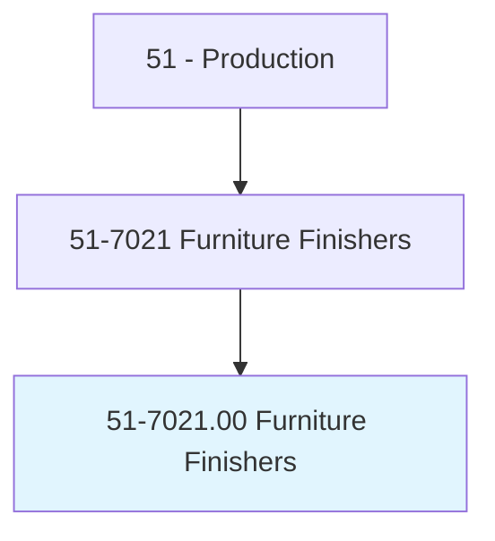
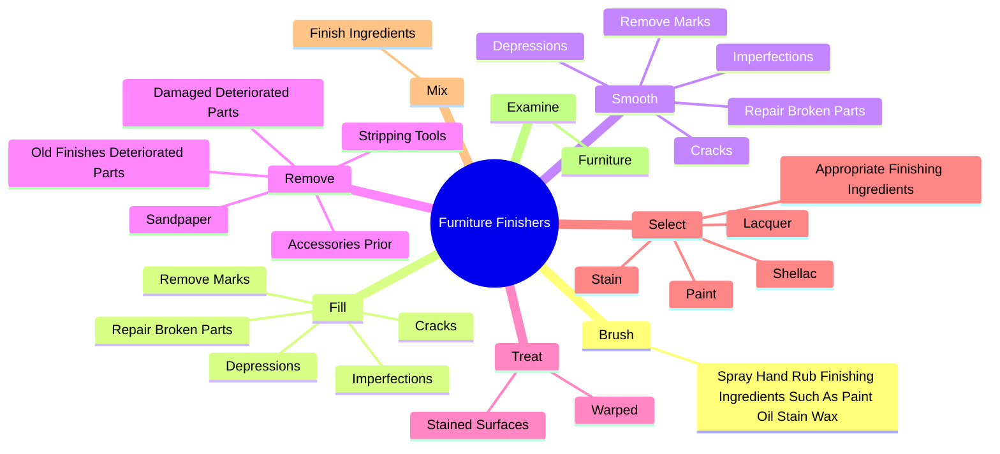
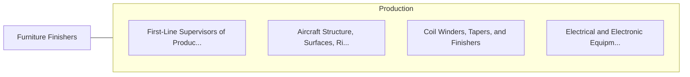

# Furniture Finishers

> Shape, finish, and refinish damaged, worn, or used furniture or new high-grade furniture to specified color or finish.

## Overview

Furniture Finishers is classified under Production (SOC 51). Shape, finish, and refinish damaged, worn, or used furniture or new high-grade furniture to specified color or finish.

## Classification Hierarchy

## Key Statistics

| Metric | Value |
|--------|-------|
| SOC Code | 51-7021.00 |
| Category | [Production](/occupations/Production/index) |
| Task Count | 113 |
| Source | O*NET |

## Core Tasks

### brush.SprayHandRubFinishingIngredientsSuchAsPaintOilStainWax

Furniture Finishers brush spray hand rub finishing ingredients such as paint oil stain wax as part of their core responsibilities.

**Actions:**
- `brush.SprayHandRubFinishingIngredientsSuchAsPaintOilStainWax.onto.IntoWoodGrainApplyLacquerOtherSealers`

### fill.Cracks

Furniture Finishers fill cracks as part of their core responsibilities.

**Actions:**
- `fill.Cracks`
- `fill.Depressions`
- `fill.RemoveMarks`
- `fill.Imperfections`

### smooth.Cracks

Furniture Finishers smooth cracks as part of their core responsibilities.

**Actions:**
- `smooth.Cracks`
- `smooth.Depressions`
- `smooth.RemoveMarks`
- `smooth.Imperfections`

## Skills & Competencies

### Technical Skills
- **Machine Operation** - Advanced
- **Quality Control** - Advanced
- **Production Processes** - Advanced

### Soft Skills
- **Communication** - Essential
- **Problem Solving** - Essential
- **Critical Thinking** - Important
- **Teamwork** - Important
- **Adaptability** - Important

## Related Occupations

## Industries

This occupation is found across multiple industries. See [Industries](/industries) for sector-specific employment data.

## Career Progression

---

*Source: O*NET 51-7021.00 - ONETOccupation*
