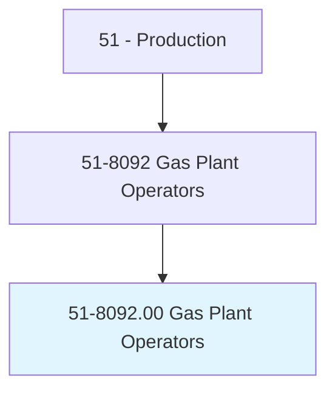
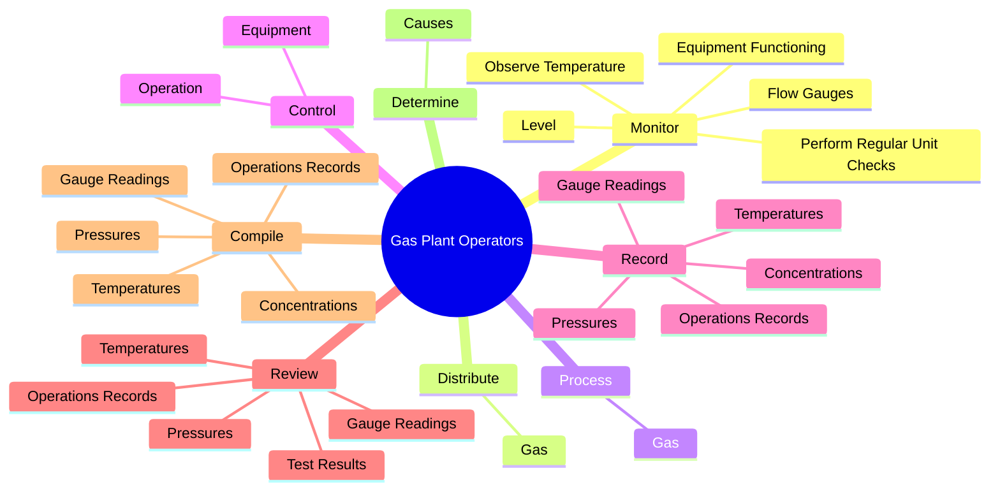
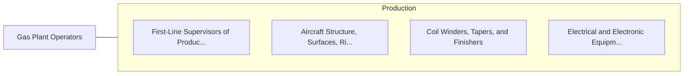

# Gas Plant Operators

> Distribute or process gas for utility companies and others by controlling compressors to maintain specified pressures on main pipelines.

## Overview

Gas Plant Operators is classified under Production (SOC 51). Distribute or process gas for utility companies and others by controlling compressors to maintain specified pressures on main pipelines.

## Classification Hierarchy

## Key Statistics

| Metric | Value |
|--------|-------|
| SOC Code | 51-8092.00 |
| Category | [Production](/occupations/Production) |
| Task Count | 109 |
| Source | O*NET |

## Core Tasks

### monitor.EquipmentFunctioning

Gas Plant Operators monitor equipment functioning as part of their core responsibilities.

**Actions:**
- `monitor.EquipmentFunctioning.to.ensure.EquipmentIsOperatingAsItShould`
- `monitor.ObserveTemperature.to.ensure.EquipmentIsOperatingAsItShould`
- `monitor.Level.to.ensure.EquipmentIsOperatingAsItShould`
- `monitor.FlowGauges.to.ensure.EquipmentIsOperatingAsItShould`

### distribute.Gas

Gas Plant Operators distribute gas as part of their core responsibilities.

**Actions:**
- `distribute.Gas.for.UtilityCompaniesPlants`
- `distribute.Gas.for.IndustrialPlants`
- `distribute.Gas.for.UsingPanelBoards`
- `distribute.Gas.for.ControlBoards`

### process.Gas

Gas Plant Operators process gas as part of their core responsibilities.

**Actions:**
- `process.Gas.for.UtilityCompaniesPlants`
- `process.Gas.for.IndustrialPlants`
- `process.Gas.for.UsingPanelBoards`
- `process.Gas.for.ControlBoards`

## Skills & Competencies

### Technical Skills
- **Machine Operation** - Advanced
- **Quality Control** - Advanced
- **Production Processes** - Advanced

### Soft Skills
- **Communication** - Essential
- **Problem Solving** - Essential
- **Critical Thinking** - Important
- **Teamwork** - Important
- **Adaptability** - Important

## Related Occupations

## Industries

This occupation is found across multiple industries. See [Industries](/industries) for sector-specific employment data.

## Career Progression

---

*Source: O*NET 51-8092.00 - ONETOccupation*
