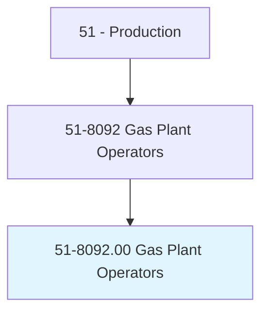
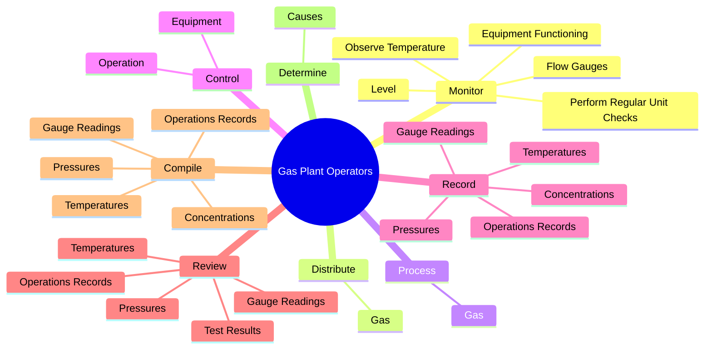
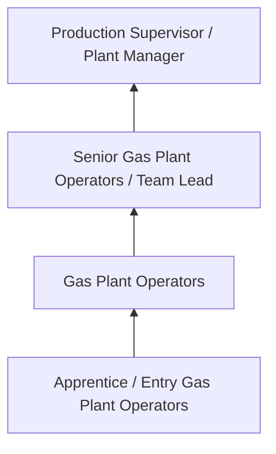
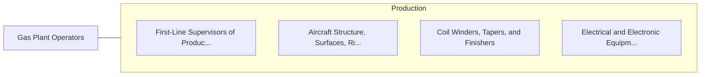

# Gas Plant Operators

> Distribute or process gas for utility companies and others by controlling compressors to maintain specified pressures on main pipelines.

## Overview

Gas Plant Operators professionals distribute or process gas for utility companies and others by controlling compressors to maintain specified pressures on main pipelines.. This occupation falls within the Production category and requires a combination of specialized knowledge, technical skills, and practical experience.

These professionals work across diverse settings and organizational contexts, applying their expertise to meet the demands of their field. They must stay current with industry standards, emerging practices, and regulatory requirements that affect their work. The role demands both independent judgment and collaborative skills, as practitioners regularly interact with colleagues, stakeholders, and the public.

As the field continues to evolve, Gas Plant Operators professionals increasingly leverage technology and data-driven approaches to enhance their effectiveness. Career opportunities span the public and private sectors, with demand influenced by economic conditions, demographic shifts, and technological advancement.

## Classification Hierarchy



## Key Statistics

| Metric | Value |
|--------|-------|
| SOC Code | 51-8092.00 |
| Job Zone | N/A |
| Category | [Production](/occupations/Production/index) |
| Core Tasks | 109+ |
| Salary Range | $28,000 - $65,000 |
| Median Salary | $40,000 |
| Growth Outlook | 1% (Little or no change) |
| Source | O*NET |

## Core Tasks



### control.Operation

Gas Plant Operators control operation as part of their core responsibilities.

**Actions:**
- `control.Operation.of.Compressors` - Control operation of compressors, scrubbers, evaporators, and refrigeration e...
- `control.Operation.of.Scrubbers` - Control operation of compressors, scrubbers, evaporators, and refrigeration e...
- `control.Operation.of.Evaporators` - Control operation of compressors, scrubbers, evaporators, and refrigeration e...
- `control.Operation.of.RefrigerationEquipment.to.Liquefy` - Control operation of compressors, scrubbers, evaporators, and refrigeration e...
- `control.Operation.of.Compress` - Control operation of compressors, scrubbers, evaporators, and refrigeration e...

### test.Gas

Gas Plant Operators test gas as part of their core responsibilities.

**Actions:**
- `test.Gas.to.assess.Factors` - Test gas, chemicals, and air during processing to assess factors such as puri...
- `test.Gas.to.Purity` - Test gas, chemicals, and air during processing to assess factors such as puri...
- `test.Gas.to.MoistureContent` - Test gas, chemicals, and air during processing to assess factors such as puri...
- `test.Gas.to.ToDetectQualityProblems` - Test gas, chemicals, and air during processing to assess factors such as puri...
- `test.Gas.to.Gas` - Test gas, chemicals, and air during processing to assess factors such as puri...

### adjust.Temperature

Gas Plant Operators adjust temperature as part of their core responsibilities.

**Actions:**
- `adjust.Temperature.of.Gas.to.maintain.ProcessesAtRequiredLevelsCorrectProblems` - Adjust temperature, pressure, vacuum, level, flow rate, or transfer of gas to...
- `adjust.Temperature.of.correct.Problems` - Adjust temperature, pressure, vacuum, level, flow rate, or transfer of gas to...
- `adjust.Pressure.of.Gas.to.maintain.ProcessesAtRequiredLevelsCorrectProblems` - Adjust temperature, pressure, vacuum, level, flow rate, or transfer of gas to...
- `adjust.Pressure.of.correct.Problems` - Adjust temperature, pressure, vacuum, level, flow rate, or transfer of gas to...
- `adjust.Vacuum.of.Gas.to.maintain.ProcessesAtRequiredLevelsCorrectProblems` - Adjust temperature, pressure, vacuum, level, flow rate, or transfer of gas to...

### monitor.EquipmentFunctioning

Gas Plant Operators monitor equipment functioning as part of their core responsibilities.

**Actions:**
- `monitor.EquipmentFunctioning.to.ensure.EquipmentIsOperatingAsItShould` - Monitor equipment functioning, observe temperature, level, and flow gauges, a...
- `monitor.ObserveTemperature.to.ensure.EquipmentIsOperatingAsItShould` - Monitor equipment functioning, observe temperature, level, and flow gauges, a...
- `monitor.Level.to.ensure.EquipmentIsOperatingAsItShould` - Monitor equipment functioning, observe temperature, level, and flow gauges, a...
- `monitor.FlowGauges.to.ensure.EquipmentIsOperatingAsItShould` - Monitor equipment functioning, observe temperature, level, and flow gauges, a...
- `monitor.PerformRegularUnitChecks.to.ensure.EquipmentIsOperatingAsItShould` - Monitor equipment functioning, observe temperature, level, and flow gauges, a...


## Skills & Competencies

### Technical Skills
- **Machine Operation** - Advanced
- **Quality Inspection** - Advanced
- **Safety Procedures** - Advanced
- **Blueprint Reading** - Proficient
- **Measurement Tools** - Proficient
- **Process Control** - Proficient

### Soft Skills
- **Attention to Detail** - Critical
- **Reliability** - Critical
- **Physical Dexterity** - Essential
- **Teamwork** - Essential
- **Problem Solving** - Important

## Education & Certifications

| Requirement | Details |
|-------------|---------|
| Typical Education | High school diploma or equivalent; some positions require technical training |
| Work Experience | 0-2 years manufacturing experience |
| On-the-Job Training | Moderate - equipment operation and safety procedures |
| Certifications | OSHA certifications, quality management certifications |

## Career Progression



## Industry Variations

### Discrete Manufacturing
Assembly of distinct products such as automobiles, electronics, or machinery. Gas Plant Operators professionals work with precision equipment and quality standards.

### Process Manufacturing
Continuous production of chemicals, food, or materials. Focus on process control and consistency.

### Custom and Job Shop
Small-batch or custom production work. Requires versatility and ability to adapt to varied specifications.

### Automated Manufacturing
Technology-driven production with robotics and advanced systems. Increasing emphasis on programming and monitoring skills.

## Technology & Tools

- **Manufacturing execution systems (MES)**
- **Computer numerical control (CNC) machines**
- **Quality management software**
- **Programmable logic controllers (PLC)**
- **Enterprise resource planning (ERP) systems**

## Related Occupations



## Industries

- [Manufacturing](/industries/Manufacturing) - High Employment
- [Food Processing](/industries/FoodProcessing) - High Employment
- [Automotive](/industries/Automotive) - Moderate Employment
- [Electronics](/industries/Electronics) - Moderate Employment

## Departments

This occupation typically works in:
- [Manufacturing](/departments/Manufacturing)
- [Quality Control](/departments/QualityControl)
- [Production Planning](/departments/ProductionPlanning)

## GraphDL Semantic Structure

```
Gas Plant Operators perform:
- monitor.EquipmentFunctioning.to.ensure.EquipmentIsOperatingAsItShould
- monitor.ObserveTemperature.to.ensure.EquipmentIsOperatingAsItShould
- monitor.Level.to.ensure.EquipmentIsOperatingAsItShould
- monitor.FlowGauges.to.ensure.EquipmentIsOperatingAsItShould
- monitor.PerformRegularUnitChecks.to.ensure.EquipmentIsOperatingAsItShould
- distribute.Gas.for.UtilityCompaniesPlants
```

---

*Source: O*NET 51-8092.00 - ONETOccupation*
