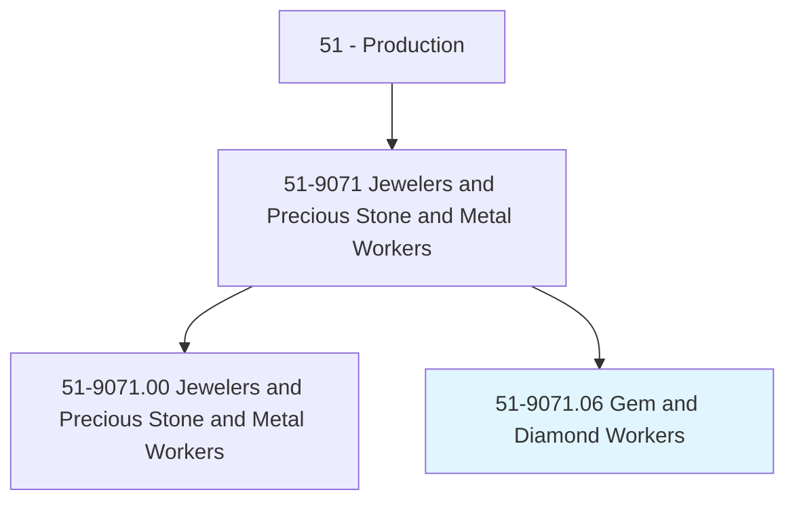
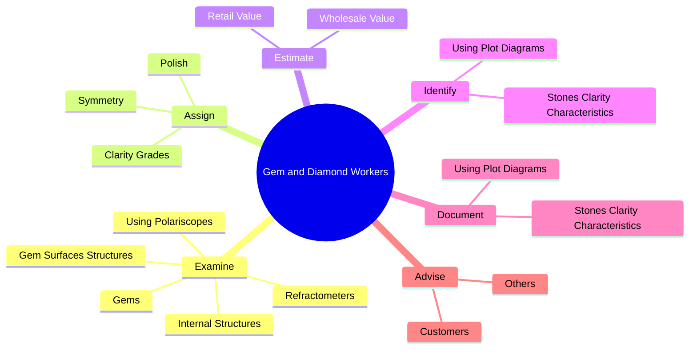
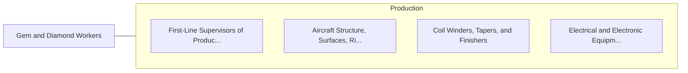

# Gem and Diamond Workers

> Fabricate, finish, or evaluate the quality of gems and diamonds used in jewelry or industrial tools.

## Overview

Gem and Diamond Workers is classified under Production (SOC 51). Fabricate, finish, or evaluate the quality of gems and diamonds used in jewelry or industrial tools.

## Classification Hierarchy

## Key Statistics

| Metric | Value |
|--------|-------|
| SOC Code | 51-9071.06 |
| Category | [Production](/occupations/Production/index) |
| Task Count | 146 |
| Source | O*NET |

## Core Tasks

### examine.Gems

Gem and Diamond Workers examine gems as part of their core responsibilities.

**Actions:**
- `examine.Gems.during.Processing.to.ensure.AccuracyOfAngles`
- `examine.Gems.during.Processing.to.positions.OfCuts`
- `examine.Gems.during.Processing.to.Bores`
- `examine.Gems.during.ProcessingToUsingMagnifyingGlasses`

### assign.Polish

Gem and Diamond Workers assign polish as part of their core responsibilities.

**Actions:**
- `assign.Polish.to.Stones`
- `assign.Polish.to.AccordingToEstablishedGradingSystems`
- `assign.Symmetry.to.Stones`
- `assign.Symmetry.to.AccordingToEstablishedGradingSystems`

### estimate.WholesaleValue

Gem and Diamond Workers estimate wholesale value as part of their core responsibilities.

**Actions:**
- `estimate.WholesaleValue.of.Gems`
- `estimate.WholesaleValue.of.FollowingPricingGuides`
- `estimate.WholesaleValue.of.MarketFluctuations`
- `estimate.WholesaleValue.of.OtherRelevantEconomicFactors`

## Skills & Competencies

### Technical Skills
- **Machine Operation** - Advanced
- **Quality Control** - Advanced
- **Production Processes** - Advanced

### Soft Skills
- **Communication** - Essential
- **Problem Solving** - Essential
- **Critical Thinking** - Important
- **Teamwork** - Important
- **Adaptability** - Important

## Related Occupations

## Industries

This occupation is found across multiple industries. See [Industries](/industries) for sector-specific employment data.

## Career Progression

---

*Source: O*NET 51-9071.06 - ONETOccupation*
