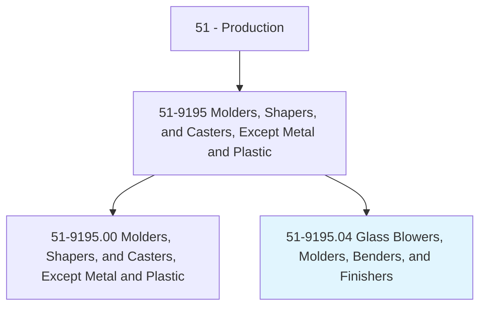
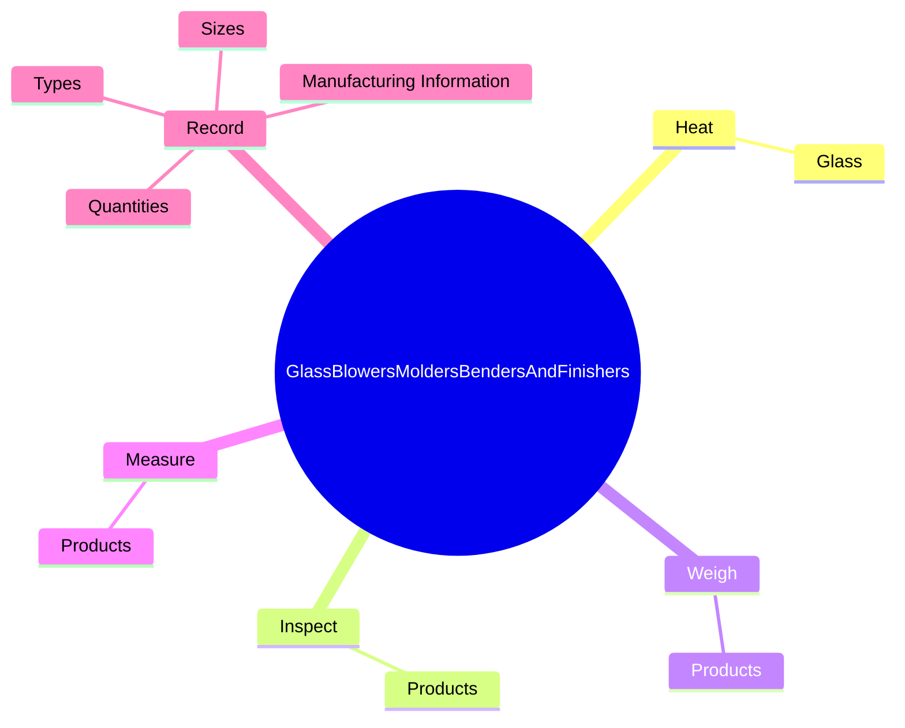
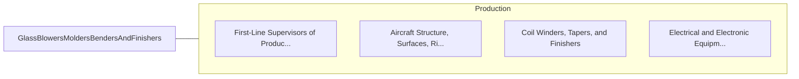

# Glass Blowers, Molders, Benders, and Finishers

> Shape molten glass according to patterns.

## Overview

Glass Blowers, Molders, Benders, and Finishers is classified under Production (SOC 51). Shape molten glass according to patterns.

## Classification Hierarchy

## Key Statistics

| Metric | Value |
|--------|-------|
| SOC Code | 51-9195.04 |
| Category | [Production](/occupations/Production/index) |
| Task Count | 87 |
| Source | O*NET |

## Core Tasks

### heat.Glass

Glass Blowers, Molders, Benders, and Finishers heat glass as part of their core responsibilities.

**Actions:**
- `heat.Glass.to.PliableStage`
- `heat.Glass.to.UsingGasFlames`
- `heat.Glass.to.Ovens`
- `heat.Glass.to.RotatingGlassToHeatItUniformly`

### inspect.Products

Glass Blowers, Molders, Benders, and Finishers inspect products as part of their core responsibilities.

**Actions:**
- `inspect.Products.to.UsingInstruments`
- `inspect.Products.to.Micrometers`
- `inspect.Products.to.Calipers`
- `inspect.Products.to.Magnifiers`

### weigh.Products

Glass Blowers, Molders, Benders, and Finishers weigh products as part of their core responsibilities.

**Actions:**
- `weigh.Products.to.UsingInstruments`
- `weigh.Products.to.Magnifiers`

## Skills & Competencies

### Technical Skills
- **Machine Operation** - Advanced
- **Quality Control** - Advanced
- **Production Processes** - Advanced

### Soft Skills
- **Communication** - Essential
- **Problem Solving** - Essential
- **Critical Thinking** - Important
- **Teamwork** - Important
- **Adaptability** - Important

## Related Occupations

## Industries

This occupation is found across multiple industries. See [Industries](/industries) for sector-specific employment data.

## Career Progression

---

*Source: O*NET 51-9195.04 - ONETOccupation*
