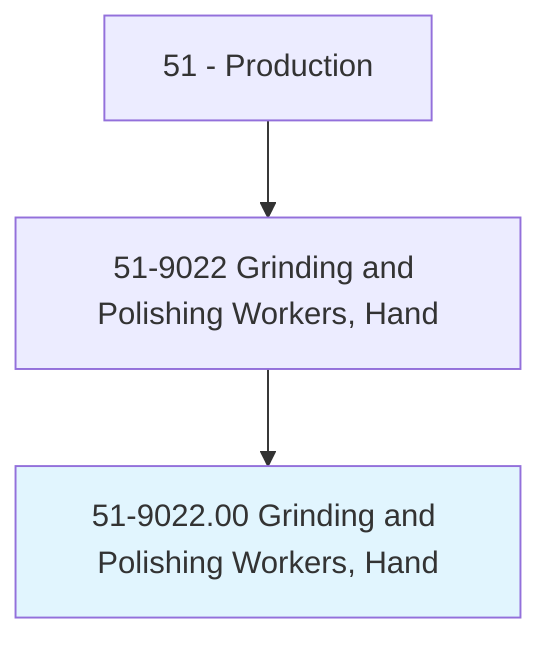
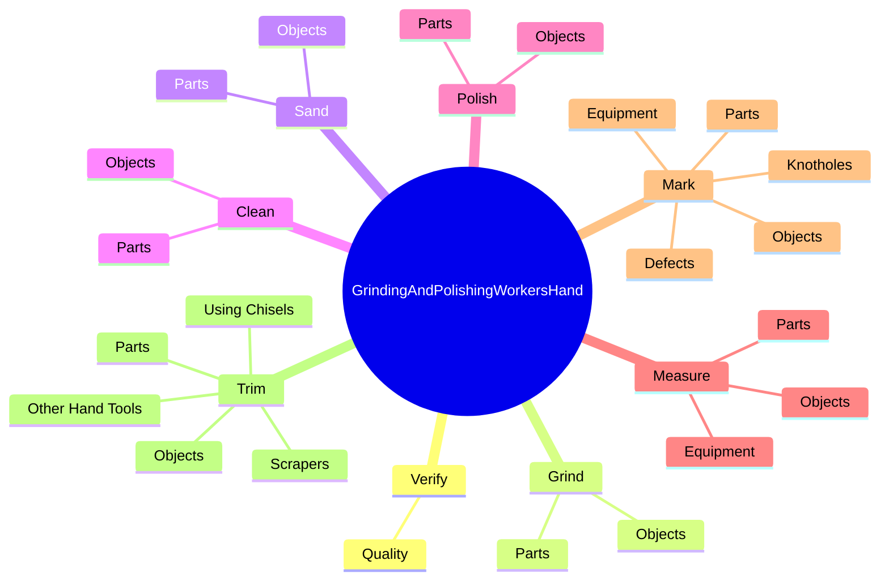

# Grinding and Polishing Workers, Hand

> Grind, sand, or polish, using hand tools or hand-held power tools, a variety of metal, wood, stone, clay, plastic, or glass objects. Includes chippers, buffers, and finishers.

## Overview

Grinding and Polishing Workers, Hand is an occupation within the Production category. Grind, sand, or polish, using hand tools or hand-held power tools, a variety of metal, wood, stone, clay, plastic, or glass objects. 

## Classification Hierarchy

## Key Statistics

| Metric | Value |
|--------|-------|
| SOC Code | 51-9022.00 |
| Category | [Production](/occupations/Production) |
| Task Count | 144 |
| Source | O*NET |

## Core Tasks

### verify.Quality

Grinding and Polishing Workers, Hand verify quality as part of their core responsibilities.

**Actions:**
- `verify.Quality.of.FinishedWorkpieces.by.InspectingThem`
- `verify.Quality.of.ComparingThem.to.Templates`
- `verify.Quality.of.MeasuringDimensions`
- `verify.Quality.of.TestingThem.in.WorkingMachinery`

### grind.Objects

Grinding and Polishing Workers, Hand grind objects as part of their core responsibilities.

**Actions:**
- `grind.Objects.to.correct.Defects`
- `grind.Objects.to.ToPrepareSurfacesForFurtherFinishing`
- `grind.Objects.to.UsingH`
- `grind.Objects.to.ToolsTools`

### sand.Objects

Grinding and Polishing Workers, Hand sand objects as part of their core responsibilities.

**Actions:**
- `sand.Objects.to.correct.Defects`
- `sand.Objects.to.ToPrepareSurfacesForFurtherFinishing`
- `sand.Objects.to.UsingH`
- `sand.Objects.to.ToolsTools`

## Skills & Competencies

### Technical Skills
- **Machine Operation** - Advanced
- **Quality Control** - Advanced
- **Production Processes** - Advanced

### Soft Skills
- **Communication** - Essential
- **Problem Solving** - Essential
- **Critical Thinking** - Important
- **Teamwork** - Important
- **Adaptability** - Important

## Related Occupations

## Industries

This occupation is found across multiple industries. See [Industries](/industries) for sector-specific employment data.

## Career Progression

---

*Source: O*NET 51-9022.00 - ONETOccupation*
