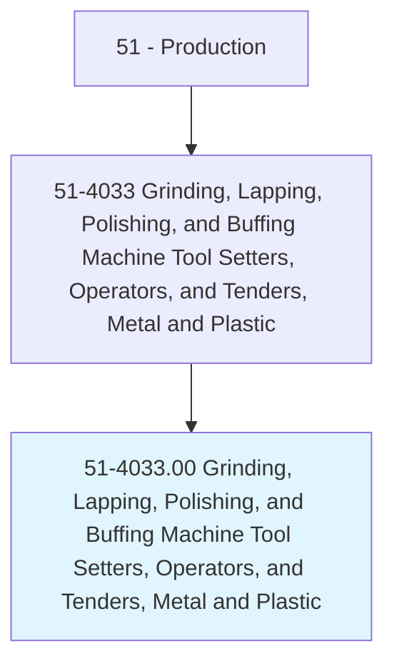
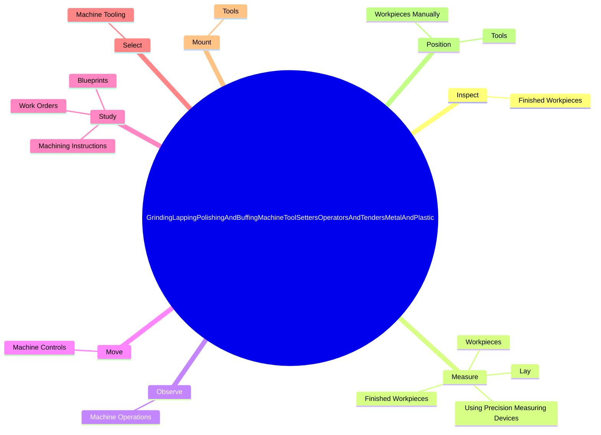

# Grinding, Lapping, Polishing, and Buffing Machine Tool Setters, Operators, and Tenders, Metal and Plastic

> Set up, operate, or tend grinding and related tools that remove excess material or burrs from surfaces, sharpen edges or corners, or buff, hone, or polish metal or plastic work pieces.

## Overview

Grinding, Lapping, Polishing, and Buffing Machine Tool Setters, Operators, and Tenders, Metal and Plastic is classified under Production (SOC 51). Set up, operate, or tend grinding and related tools that remove excess material or burrs from surfaces, sharpen edges or corners, or buff, hone, or polish metal or plastic work pieces.

## Classification Hierarchy

## Key Statistics

| Metric | Value |
|--------|-------|
| SOC Code | 51-4033.00 |
| Category | [Production](/occupations/Production/index) |
| Task Count | 105 |
| Source | O*NET |

## Core Tasks

### inspect.FinishedWorkpieces

Grinding, Lapping, Polishing, and Buffing Machine Tool Setters, Operators, and Tenders, Metal and Plastic inspect finished workpieces as part of their core responsibilities.

**Actions:**
- `inspect.FinishedWorkpieces.to.determine.ConformanceToSpecifications`
- `inspect.FinishedWorkpieces.to.UsingMeasuringInstruments`
- `inspect.FinishedWorkpieces.to.gauges`
- `inspect.FinishedWorkpieces.to.Micrometers`

### measure.FinishedWorkpieces

Grinding, Lapping, Polishing, and Buffing Machine Tool Setters, Operators, and Tenders, Metal and Plastic measure finished workpieces as part of their core responsibilities.

**Actions:**
- `measure.FinishedWorkpieces.to.determine.ConformanceToSpecifications`
- `measure.FinishedWorkpieces.to.UsingMeasuringInstruments`
- `measure.FinishedWorkpieces.to.gauges`
- `measure.FinishedWorkpieces.to.Micrometers`

### observe.MachineOperations

Grinding, Lapping, Polishing, and Buffing Machine Tool Setters, Operators, and Tenders, Metal and Plastic observe machine operations as part of their core responsibilities.

**Actions:**
- `observe.MachineOperations.to.detect.Problems`
- `observe.MachineOperations.to.MakingNecessaryAdjustmentsToCorrectProblems`

## Skills & Competencies

### Technical Skills
- **Machine Operation** - Advanced
- **Quality Control** - Advanced
- **Production Processes** - Advanced

### Soft Skills
- **Communication** - Essential
- **Problem Solving** - Essential
- **Critical Thinking** - Important
- **Teamwork** - Important
- **Adaptability** - Important

## Related Occupations

## Industries

This occupation is found across multiple industries. See [Industries](/industries) for sector-specific employment data.

## Career Progression

---

*Source: O*NET 51-4033.00 - ONETOccupation*
