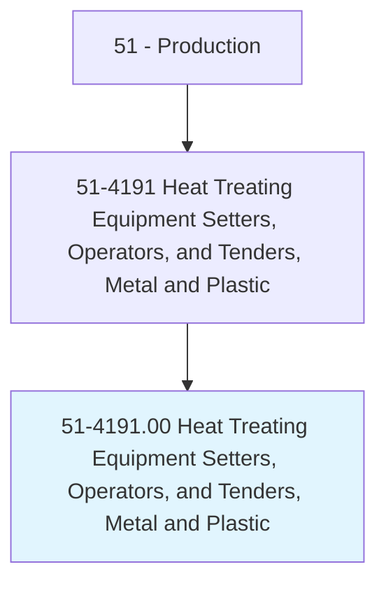
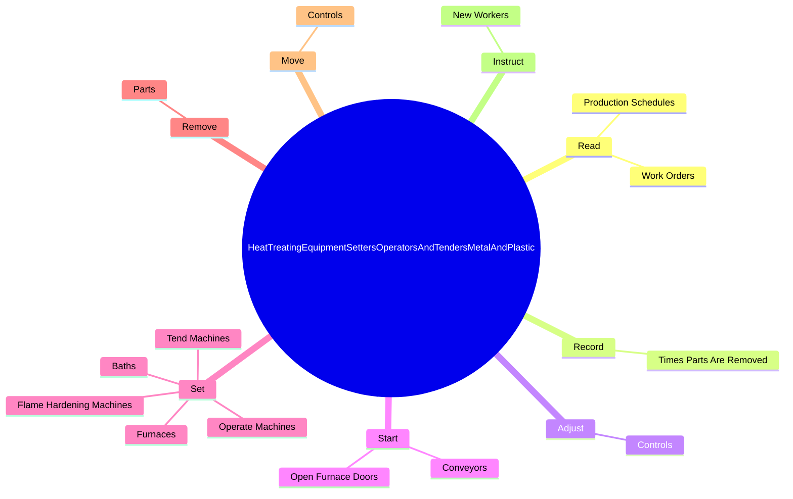

# Heat Treating Equipment Setters, Operators, and Tenders, Metal and Plastic

> Set up, operate, or tend heating equipment, such as heat-treating furnaces, flame-hardening machines, induction machines, soaking pits, or vacuum equipment to temper, harden, anneal, or heat treat metal or plastic objects.

## Overview

Heat Treating Equipment Setters, Operators, and Tenders, Metal and Plastic is classified under Production (SOC 51). Set up, operate, or tend heating equipment, such as heat-treating furnaces, flame-hardening machines, induction machines, soaking pits, or vacuum equipment to temper, harden, anneal, or heat treat metal or plastic objects.

## Classification Hierarchy

## Key Statistics

| Metric | Value |
|--------|-------|
| SOC Code | 51-4191.00 |
| Category | [Production](/occupations/Production) |
| Task Count | 140 |
| Source | O*NET |

## Core Tasks

### read.ProductionSchedules

Heat Treating Equipment Setters, Operators, and Tenders, Metal and Plastic read production schedules as part of their core responsibilities.

**Actions:**
- `read.ProductionSchedules.to.determine.ProcessingSequences`
- `read.ProductionSchedules.to.FurnaceTemperatures`
- `read.ProductionSchedules.to.heat.CycleRequirementsForObjectsToBeHeatTreated`
- `read.WorkOrders.to.determine.ProcessingSequences`

### record.TimesPartsAreRemoved

Heat Treating Equipment Setters, Operators, and Tenders, Metal and Plastic record times parts are removed as part of their core responsibilities.

**Actions:**
- `record.TimesPartsAreRemoved.from.Furnaces.to.document.ObjectsHaveAttainedSpecifiedTemperaturesForSpecifiedTimes`

### adjust.Controls

Heat Treating Equipment Setters, Operators, and Tenders, Metal and Plastic adjust controls as part of their core responsibilities.

**Actions:**
- `adjust.Controls.to.maintain.Temperatures`
- `adjust.Controls.to.HeatingTimes`
- `adjust.Controls.to.UsingThermalInstruments`
- `adjust.Controls.to.charts`

## Skills & Competencies

### Technical Skills
- **Machine Operation** - Advanced
- **Quality Control** - Advanced
- **Production Processes** - Advanced

### Soft Skills
- **Communication** - Essential
- **Problem Solving** - Essential
- **Critical Thinking** - Important
- **Teamwork** - Important
- **Adaptability** - Important

## Related Occupations

## Industries

This occupation is found across multiple industries. See [Industries](/industries) for sector-specific employment data.

## Career Progression

---

*Source: O*NET 51-4191.00 - ONETOccupation*
