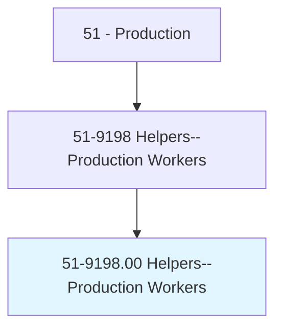
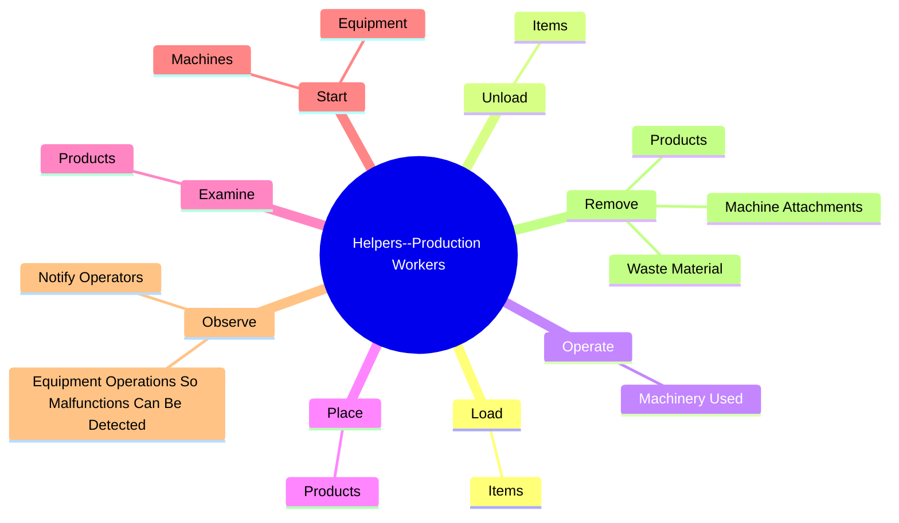
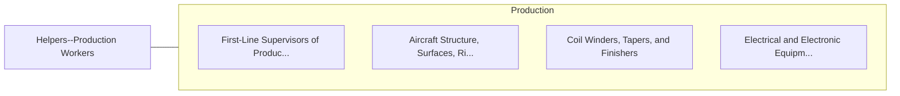

# Helpers--Production Workers

> Help production workers by performing duties requiring less skill. Duties include supplying or holding materials or tools, and cleaning work area and equipment.

## Overview

Helpers--Production Workers is an occupation within the Production category. Help production workers by performing duties requiring less skill. 

## Classification Hierarchy

## Key Statistics

| Metric | Value |
|--------|-------|
| SOC Code | 51-9198.00 |
| Category | [Production](/occupations/Production) |
| Task Count | 120 |
| Source | O*NET |

## Core Tasks

### load.Items

Helpers--Production Workers load items as part of their core responsibilities.

**Actions:**
- `load.Items.from.Machines`
- `load.Items.from.Conveyors`
- `load.Items.from.Conveyances`

### unload.Items

Helpers--Production Workers unload items as part of their core responsibilities.

**Actions:**
- `unload.Items.from.Machines`
- `unload.Items.from.Conveyors`
- `unload.Items.from.Conveyances`

### operate.MachineryUsed

Helpers--Production Workers operate machinery used as part of their core responsibilities.

**Actions:**
- `operate.MachineryUsed.in.ProductionProcess`
- `operate.MachineryUsed.in.AssistMachineOperators`

## Skills & Competencies

### Technical Skills
- **Machine Operation** - Advanced
- **Quality Control** - Advanced
- **Production Processes** - Advanced

### Soft Skills
- **Communication** - Essential
- **Problem Solving** - Essential
- **Critical Thinking** - Important
- **Teamwork** - Important
- **Adaptability** - Important

## Related Occupations

## Industries

This occupation is found across multiple industries. See [Industries](/industries) for sector-specific employment data.

## Career Progression

---

*Source: O*NET 51-9198.00 - ONETOccupation*
