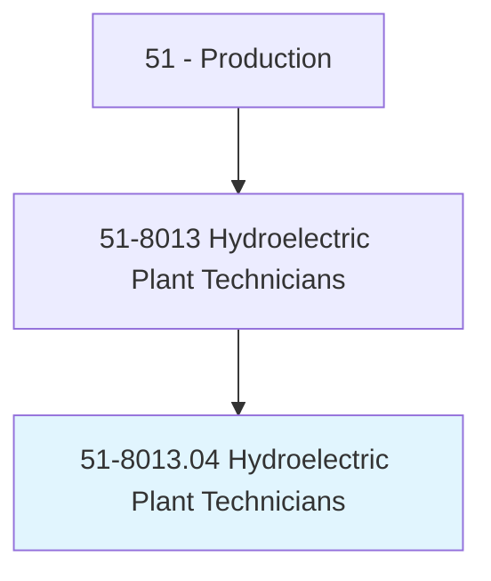
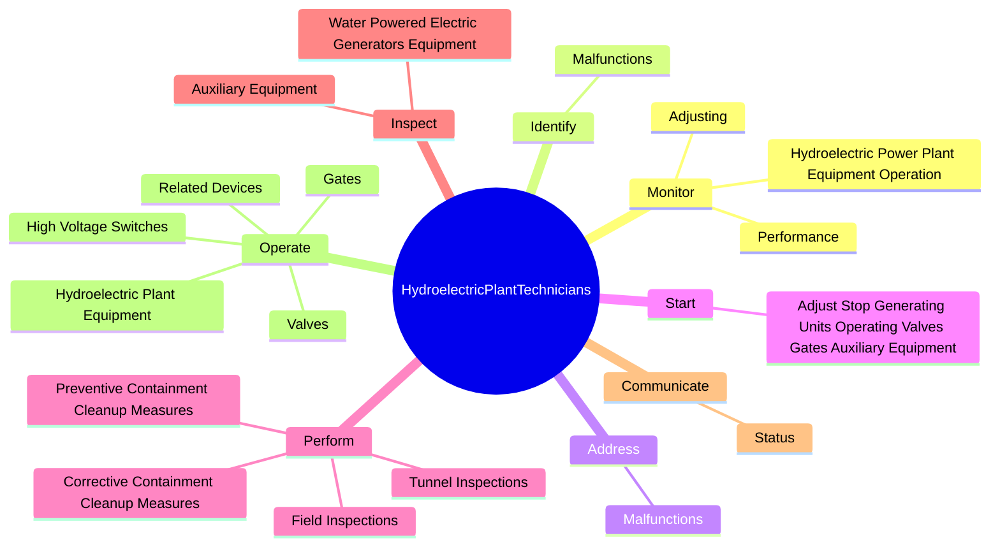
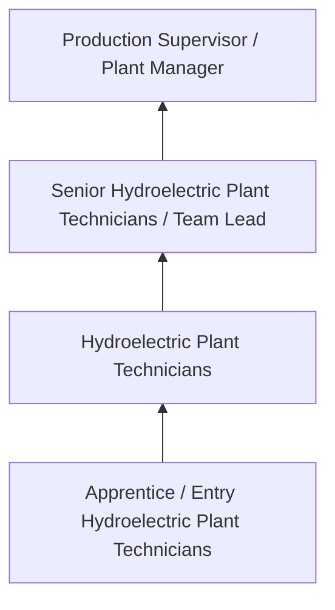
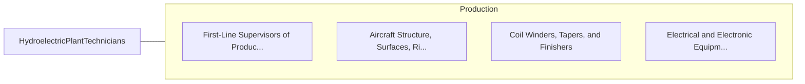

# Hydroelectric Plant Technicians

> Monitor and control activities associated with hydropower generation. Operate plant equipment, such as turbines, pumps, valves, gates, fans, electric control boards, and battery banks. Monitor equipment operation and performance and make necessary adjustments to ensure optimal performance. Perform equipment maintenance and repair as necessary.

## Overview

Hydroelectric Plant Technicians professionals monitor and control activities associated with hydropower generation. This occupation falls within the Production category and requires a combination of specialized knowledge, technical skills, and practical experience.

These professionals work across diverse settings and organizational contexts, applying their expertise to meet the demands of their field. They must stay current with industry standards, emerging practices, and regulatory requirements that affect their work. The role demands both independent judgment and collaborative skills, as practitioners regularly interact with colleagues, stakeholders, and the public.

As the field continues to evolve, Hydroelectric Plant Technicians professionals increasingly leverage technology and data-driven approaches to enhance their effectiveness. Career opportunities span the public and private sectors, with demand influenced by economic conditions, demographic shifts, and technological advancement.

## Classification Hierarchy



## Key Statistics

| Metric | Value |
|--------|-------|
| SOC Code | 51-8013.04 |
| Job Zone | N/A |
| Category | [Production](/occupations/Production/index) |
| Core Tasks | 154+ |
| Salary Range | $28,000 - $65,000 |
| Median Salary | $40,000 |
| Growth Outlook | 1% (Little or no change) |
| Source | O*NET |

## Core Tasks



### maintain.HydroelectricPlantElectrical

Hydroelectric Plant Technicians maintain hydroelectric plant electrical as part of their core responsibilities.

**Actions:**
- `maintain.HydroelectricPlantElectrical` - Maintain or repair hydroelectric plant electrical, mechanical, or electronic ...
- `maintain.Mechanical` - Maintain or repair hydroelectric plant electrical, mechanical, or electronic ...
- `maintain.ElectronicEquipment` - Maintain or repair hydroelectric plant electrical, mechanical, or electronic ...
- `maintain.Motors` - Maintain or repair hydroelectric plant electrical, mechanical, or electronic ...
- `maintain.VoltageRegulators` - Maintain or repair hydroelectric plant electrical, mechanical, or electronic ...

### connect.MetalParts

Hydroelectric Plant Technicians connect metal parts as part of their core responsibilities.

**Actions:**
- `connect.MetalParts.in.HydroelectricPlants.by.Welding` - Connect metal parts or components in hydroelectric plants by welding, solderi...
- `connect.MetalParts.in.Soldering` - Connect metal parts or components in hydroelectric plants by welding, solderi...
- `connect.MetalParts.in.Riveting` - Connect metal parts or components in hydroelectric plants by welding, solderi...
- `connect.MetalParts.in.Tapping` - Connect metal parts or components in hydroelectric plants by welding, solderi...
- `connect.MetalParts.in.Bolting` - Connect metal parts or components in hydroelectric plants by welding, solderi...

### repair.HydroelectricPlantElectrical

Hydroelectric Plant Technicians repair hydroelectric plant electrical as part of their core responsibilities.

**Actions:**
- `repair.HydroelectricPlantElectrical` - Maintain or repair hydroelectric plant electrical, mechanical, or electronic ...
- `repair.Mechanical` - Maintain or repair hydroelectric plant electrical, mechanical, or electronic ...
- `repair.Motors` - Maintain or repair hydroelectric plant electrical, mechanical, or electronic ...
- `repair.VoltageRegulators` - Maintain or repair hydroelectric plant electrical, mechanical, or electronic ...
- `repair.BatterySystems` - Maintain or repair hydroelectric plant electrical, mechanical, or electronic ...

### calibrate.ElectricalEquipment

Hydroelectric Plant Technicians calibrate electrical equipment as part of their core responsibilities.

**Actions:**
- `calibrate.ElectricalEquipment` - Install or calibrate electrical or mechanical equipment, such as motors, engi...
- `calibrate.Mechanicalequipment` - Install or calibrate electrical or mechanical equipment, such as motors, engi...
- `calibrate.Motors` - Install or calibrate electrical or mechanical equipment, such as motors, engi...
- `calibrate.Engines` - Install or calibrate electrical or mechanical equipment, such as motors, engi...
- `calibrate.Switchboards` - Install or calibrate electrical or mechanical equipment, such as motors, engi...


## Skills & Competencies

### Technical Skills
- **Machine Operation** - Advanced
- **Quality Inspection** - Advanced
- **Safety Procedures** - Advanced
- **Blueprint Reading** - Proficient
- **Measurement Tools** - Proficient
- **Process Control** - Proficient

### Soft Skills
- **Attention to Detail** - Critical
- **Reliability** - Critical
- **Physical Dexterity** - Essential
- **Teamwork** - Essential
- **Problem Solving** - Important

## Education & Certifications

| Requirement | Details |
|-------------|---------|
| Typical Education | High school diploma or equivalent; some positions require technical training |
| Work Experience | 0-2 years manufacturing experience |
| On-the-Job Training | Moderate - equipment operation and safety procedures |
| Certifications | OSHA certifications, quality management certifications |

## Career Progression



## Industry Variations

### Discrete Manufacturing
Assembly of distinct products such as automobiles, electronics, or machinery. Hydroelectric Plant Technicians professionals work with precision equipment and quality standards.

### Process Manufacturing
Continuous production of chemicals, food, or materials. Focus on process control and consistency.

### Custom and Job Shop
Small-batch or custom production work. Requires versatility and ability to adapt to varied specifications.

### Automated Manufacturing
Technology-driven production with robotics and advanced systems. Increasing emphasis on programming and monitoring skills.

## Technology & Tools

- **Manufacturing execution systems (MES)**
- **Computer numerical control (CNC) machines**
- **Quality management software**
- **Programmable logic controllers (PLC)**
- **Enterprise resource planning (ERP) systems**

## Related Occupations



## Industries

- [Manufacturing](/industries/Manufacturing) - High Employment
- Food Processing - High Employment
- [Automotive](/industries/Manufacturing) - Moderate Employment
- [Electronics](/industries/Electronics) - Moderate Employment

## Departments

This occupation typically works in:
- [Manufacturing](/departments/Operations)
- Quality Control
- Production Planning

## GraphDL Semantic Structure

```graphdl
Hydroelectric Plant Technicians perform:
- monitor.HydroelectricPowerPlantEquipmentOperation.to.PerformanceSpecifications
- monitor.HydroelectricPowerPlantEquipmentOperation.to.AsNecessary
- monitor.Performance.to.PerformanceSpecifications
- monitor.Performance.to.AsNecessary
- monitor.Adjusting.to.PerformanceSpecifications
- monitor.Adjusting.to.AsNecessary
```

---

*Source: O*NET 51-8013.04 - ONETOccupation*
