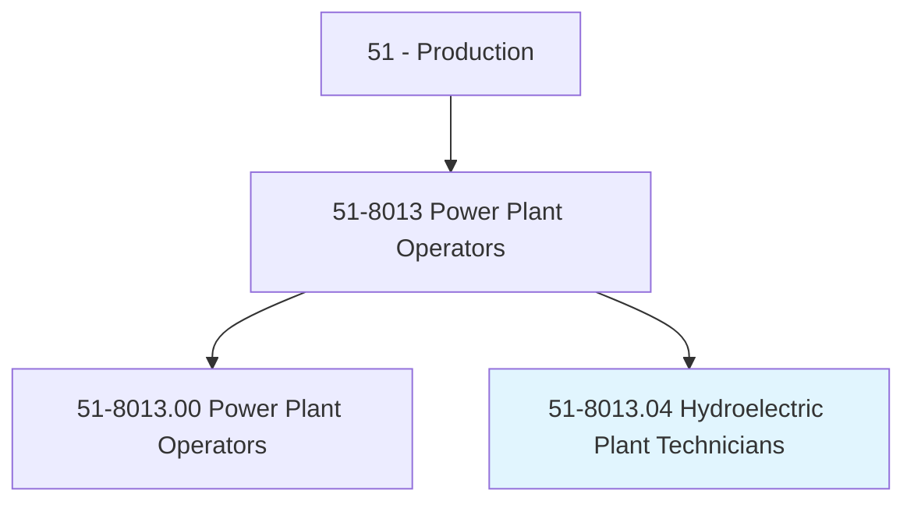
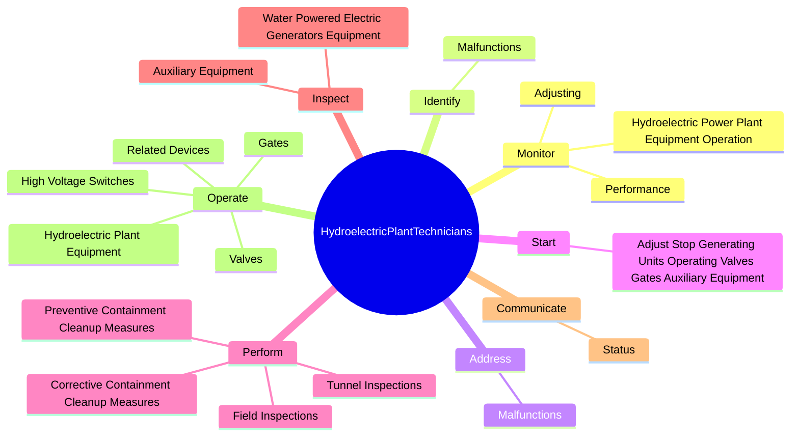
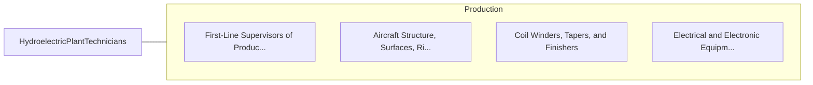

# Hydroelectric Plant Technicians

> Monitor and control activities associated with hydropower generation. Operate plant equipment, such as turbines, pumps, valves, gates, fans, electric control boards, and battery banks. Monitor equipment operation and performance and make necessary adjustments to ensure optimal performance. Perform equipment maintenance and repair as necessary.

## Overview

Hydroelectric Plant Technicians is a specialized variant within the Production category. Monitor and control activities associated with hydropower generation. Operate plant equipment, such as turbines, pumps, valves, gates, fans, electric control boards, and battery banks.

## Classification Hierarchy

## Key Statistics

| Metric | Value |
|--------|-------|
| SOC Code | 51-8013.04 |
| Category | [Production](/occupations/Production) |
| Task Count | 154 |
| Source | O*NET |

## Core Tasks

### monitor.HydroelectricPowerPlantEquipmentOperation

Hydroelectric Plant Technicians monitor hydroelectric power plant equipment operation as part of their core responsibilities.

**Actions:**
- `monitor.HydroelectricPowerPlantEquipmentOperation.to.PerformanceSpecifications`
- `monitor.HydroelectricPowerPlantEquipmentOperation.to.AsNecessary`
- `monitor.Performance.to.PerformanceSpecifications`
- `monitor.Performance.to.AsNecessary`

### identify.Malfunctions

Hydroelectric Plant Technicians identify malfunctions as part of their core responsibilities.

**Actions:**
- `identify.Malfunctions.of.HydroelectricPlantOperationalEquipment`
- `identify.Malfunctions.of.Generators`
- `identify.Malfunctions.of.Transformers`
- `identify.Malfunctions.of.Turbines`

### address.Malfunctions

Hydroelectric Plant Technicians address malfunctions as part of their core responsibilities.

**Actions:**
- `address.Malfunctions.of.HydroelectricPlantOperationalEquipment`
- `address.Malfunctions.of.Generators`
- `address.Malfunctions.of.Transformers`
- `address.Malfunctions.of.Turbines`

## Skills & Competencies

### Technical Skills
- **Machine Operation** - Advanced
- **Quality Control** - Advanced
- **Production Processes** - Advanced

### Soft Skills
- **Communication** - Essential
- **Problem Solving** - Essential
- **Critical Thinking** - Important
- **Teamwork** - Important
- **Adaptability** - Important

## Related Occupations

## Industries

This occupation is found across multiple industries. See [Industries](/industries) for sector-specific employment data.

## Career Progression

---

*Source: O*NET 51-8013.04 - ONETOccupation*
