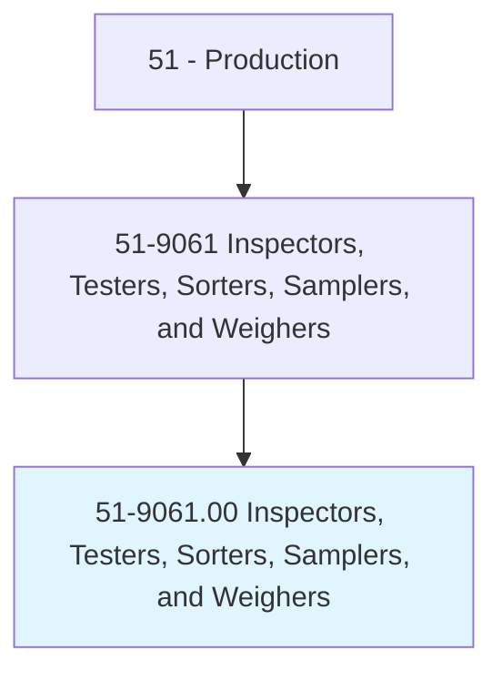
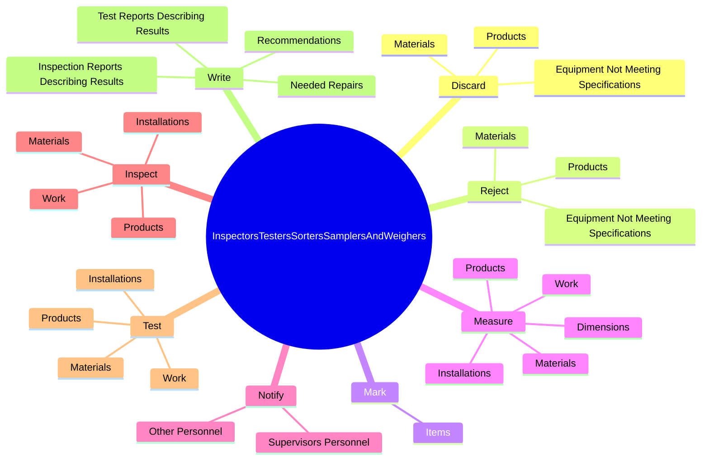
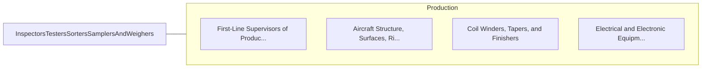

# Inspectors, Testers, Sorters, Samplers, and Weighers

> Inspect, test, sort, sample, or weigh nonagricultural raw materials or processed, machined, fabricated, or assembled parts or products for defects, wear, and deviations from specifications. May use precision measuring instruments and complex test equipment.

## Overview

Inspectors, Testers, Sorters, Samplers, and Weighers is an occupation within the Production category. Inspect, test, sort, sample, or weigh nonagricultural raw materials or processed, machined, fabricated, or assembled parts or products for defects, wear, and deviations from specifications. 

## Classification Hierarchy

## Key Statistics

| Metric | Value |
|--------|-------|
| SOC Code | 51-9061.00 |
| Category | [Production](/occupations/Production) |
| Task Count | 207 |
| Source | O*NET |

## Core Tasks

### discard.Products

Inspectors, Testers, Sorters, Samplers, and Weighers discard products as part of their core responsibilities.

**Actions:**
- `discard.Products`
- `discard.Materials`
- `discard.EquipmentNotMeetingSpecifications`

### reject.Products

Inspectors, Testers, Sorters, Samplers, and Weighers reject products as part of their core responsibilities.

**Actions:**
- `reject.Products`
- `reject.Materials`
- `reject.EquipmentNotMeetingSpecifications`

### mark.Items

Inspectors, Testers, Sorters, Samplers, and Weighers mark items as part of their core responsibilities.

**Actions:**
- `mark.Items.with.Details`
- `mark.Items.with.Grade`
- `mark.Items.with.AcceptanceRejectionStatus`

## Skills & Competencies

### Technical Skills
- **Machine Operation** - Advanced
- **Quality Control** - Advanced
- **Production Processes** - Advanced

### Soft Skills
- **Communication** - Essential
- **Problem Solving** - Essential
- **Critical Thinking** - Important
- **Teamwork** - Important
- **Adaptability** - Important

## Related Occupations

## Industries

This occupation is found across multiple industries. See [Industries](/industries) for sector-specific employment data.

## Career Progression

---

*Source: O*NET 51-9061.00 - ONETOccupation*
