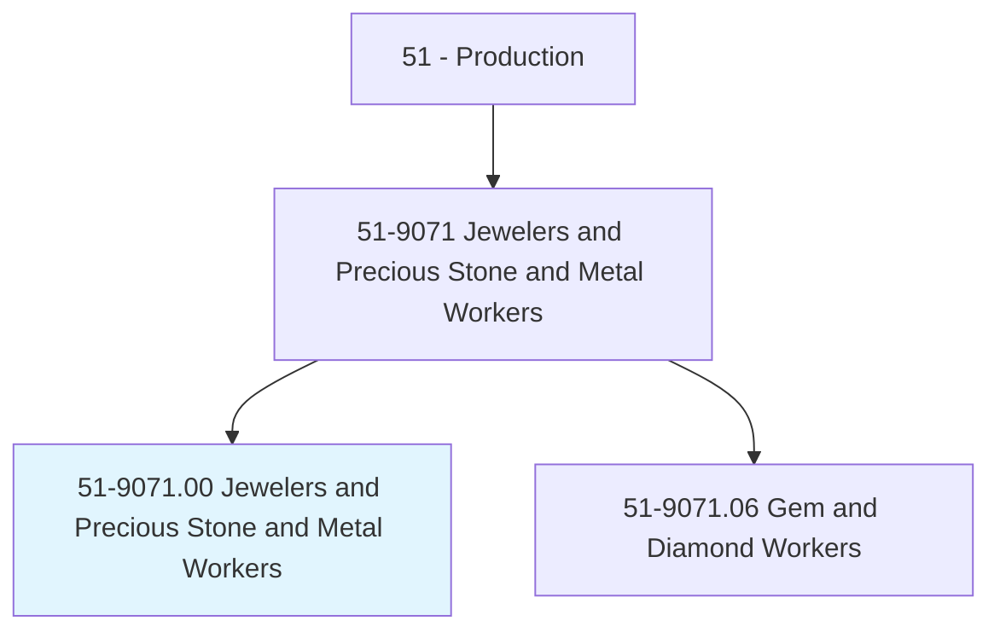
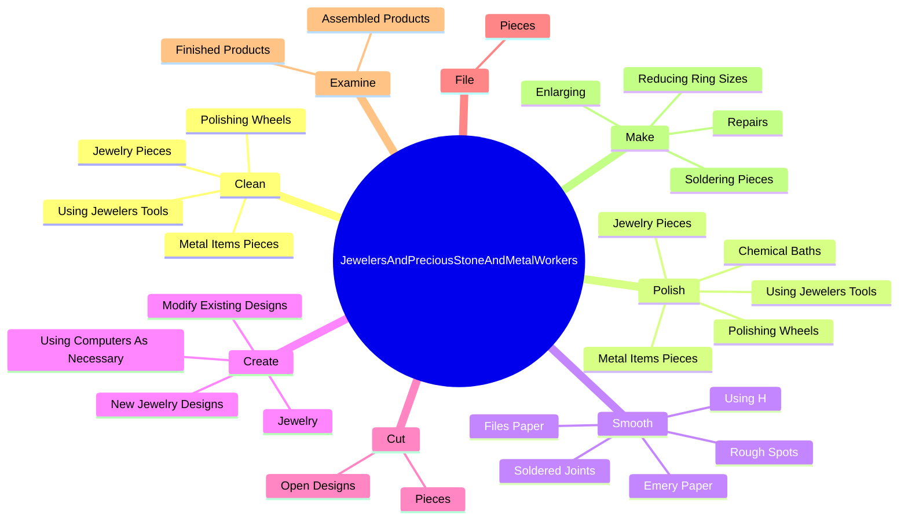
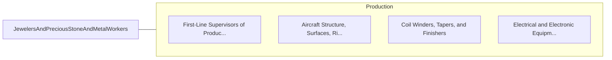

# Jewelers and Precious Stone and Metal Workers

> Design, fabricate, adjust, repair, or appraise jewelry, gold, silver, other precious metals, or gems.

## Overview

Jewelers and Precious Stone and Metal Workers is classified under Production (SOC 51). Design, fabricate, adjust, repair, or appraise jewelry, gold, silver, other precious metals, or gems.

## Classification Hierarchy

## Key Statistics

| Metric | Value |
|--------|-------|
| SOC Code | 51-9071.00 |
| Category | [Production](/occupations/Production) |
| Task Count | 178 |
| Source | O*NET |

## Core Tasks

### clean.MetalItemsPieces

Jewelers and Precious Stone and Metal Workers clean metal items pieces as part of their core responsibilities.

**Actions:**
- `clean.MetalItemsPieces`
- `clean.JewelryPieces`
- `clean.UsingJewelersTools`
- `clean.PolishingWheels`

### polish.MetalItemsPieces

Jewelers and Precious Stone and Metal Workers polish metal items pieces as part of their core responsibilities.

**Actions:**
- `polish.MetalItemsPieces`
- `polish.JewelryPieces`
- `polish.UsingJewelersTools`
- `polish.PolishingWheels`

### smooth.SolderedJoints

Jewelers and Precious Stone and Metal Workers smooth soldered joints as part of their core responsibilities.

**Actions:**
- `smooth.SolderedJoints.with.PolishingWheels`
- `smooth.SolderedJoints.with.BuffingWire`
- `smooth.RoughSpots.with.PolishingWheels`
- `smooth.RoughSpots.with.BuffingWire`

## Skills & Competencies

### Technical Skills
- **Machine Operation** - Advanced
- **Quality Control** - Advanced
- **Production Processes** - Advanced

### Soft Skills
- **Communication** - Essential
- **Problem Solving** - Essential
- **Critical Thinking** - Important
- **Teamwork** - Important
- **Adaptability** - Important

## Related Occupations

## Industries

This occupation is found across multiple industries. See [Industries](/industries) for sector-specific employment data.

## Career Progression

---

*Source: O*NET 51-9071.00 - ONETOccupation*
