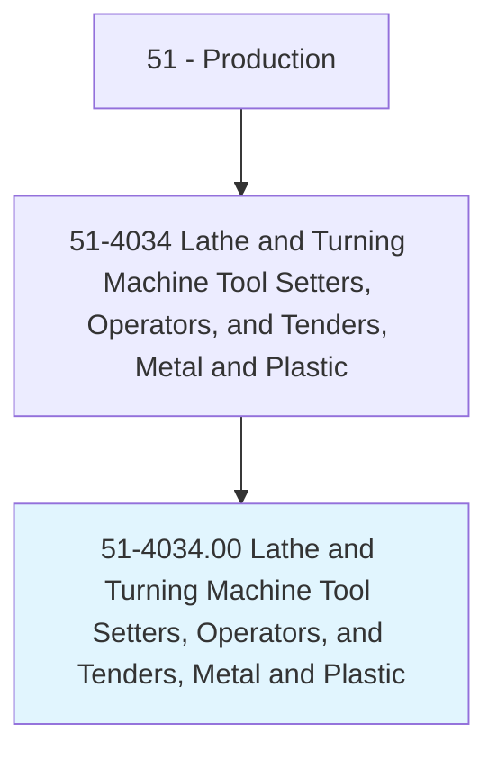
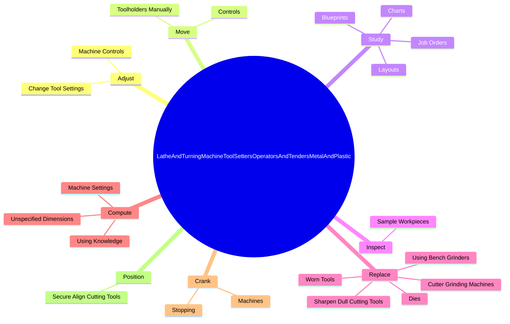

# Lathe and Turning Machine Tool Setters, Operators, and Tenders, Metal and Plastic

> Set up, operate, or tend lathe and turning machines to turn, bore, thread, form, or face metal or plastic materials, such as wire, rod, or bar stock.

## Overview

Lathe and Turning Machine Tool Setters, Operators, and Tenders, Metal and Plastic is classified under Production (SOC 51). Set up, operate, or tend lathe and turning machines to turn, bore, thread, form, or face metal or plastic materials, such as wire, rod, or bar stock.

## Classification Hierarchy

## Key Statistics

| Metric | Value |
|--------|-------|
| SOC Code | 51-4034.00 |
| Category | [Production](/occupations/Production/index) |
| Task Count | 118 |
| Source | O*NET |

## Core Tasks

### adjust.MachineControls

Lathe and Turning Machine Tool Setters, Operators, and Tenders, Metal and Plastic adjust machine controls as part of their core responsibilities.

**Actions:**
- `adjust.MachineControls.to.keep.DimensionsWithinSpecifiedTolerances`
- `adjust.ChangeToolSettings.to.keep.DimensionsWithinSpecifiedTolerances`

### move.Controls

Lathe and Turning Machine Tool Setters, Operators, and Tenders, Metal and Plastic move controls as part of their core responsibilities.

**Actions:**
- `move.Controls.to.set.CuttingSpeedsFeedRates`
- `move.Controls.to.DepthsFeedRates`
- `move.Controls.to.ToPositionToolsInRelationToWorkpieces`
- `move.ToolholdersManually.by.TurningHandwheels`

### study.Blueprints

Lathe and Turning Machine Tool Setters, Operators, and Tenders, Metal and Plastic study blueprints as part of their core responsibilities.

**Actions:**
- `study.Blueprints.for.Information.on.SpecificationsInstructions`
- `study.Blueprints.for.ToolingInstructions`
- `study.Blueprints.for..to.determine.MaterialRequirements`
- `study.Blueprints.for.OperationalSequences`

## Skills & Competencies

### Technical Skills
- **Machine Operation** - Advanced
- **Quality Control** - Advanced
- **Production Processes** - Advanced

### Soft Skills
- **Communication** - Essential
- **Problem Solving** - Essential
- **Critical Thinking** - Important
- **Teamwork** - Important
- **Adaptability** - Important

## Related Occupations

## Industries

This occupation is found across multiple industries. See [Industries](/industries) for sector-specific employment data.

## Career Progression

---

*Source: O*NET 51-4034.00 - ONETOccupation*
