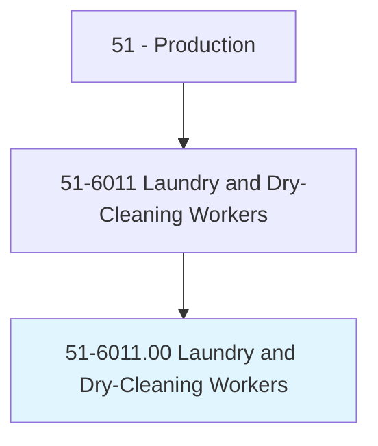
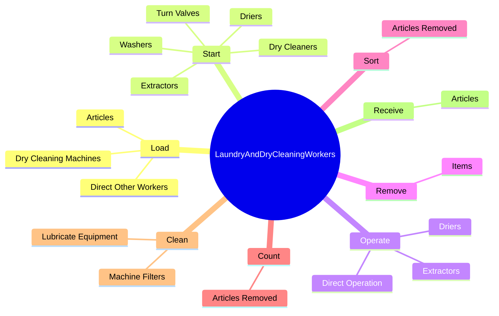
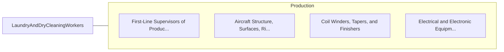

# Laundry and Dry-Cleaning Workers

> Operate or tend washing or dry-cleaning machines to wash or dry-clean industrial or household articles, such as cloth garments, suede, leather, furs, blankets, draperies, linens, rugs, and carpets. Includes spotters and dyers of these articles.

## Overview

Laundry and Dry-Cleaning Workers is an occupation within the Production category. Operate or tend washing or dry-cleaning machines to wash or dry-clean industrial or household articles, such as cloth garments, suede, leather, furs, blankets, draperies, linens, rugs, and carpets. 

## Classification Hierarchy

## Key Statistics

| Metric | Value |
|--------|-------|
| SOC Code | 51-6011.00 |
| Category | [Production](/occupations/Production/index) |
| Task Count | 198 |
| Source | O*NET |

## Core Tasks

### load.Articles

Laundry and Dry-Cleaning Workers load articles as part of their core responsibilities.

**Actions:**
- `load.Articles.into.WashersMachines.to.perform.Loading`
- `load.DryCleaningMachines.to.perform.Loading`
- `load.DirectOtherWorkers.to.perform.Loading`

### start.Washers

Laundry and Dry-Cleaning Workers start washers as part of their core responsibilities.

**Actions:**
- `start.Washers.to.regulate.MachineProcesses`
- `start.Washers.to.VolumeOfSoap`
- `start.Washers.to.Detergent`
- `start.Washers.to.water`

### operate.Extractors

Laundry and Dry-Cleaning Workers operate extractors as part of their core responsibilities.

**Actions:**
- `operate.Extractors`
- `operate.Driers`
- `operate.DirectOperation`

## Skills & Competencies

### Technical Skills
- **Machine Operation** - Advanced
- **Quality Control** - Advanced
- **Production Processes** - Advanced

### Soft Skills
- **Communication** - Essential
- **Problem Solving** - Essential
- **Critical Thinking** - Important
- **Teamwork** - Important
- **Adaptability** - Important

## Related Occupations

## Industries

This occupation is found across multiple industries. See [Industries](/industries) for sector-specific employment data.

## Career Progression

---

*Source: O*NET 51-6011.00 - ONETOccupation*
