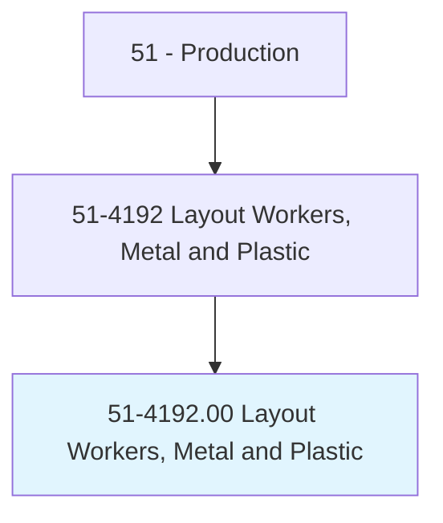
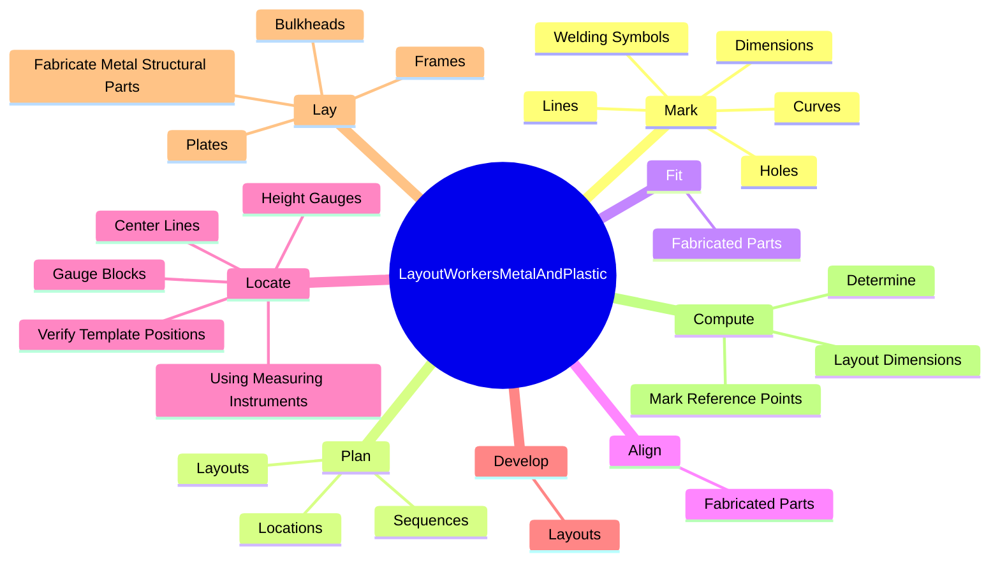
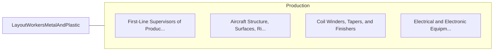

# Layout Workers, Metal and Plastic

> Lay out reference points and dimensions on metal or plastic stock or workpieces, such as sheets, plates, tubes, structural shapes, castings, or machine parts, for further processing. Includes shipfitters.

## Overview

Layout Workers, Metal and Plastic is an occupation within the Production category. Lay out reference points and dimensions on metal or plastic stock or workpieces, such as sheets, plates, tubes, structural shapes, castings, or machine parts, for further processing. 

## Classification Hierarchy

## Key Statistics

| Metric | Value |
|--------|-------|
| SOC Code | 51-4192.00 |
| Category | [Production](/occupations/Production/index) |
| Task Count | 95 |
| Source | O*NET |

## Core Tasks

### mark.Curves

Layout Workers, Metal and Plastic mark curves as part of their core responsibilities.

**Actions:**
- `mark.Curves`
- `mark.Lines`
- `mark.Holes`
- `mark.Dimensions`

### plan.Locations

Layout Workers, Metal and Plastic plan locations as part of their core responsibilities.

**Actions:**
- `plan.Locations.of.Cutting`
- `plan.Locations.of.Drilling`
- `plan.Locations.of.Bending`
- `plan.Locations.of.Rolling`

### fit.FabricatedParts

Layout Workers, Metal and Plastic fit fabricated parts as part of their core responsibilities.

**Actions:**
- `fit.FabricatedParts.to.BeWelded`
- `fit.FabricatedParts.to.assembled`

## Skills & Competencies

### Technical Skills
- **Machine Operation** - Advanced
- **Quality Control** - Advanced
- **Production Processes** - Advanced

### Soft Skills
- **Communication** - Essential
- **Problem Solving** - Essential
- **Critical Thinking** - Important
- **Teamwork** - Important
- **Adaptability** - Important

## Related Occupations

## Industries

This occupation is found across multiple industries. See [Industries](/industries) for sector-specific employment data.

## Career Progression

---

*Source: O*NET 51-4192.00 - ONETOccupation*
