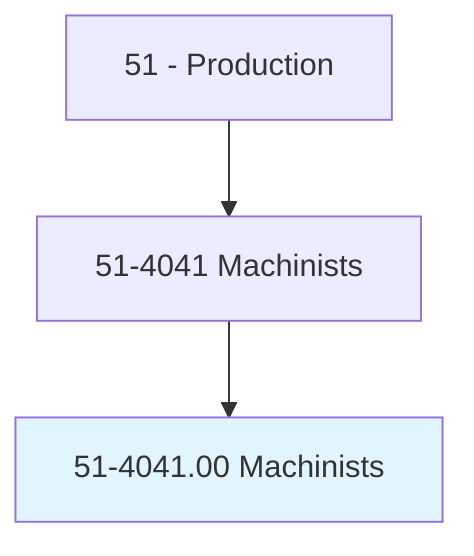
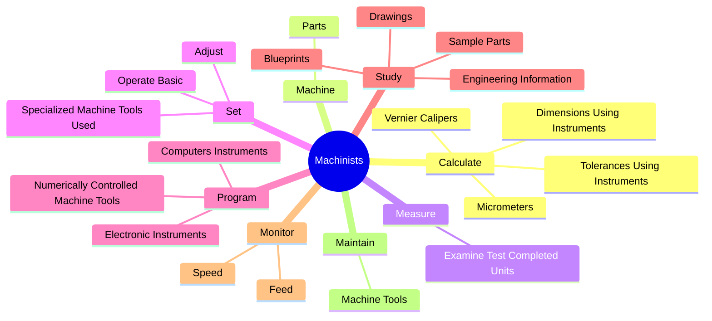
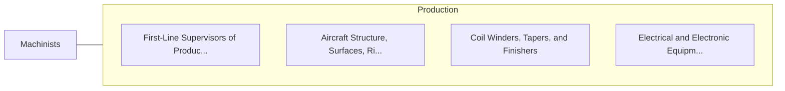

# Machinists

> Set up and operate a variety of machine tools to produce precision parts and instruments out of metal. Includes precision instrument makers who fabricate, modify, or repair mechanical instruments. May also fabricate and modify parts to make or repair machine tools or maintain industrial machines, applying knowledge of mechanics, mathematics, metal properties, layout, and machining procedures.

## Overview

Machinists is an occupation within the Production category. Set up and operate a variety of machine tools to produce precision parts and instruments out of metal. Includes precision instrument makers who fabricate, modify, or repair mechanical instruments.

## Classification Hierarchy

## Key Statistics

| Metric | Value |
|--------|-------|
| SOC Code | 51-4041.00 |
| Category | [Production](/occupations/Production/index) |
| Task Count | 107 |
| Source | O*NET |

## Core Tasks

### calculate.DimensionsUsingInstruments

Machinists calculate dimensions using instruments as part of their core responsibilities.

**Actions:**
- `calculate.DimensionsUsingInstruments`
- `calculate.TolerancesUsingInstruments`
- `calculate.Micrometers`
- `calculate.VernierCalipers`

### machine.Parts

Machinists machine parts as part of their core responsibilities.

**Actions:**
- `machine.Parts.to.Specifications`
- `machine.Parts.to.UsingMachineTools`
- `machine.Parts.to.Lathes`
- `machine.Parts.to.MillingMachines`

### measure.ExamineTestCompletedUnits

Machinists measure examine test completed units as part of their core responsibilities.

**Actions:**
- `measure.ExamineTestCompletedUnits.to.check.ForDefectsEnsureConformanceToSpecificationsUsingPrecisionInstrumentsSuchAsMicrometers`

## Skills & Competencies

### Technical Skills
- **Machine Operation** - Advanced
- **Quality Control** - Advanced
- **Production Processes** - Advanced

### Soft Skills
- **Communication** - Essential
- **Problem Solving** - Essential
- **Critical Thinking** - Important
- **Teamwork** - Important
- **Adaptability** - Important

## Related Occupations

## Industries

This occupation is found across multiple industries. See [Industries](/industries) for sector-specific employment data.

## Career Progression

---

*Source: O*NET 51-4041.00 - ONETOccupation*
