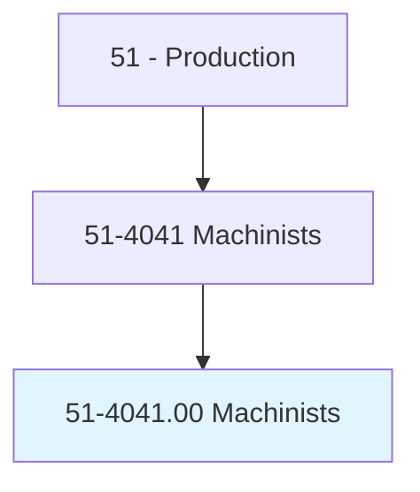
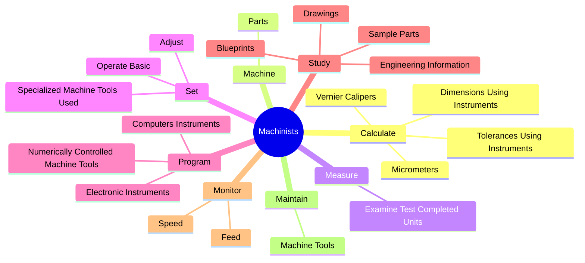
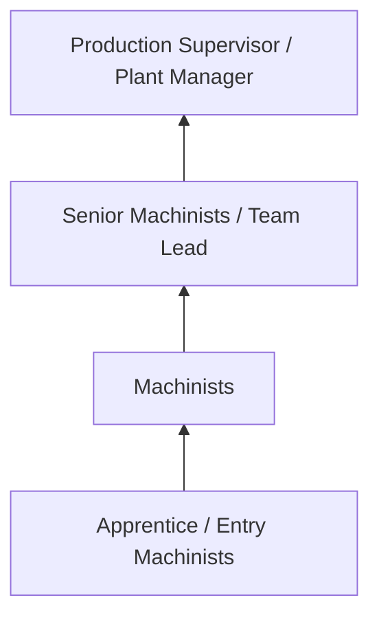
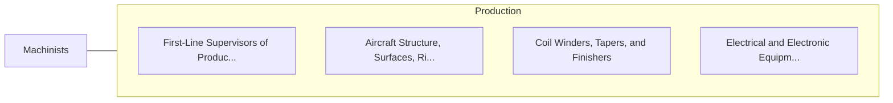

# Machinists

> Set up and operate a variety of machine tools to produce precision parts and instruments out of metal. Includes precision instrument makers who fabricate, modify, or repair mechanical instruments. May also fabricate and modify parts to make or repair machine tools or maintain industrial machines, applying knowledge of mechanics, mathematics, metal properties, layout, and machining procedures.

## Overview

Machinists professionals set up and operate a variety of machine tools to produce precision parts and instruments out of metal. This occupation falls within the Production category and requires a combination of specialized knowledge, technical skills, and practical experience.

These professionals work across diverse settings and organizational contexts, applying their expertise to meet the demands of their field. They must stay current with industry standards, emerging practices, and regulatory requirements that affect their work. The role demands both independent judgment and collaborative skills, as practitioners regularly interact with colleagues, stakeholders, and the public.

As the field continues to evolve, Machinists professionals increasingly leverage technology and data-driven approaches to enhance their effectiveness. Career opportunities span the public and private sectors, with demand influenced by economic conditions, demographic shifts, and technological advancement.

## Classification Hierarchy



## Key Statistics

| Metric | Value |
|--------|-------|
| SOC Code | 51-4041.00 |
| Job Zone | N/A |
| Category | [Production](/occupations/Production/index) |
| Core Tasks | 107+ |
| Salary Range | $28,000 - $65,000 |
| Median Salary | $40,000 |
| Growth Outlook | 1% (Little or no change) |
| Source | O*NET |

## Core Tasks



### dismantle.Machines

Machinists dismantle machines as part of their core responsibilities.

**Actions:**
- `dismantle.Machines.to.examine.PartsForDefects` - Dismantle machines or equipment, using hand tools or power tools to examine p...
- `dismantle.Machines.to.replace.DefectivePartsWhereNeeded` - Dismantle machines or equipment, using hand tools or power tools to examine p...
- `dismantle.Equipment.to.examine.PartsForDefects` - Dismantle machines or equipment, using hand tools or power tools to examine p...
- `dismantle.Equipment.to.replace.DefectivePartsWhereNeeded` - Dismantle machines or equipment, using hand tools or power tools to examine p...
- `dismantle.UsingH.to.examine.PartsForDefects` - Dismantle machines or equipment, using hand tools or power tools to examine p...

### install.RepairedParts

Machinists install repaired parts as part of their core responsibilities.

**Actions:**
- `install.RepairedParts.into.Equipment` - Install repaired parts into equipment or install new equipment.
- `install.InstallNewEquipment` - Install repaired parts into equipment or install new equipment.
- `install.ExperimentalParts` - Install experimental parts or assemblies, such as hydraulic systems, electric...
- `install.Assemblies` - Install experimental parts or assemblies, such as hydraulic systems, electric...
- `install.HydraulicSystems` - Install experimental parts or assemblies, such as hydraulic systems, electric...

### set.Adjust

Machinists set adjust as part of their core responsibilities.

**Actions:**
- `set.Adjust.to.perform.PrecisionMachiningOperations` - Set up, adjust, or operate basic or specialized machine tools used to perform...
- `set.OperateBasic.to.perform.PrecisionMachiningOperations` - Set up, adjust, or operate basic or specialized machine tools used to perform...
- `set.SpecializedMachineToolsUsed.to.perform.PrecisionMachiningOperations` - Set up, adjust, or operate basic or specialized machine tools used to perform...
- `set.OperateMetalworking` - Set up or operate metalworking, brazing, heat-treating, welding, or cutting e...
- `set.Brazing` - Set up or operate metalworking, brazing, heat-treating, welding, or cutting e...

### study.SampleParts

Machinists study sample parts as part of their core responsibilities.

**Actions:**
- `study.SampleParts.to.determine.Methods` - Study sample parts, blueprints, drawings, or engineering information to deter...
- `study.SampleParts.to.sequences.OfOperationsNeededToFabricateProducts` - Study sample parts, blueprints, drawings, or engineering information to deter...
- `study.Blueprints.to.determine.Methods` - Study sample parts, blueprints, drawings, or engineering information to deter...
- `study.Blueprints.to.sequences.OfOperationsNeededToFabricateProducts` - Study sample parts, blueprints, drawings, or engineering information to deter...
- `study.Drawings.to.determine.Methods` - Study sample parts, blueprints, drawings, or engineering information to deter...


## Skills & Competencies

### Technical Skills
- **Machine Operation** - Advanced
- **Quality Inspection** - Advanced
- **Safety Procedures** - Advanced
- **Blueprint Reading** - Proficient
- **Measurement Tools** - Proficient
- **Process Control** - Proficient

### Soft Skills
- **Attention to Detail** - Critical
- **Reliability** - Critical
- **Physical Dexterity** - Essential
- **Teamwork** - Essential
- **Problem Solving** - Important

## Education & Certifications

| Requirement | Details |
|-------------|---------|
| Typical Education | High school diploma or equivalent; some positions require technical training |
| Work Experience | 0-2 years manufacturing experience |
| On-the-Job Training | Moderate - equipment operation and safety procedures |
| Certifications | OSHA certifications, quality management certifications |

## Career Progression



## Industry Variations

### Discrete Manufacturing
Assembly of distinct products such as automobiles, electronics, or machinery. Machinists professionals work with precision equipment and quality standards.

### Process Manufacturing
Continuous production of chemicals, food, or materials. Focus on process control and consistency.

### Custom and Job Shop
Small-batch or custom production work. Requires versatility and ability to adapt to varied specifications.

### Automated Manufacturing
Technology-driven production with robotics and advanced systems. Increasing emphasis on programming and monitoring skills.

## Technology & Tools

- **Manufacturing execution systems (MES)**
- **Computer numerical control (CNC) machines**
- **Quality management software**
- **Programmable logic controllers (PLC)**
- **Enterprise resource planning (ERP) systems**

## Related Occupations



## Industries

- [Manufacturing](/industries/Manufacturing) - High Employment
- Food Processing - High Employment
- [Automotive](/industries/Manufacturing) - Moderate Employment
- [Electronics](/industries/Electronics) - Moderate Employment

## Departments

This occupation typically works in:
- [Manufacturing](/departments/Operations)
- Quality Control
- Production Planning

## GraphDL Semantic Structure

```graphdl
Machinists perform:
- calculate.DimensionsUsingInstruments
- calculate.TolerancesUsingInstruments
- calculate.Micrometers
- calculate.VernierCalipers
- machine.Parts.to.Specifications
- machine.Parts.to.UsingMachineTools
```

---

*Source: O*NET 51-4041.00 - ONETOccupation*
