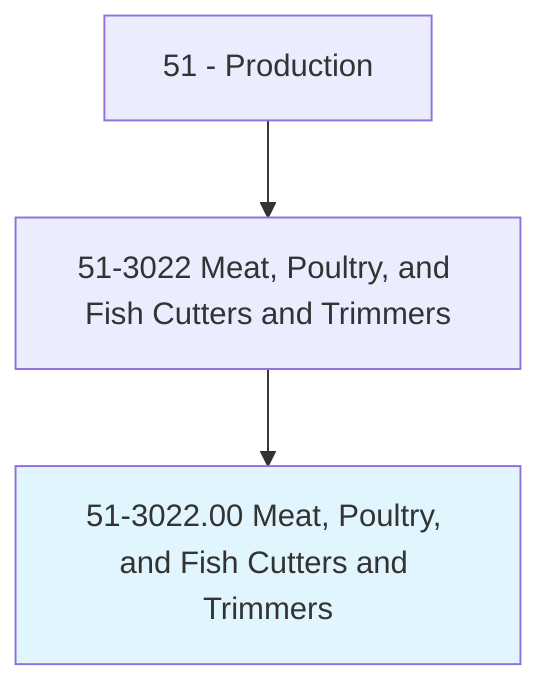
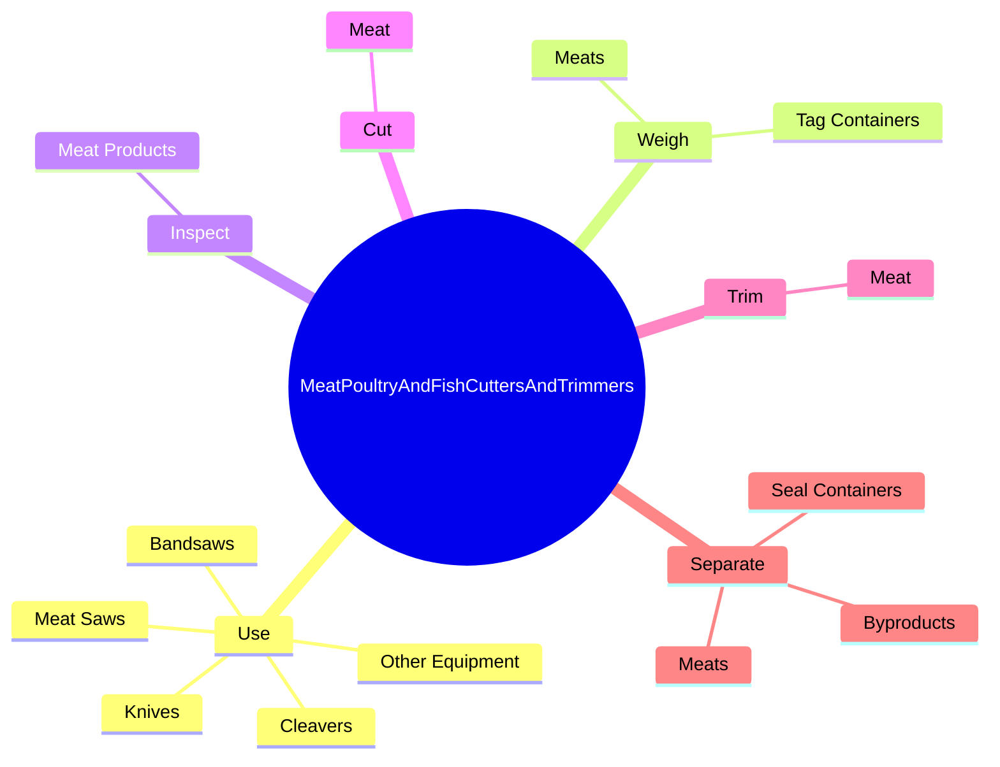
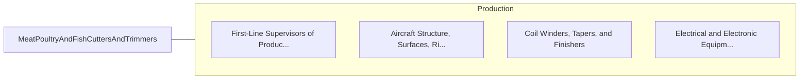

# Meat, Poultry, and Fish Cutters and Trimmers

> Use hands or hand tools to perform routine cutting and trimming of meat, poultry, and seafood.

## Overview

Meat, Poultry, and Fish Cutters and Trimmers is classified under Production (SOC 51). Use hands or hand tools to perform routine cutting and trimming of meat, poultry, and seafood.

## Classification Hierarchy

## Key Statistics

| Metric | Value |
|--------|-------|
| SOC Code | 51-3022.00 |
| Category | [Production](/occupations/Production/index) |
| Task Count | 45 |
| Source | O*NET |

## Core Tasks

### use.Knives

Meat, Poultry, and Fish Cutters and Trimmers use knives as part of their core responsibilities.

**Actions:**
- `use.Knives.to.perform.MeatCutting`
- `use.Knives.to.Trimming`
- `use.Cleavers.to.perform.MeatCutting`
- `use.Cleavers.to.Trimming`

### weigh.Meats

Meat, Poultry, and Fish Cutters and Trimmers weigh meats as part of their core responsibilities.

**Actions:**
- `weigh.Meats.for.Weight`
- `weigh.Meats.for.Contents`
- `weigh.TagContainers.for.Weight`
- `weigh.TagContainers.for.Contents`

### inspect.MeatProducts

Meat, Poultry, and Fish Cutters and Trimmers inspect meat products as part of their core responsibilities.

**Actions:**
- `inspect.MeatProducts.for.Defects`
- `inspect.MeatProducts.for.Bruises`
- `inspect.MeatProducts.for.Blemishes`
- `inspect.MeatProducts.for.RemoveThemAlong.with.ExcessFat`

## Skills & Competencies

### Technical Skills
- **Machine Operation** - Advanced
- **Quality Control** - Advanced
- **Production Processes** - Advanced

### Soft Skills
- **Communication** - Essential
- **Problem Solving** - Essential
- **Critical Thinking** - Important
- **Teamwork** - Important
- **Adaptability** - Important

## Related Occupations

## Industries

This occupation is found across multiple industries. See [Industries](/industries) for sector-specific employment data.

## Career Progression

---

*Source: O*NET 51-3022.00 - ONETOccupation*
