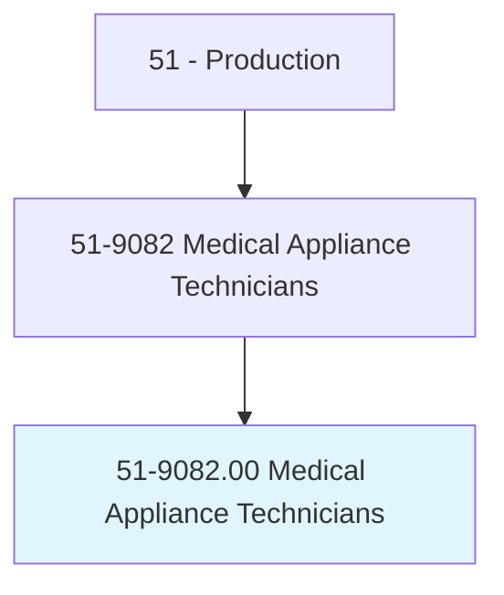
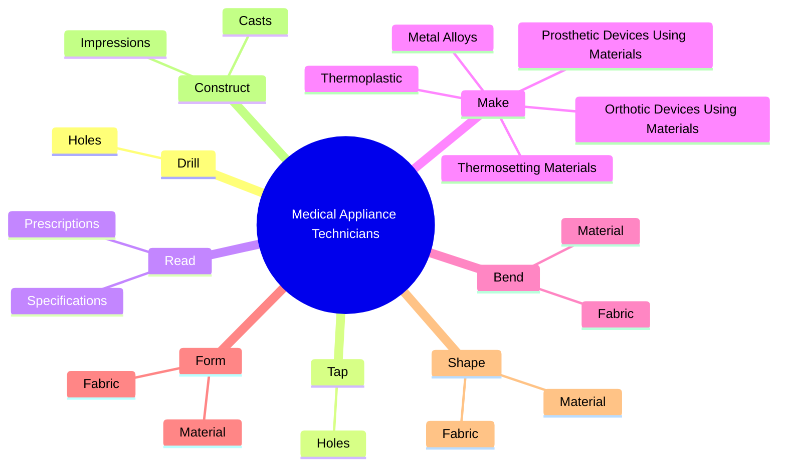
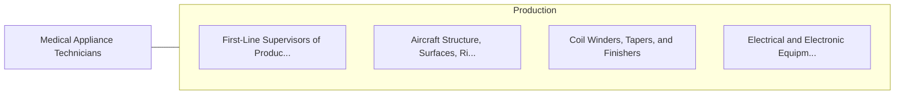

# Medical Appliance Technicians

> Construct, maintain, or repair medical supportive devices such as braces, orthotics and prosthetic devices, joints, arch supports, and other surgical and medical appliances.

## Overview

Medical Appliance Technicians is classified under Production (SOC 51). Construct, maintain, or repair medical supportive devices such as braces, orthotics and prosthetic devices, joints, arch supports, and other surgical and medical appliances.

## Classification Hierarchy

## Key Statistics

| Metric | Value |
|--------|-------|
| SOC Code | 51-9082.00 |
| Category | [Production](/occupations/Production) |
| Task Count | 82 |
| Source | O*NET |

## Core Tasks

### drill.Holes

Medical Appliance Technicians drill holes as part of their core responsibilities.

**Actions:**
- `drill.Holes.for.Rivets`
- `drill.Holes.for.Glue`
- `drill.Holes.for.Weld`
- `drill.Holes.for.Bolt`

### tap.Holes

Medical Appliance Technicians tap holes as part of their core responsibilities.

**Actions:**
- `tap.Holes.for.Rivets`
- `tap.Holes.for.Glue`
- `tap.Holes.for.Weld`
- `tap.Holes.for.Bolt`

### read.Prescriptions

Medical Appliance Technicians read prescriptions as part of their core responsibilities.

**Actions:**
- `read.Prescriptions.to.determine.TypeOfProductToBeFabricatedMaterialsToolsRequired`
- `read.Prescriptions.to.DeviceToBeFabricatedMaterialsToolsRequired`
- `read.Specifications.to.determine.TypeOfProductToBeFabricatedMaterialsToolsRequired`
- `read.Specifications.to.DeviceToBeFabricatedMaterialsToolsRequired`

## Skills & Competencies

### Technical Skills
- **Machine Operation** - Advanced
- **Quality Control** - Advanced
- **Production Processes** - Advanced

### Soft Skills
- **Communication** - Essential
- **Problem Solving** - Essential
- **Critical Thinking** - Important
- **Teamwork** - Important
- **Adaptability** - Important

## Related Occupations

## Industries

This occupation is found across multiple industries. See [Industries](/industries) for sector-specific employment data.

## Career Progression

---

*Source: O*NET 51-9082.00 - ONETOccupation*
