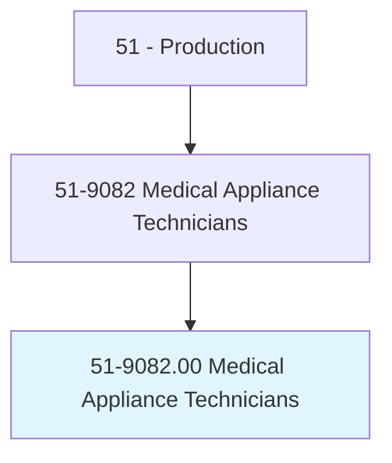
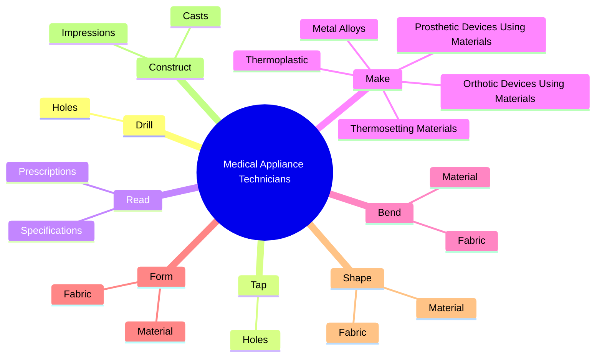
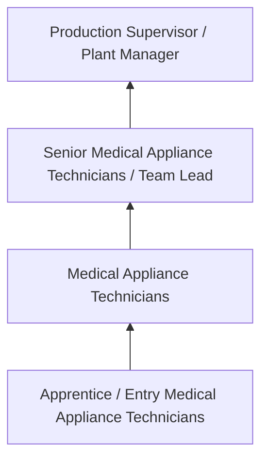
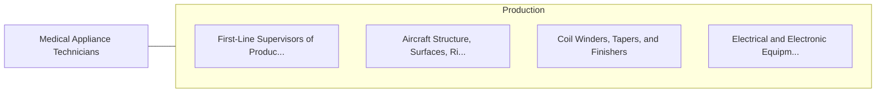

# Medical Appliance Technicians

> Construct, maintain, or repair medical supportive devices such as braces, orthotics and prosthetic devices, joints, arch supports, and other surgical and medical appliances.

## Overview

Medical Appliance Technicians professionals construct, maintain, or repair medical supportive devices such as braces, orthotics and prosthetic devices, joints, arch supports, and other surgical and medical appliances.. This occupation falls within the Production category and requires a combination of specialized knowledge, technical skills, and practical experience.

These professionals work across diverse settings and organizational contexts, applying their expertise to meet the demands of their field. They must stay current with industry standards, emerging practices, and regulatory requirements that affect their work. The role demands both independent judgment and collaborative skills, as practitioners regularly interact with colleagues, stakeholders, and the public.

As the field continues to evolve, Medical Appliance Technicians professionals increasingly leverage technology and data-driven approaches to enhance their effectiveness. Career opportunities span the public and private sectors, with demand influenced by economic conditions, demographic shifts, and technological advancement.

## Classification Hierarchy



## Key Statistics

| Metric | Value |
|--------|-------|
| SOC Code | 51-9082.00 |
| Job Zone | N/A |
| Category | [Production](/occupations/Production/index) |
| Core Tasks | 82+ |
| Salary Range | $28,000 - $65,000 |
| Median Salary | $40,000 |
| Growth Outlook | 1% (Little or no change) |
| Source | O*NET |

## Core Tasks



### make.OrthoticDevicesUsingMaterials

Medical Appliance Technicians make orthotic devices using materials as part of their core responsibilities.

**Actions:**
- `make.OrthoticDevicesUsingMaterials` - Make orthotic or prosthetic devices, using materials such as thermoplastic an...
- `make.ProstheticDevicesUsingMaterials` - Make orthotic or prosthetic devices, using materials such as thermoplastic an...
- `make.Thermoplastic` - Make orthotic or prosthetic devices, using materials such as thermoplastic an...
- `make.ThermosettingMaterials` - Make orthotic or prosthetic devices, using materials such as thermoplastic an...
- `make.MetalAlloys` - Make orthotic or prosthetic devices, using materials such as thermoplastic an...

### cover.PadMetalStructuresDevicesUsingCoverings

Medical Appliance Technicians cover pad metal structures devices using coverings as part of their core responsibilities.

**Actions:**
- `cover.PadMetalStructuresDevicesUsingCoverings` - Cover or pad metal or plastic structures or devices, using coverings such as ...
- `cover.PlasticStructuresDevicesUsingCoverings` - Cover or pad metal or plastic structures or devices, using coverings such as ...
- `cover.Rubber` - Cover or pad metal or plastic structures or devices, using coverings such as ...
- `cover.Leather` - Cover or pad metal or plastic structures or devices, using coverings such as ...
- `cover.Felt` - Cover or pad metal or plastic structures or devices, using coverings such as ...

### drill.Holes

Medical Appliance Technicians drill holes as part of their core responsibilities.

**Actions:**
- `drill.Holes.for.Rivets` - Drill and tap holes for rivets, and glue, weld, bolt, or rivet parts together...
- `drill.Holes.for.Glue` - Drill and tap holes for rivets, and glue, weld, bolt, or rivet parts together...
- `drill.Holes.for.Weld` - Drill and tap holes for rivets, and glue, weld, bolt, or rivet parts together...
- `drill.Holes.for.Bolt` - Drill and tap holes for rivets, and glue, weld, bolt, or rivet parts together...
- `drill.Holes.for.RivetPartsTogether.to.form.ProstheticDevices` - Drill and tap holes for rivets, and glue, weld, bolt, or rivet parts together...

### tap.Holes

Medical Appliance Technicians tap holes as part of their core responsibilities.

**Actions:**
- `tap.Holes.for.Rivets` - Drill and tap holes for rivets, and glue, weld, bolt, or rivet parts together...
- `tap.Holes.for.Glue` - Drill and tap holes for rivets, and glue, weld, bolt, or rivet parts together...
- `tap.Holes.for.Weld` - Drill and tap holes for rivets, and glue, weld, bolt, or rivet parts together...
- `tap.Holes.for.Bolt` - Drill and tap holes for rivets, and glue, weld, bolt, or rivet parts together...
- `tap.Holes.for.RivetPartsTogether.to.form.ProstheticDevices` - Drill and tap holes for rivets, and glue, weld, bolt, or rivet parts together...


## Skills & Competencies

### Technical Skills
- **Machine Operation** - Advanced
- **Quality Inspection** - Advanced
- **Safety Procedures** - Advanced
- **Blueprint Reading** - Proficient
- **Measurement Tools** - Proficient
- **Process Control** - Proficient

### Soft Skills
- **Attention to Detail** - Critical
- **Reliability** - Critical
- **Physical Dexterity** - Essential
- **Teamwork** - Essential
- **Problem Solving** - Important

## Education & Certifications

| Requirement | Details |
|-------------|---------|
| Typical Education | High school diploma or equivalent; some positions require technical training |
| Work Experience | 0-2 years manufacturing experience |
| On-the-Job Training | Moderate - equipment operation and safety procedures |
| Certifications | OSHA certifications, quality management certifications |

## Career Progression



## Industry Variations

### Discrete Manufacturing
Assembly of distinct products such as automobiles, electronics, or machinery. Medical Appliance Technicians professionals work with precision equipment and quality standards.

### Process Manufacturing
Continuous production of chemicals, food, or materials. Focus on process control and consistency.

### Custom and Job Shop
Small-batch or custom production work. Requires versatility and ability to adapt to varied specifications.

### Automated Manufacturing
Technology-driven production with robotics and advanced systems. Increasing emphasis on programming and monitoring skills.

## Technology & Tools

- **Manufacturing execution systems (MES)**
- **Computer numerical control (CNC) machines**
- **Quality management software**
- **Programmable logic controllers (PLC)**
- **Enterprise resource planning (ERP) systems**

## Related Occupations



## Industries

- [Manufacturing](/industries/Manufacturing) - High Employment
- Food Processing - High Employment
- [Automotive](/industries/Manufacturing) - Moderate Employment
- [Electronics](/industries/Electronics) - Moderate Employment

## Departments

This occupation typically works in:
- [Manufacturing](/departments/Operations)
- Quality Control
- Production Planning

## GraphDL Semantic Structure

```graphdl
Medical Appliance Technicians perform:
- drill.Holes.for.Rivets
- drill.Holes.for.Glue
- drill.Holes.for.Weld
- drill.Holes.for.Bolt
- drill.Holes.for.RivetPartsTogether.to.form.ProstheticDevices
- drill.Holes.for.OrthoticDevices
```

---

*Source: O*NET 51-9082.00 - ONETOccupation*
