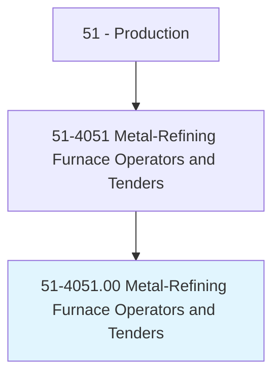
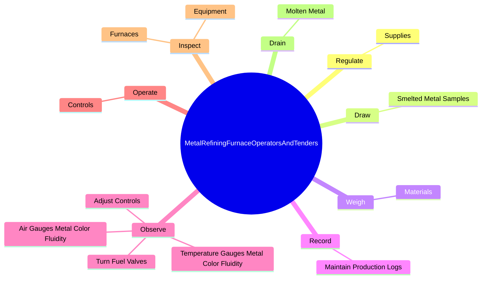
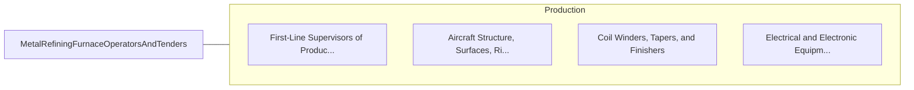

# Metal-Refining Furnace Operators and Tenders

> Operate or tend furnaces, such as gas, oil, coal, electric-arc or electric induction, open-hearth, or oxygen furnaces, to melt and refine metal before casting or to produce specified types of steel.

## Overview

Metal-Refining Furnace Operators and Tenders is classified under Production (SOC 51). Operate or tend furnaces, such as gas, oil, coal, electric-arc or electric induction, open-hearth, or oxygen furnaces, to melt and refine metal before casting or to produce specified types of steel.

## Classification Hierarchy

## Key Statistics

| Metric | Value |
|--------|-------|
| SOC Code | 51-4051.00 |
| Category | [Production](/occupations/Production/index) |
| Task Count | 67 |
| Source | O*NET |

## Core Tasks

### regulate.Supplies

Metal-Refining Furnace Operators and Tenders regulate supplies as part of their core responsibilities.

**Actions:**
- `regulate.Supplies.of.Fuel`
- `regulate.Supplies.of.Air`
- `regulate.Supplies.of.ControlFlow.of.ElectricCurrent`
- `regulate.Supplies.of.WaterCoolant.to.heat.Furnaces`

### draw.SmeltedMetalSamples

Metal-Refining Furnace Operators and Tenders draw smelted metal samples as part of their core responsibilities.

**Actions:**
- `draw.SmeltedMetalSamples.from.Furnaces.for.Analysis`
- `draw.SmeltedMetalSamples.from.Kettles.for.Analysis`
- `draw.SmeltedMetalSamples.from.CalculateTypes`
- `draw.SmeltedMetalSamples.from.AmountsOfMaterialsNeeded.to.ensure.MaterialsMeetSpecifications`

### weigh.Materials

Metal-Refining Furnace Operators and Tenders weigh materials as part of their core responsibilities.

**Actions:**
- `weigh.Materials.to.BeChargedIntoFurnaces`
- `weigh.Materials.to.UsingScales`

## Skills & Competencies

### Technical Skills
- **Machine Operation** - Advanced
- **Quality Control** - Advanced
- **Production Processes** - Advanced

### Soft Skills
- **Communication** - Essential
- **Problem Solving** - Essential
- **Critical Thinking** - Important
- **Teamwork** - Important
- **Adaptability** - Important

## Related Occupations

## Industries

This occupation is found across multiple industries. See [Industries](/industries) for sector-specific employment data.

## Career Progression

---

*Source: O*NET 51-4051.00 - ONETOccupation*
