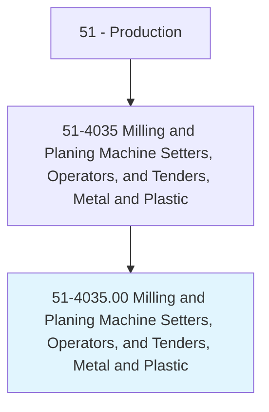
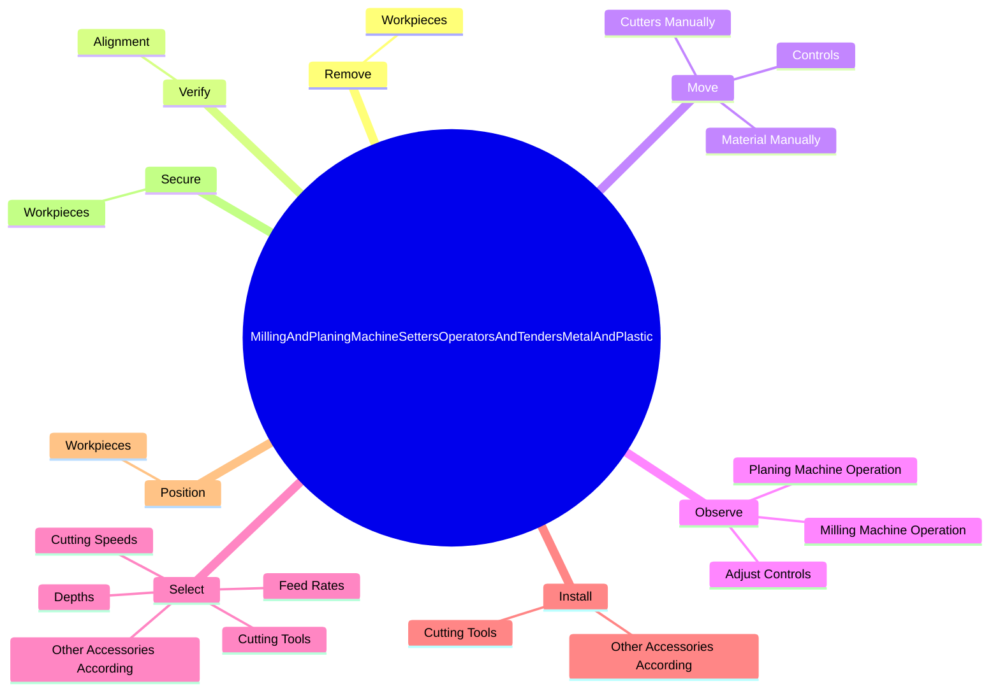

# Milling and Planing Machine Setters, Operators, and Tenders, Metal and Plastic

> Set up, operate, or tend milling or planing machines to mill, plane, shape, groove, or profile metal or plastic work pieces.

## Overview

Milling and Planing Machine Setters, Operators, and Tenders, Metal and Plastic is classified under Production (SOC 51). Set up, operate, or tend milling or planing machines to mill, plane, shape, groove, or profile metal or plastic work pieces.

## Classification Hierarchy

## Key Statistics

| Metric | Value |
|--------|-------|
| SOC Code | 51-4035.00 |
| Category | [Production](/occupations/Production) |
| Task Count | 108 |
| Source | O*NET |

## Core Tasks

### remove.Workpieces

Milling and Planing Machine Setters, Operators, and Tenders, Metal and Plastic remove workpieces as part of their core responsibilities.

**Actions:**
- `remove.Workpieces.from.Machines`
- `remove.Workpieces.from.Check.to.ensure.TheyConformToSpecifications`
- `remove.Workpieces.from.UsingMeasuringInstruments`
- `remove.Workpieces.from.Microscopes`

### verify.Alignment

Milling and Planing Machine Setters, Operators, and Tenders, Metal and Plastic verify alignment as part of their core responsibilities.

**Actions:**
- `verify.Alignment.of.Workpieces.on.Machines`
- `verify.Alignment.of.UsingMeasuringInstruments`
- `verify.Alignment.of.Rules`
- `verify.Alignment.of.Gauges`

### move.Controls

Milling and Planing Machine Setters, Operators, and Tenders, Metal and Plastic move controls as part of their core responsibilities.

**Actions:**
- `move.Controls.to.set.CuttingSpecifications`
- `move.Controls.to.ToPositionCuttingTools`
- `move.Controls.to.WorkpiecesInRelationToOther`
- `move.Controls.to.ToStartMachines`

## Skills & Competencies

### Technical Skills
- **Machine Operation** - Advanced
- **Quality Control** - Advanced
- **Production Processes** - Advanced

### Soft Skills
- **Communication** - Essential
- **Problem Solving** - Essential
- **Critical Thinking** - Important
- **Teamwork** - Important
- **Adaptability** - Important

## Related Occupations

## Industries

This occupation is found across multiple industries. See [Industries](/industries) for sector-specific employment data.

## Career Progression

---

*Source: O*NET 51-4035.00 - ONETOccupation*
