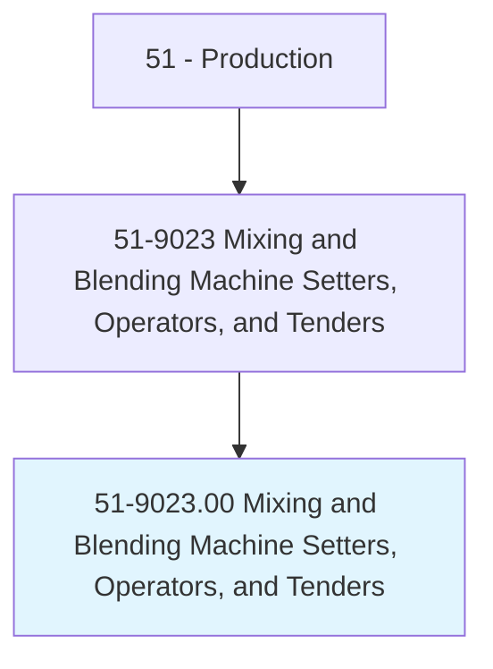
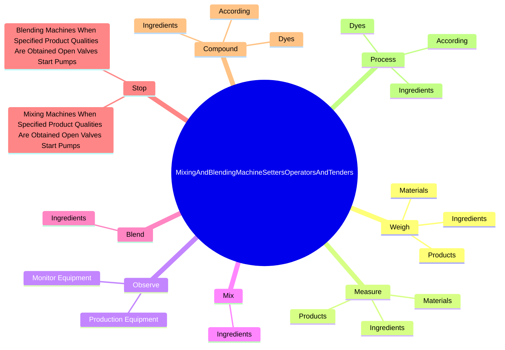

# Mixing and Blending Machine Setters, Operators, and Tenders

> Set up, operate, or tend machines to mix or blend materials, such as chemicals, tobacco, liquids, color pigments, or explosive ingredients.

## Overview

Mixing and Blending Machine Setters, Operators, and Tenders is classified under Production (SOC 51). Set up, operate, or tend machines to mix or blend materials, such as chemicals, tobacco, liquids, color pigments, or explosive ingredients.

## Classification Hierarchy

## Key Statistics

| Metric | Value |
|--------|-------|
| SOC Code | 51-9023.00 |
| Category | [Production](/occupations/Production) |
| Task Count | 53 |
| Source | O*NET |

## Core Tasks

### weigh.Materials

Mixing and Blending Machine Setters, Operators, and Tenders weigh materials as part of their core responsibilities.

**Actions:**
- `weigh.Materials.to.ensure.ConformanceToRequirements`
- `weigh.Ingredients.to.ensure.ConformanceToRequirements`
- `weigh.Products.to.ensure.ConformanceToRequirements`

### measure.Materials

Mixing and Blending Machine Setters, Operators, and Tenders measure materials as part of their core responsibilities.

**Actions:**
- `measure.Materials.to.ensure.ConformanceToRequirements`
- `measure.Ingredients.to.ensure.ConformanceToRequirements`
- `measure.Products.to.ensure.ConformanceToRequirements`

### observe.ProductionEquipment

Mixing and Blending Machine Setters, Operators, and Tenders observe production equipment as part of their core responsibilities.

**Actions:**
- `observe.ProductionEquipment.to.ensure.SafeOperation`
- `observe.ProductionEquipment.to.EfficientOperation`
- `observe.MonitorEquipment.to.ensure.SafeOperation`
- `observe.MonitorEquipment.to.EfficientOperation`

## Skills & Competencies

### Technical Skills
- **Machine Operation** - Advanced
- **Quality Control** - Advanced
- **Production Processes** - Advanced

### Soft Skills
- **Communication** - Essential
- **Problem Solving** - Essential
- **Critical Thinking** - Important
- **Teamwork** - Important
- **Adaptability** - Important

## Related Occupations

## Industries

This occupation is found across multiple industries. See [Industries](/industries) for sector-specific employment data.

## Career Progression

---

*Source: O*NET 51-9023.00 - ONETOccupation*
