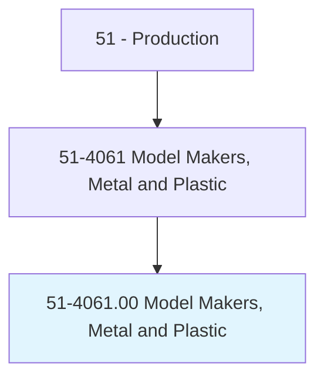
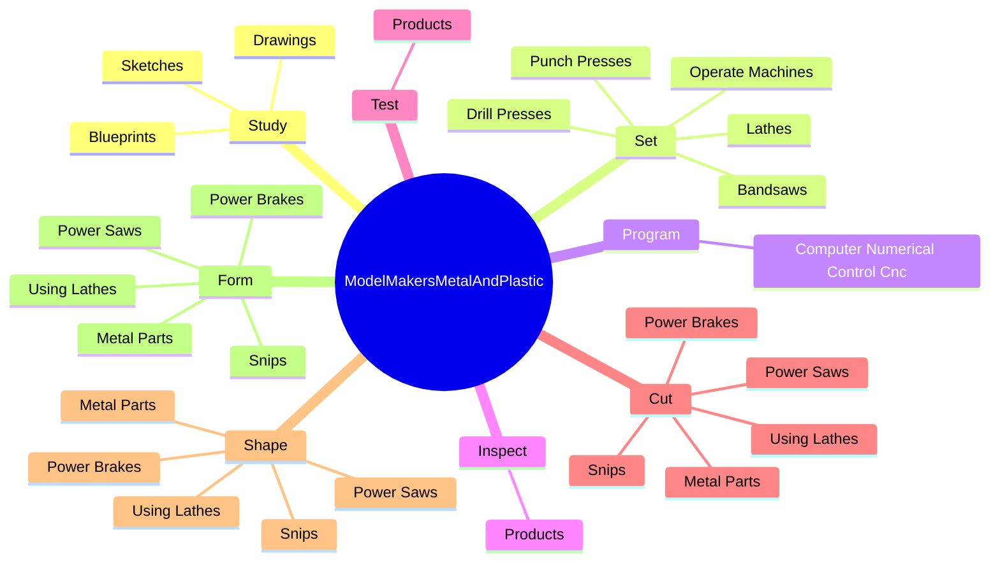
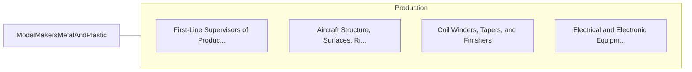

# Model Makers, Metal and Plastic

> Set up and operate machines, such as lathes, milling and engraving machines, and jig borers to make working models of metal or plastic objects. Includes template makers.

## Overview

Model Makers, Metal and Plastic is an occupation within the Production category. Set up and operate machines, such as lathes, milling and engraving machines, and jig borers to make working models of metal or plastic objects. 

## Classification Hierarchy

## Key Statistics

| Metric | Value |
|--------|-------|
| SOC Code | 51-4061.00 |
| Category | [Production](/occupations/Production/index) |
| Task Count | 117 |
| Source | O*NET |

## Core Tasks

### study.Blueprints

Model Makers, Metal and Plastic study blueprints as part of their core responsibilities.

**Actions:**
- `study.Blueprints.to.determine.MaterialDimensions`
- `study.Blueprints.to.RequiredEquipment`
- `study.Blueprints.to.OperationsSequences`
- `study.Drawings.to.determine.MaterialDimensions`

### set.OperateMachines

Model Makers, Metal and Plastic set operate machines as part of their core responsibilities.

**Actions:**
- `set.OperateMachines.to.fabricate.Prototypes`
- `set.OperateMachines.to.models`
- `set.Lathes.to.fabricate.Prototypes`
- `set.Lathes.to.models`

### program.ComputerNumericalControlCnc

Model Makers, Metal and Plastic program computer numerical control cnc as part of their core responsibilities.

**Actions:**
- `program.ComputerNumericalControlCnc`

## Skills & Competencies

### Technical Skills
- **Machine Operation** - Advanced
- **Quality Control** - Advanced
- **Production Processes** - Advanced

### Soft Skills
- **Communication** - Essential
- **Problem Solving** - Essential
- **Critical Thinking** - Important
- **Teamwork** - Important
- **Adaptability** - Important

## Related Occupations

## Industries

This occupation is found across multiple industries. See [Industries](/industries) for sector-specific employment data.

## Career Progression

---

*Source: O*NET 51-4061.00 - ONETOccupation*
