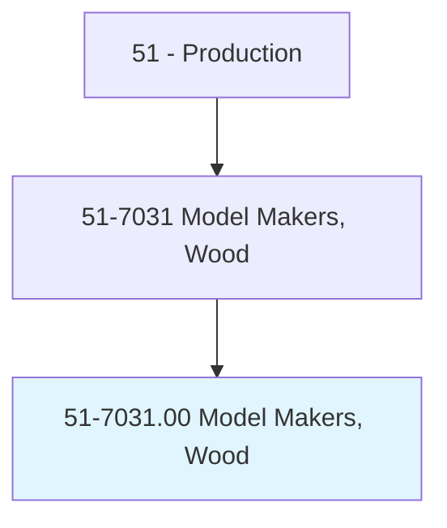
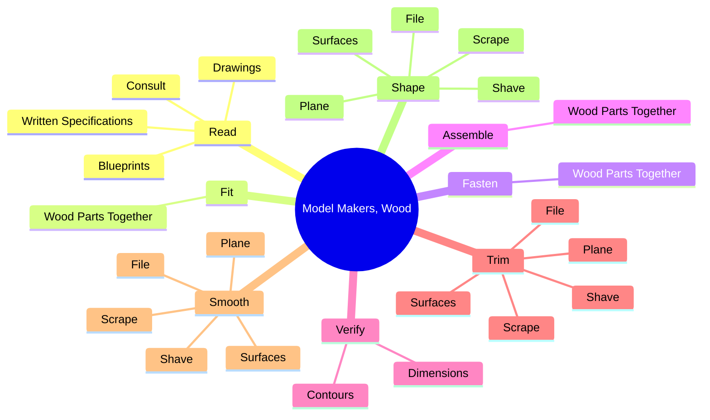
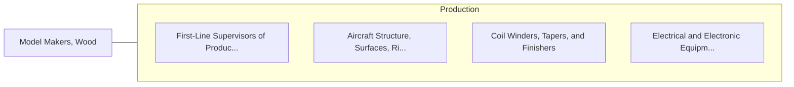

# Model Makers, Wood

> Construct full-size and scale wooden precision models of products. Includes wood jig builders and loft workers.

## Overview

Model Makers, Wood is an occupation within the Production category. Construct full-size and scale wooden precision models of products. 

## Classification Hierarchy

## Key Statistics

| Metric | Value |
|--------|-------|
| SOC Code | 51-7031.00 |
| Category | [Production](/occupations/Production) |
| Task Count | 160 |
| Source | O*NET |

## Core Tasks

### read.Blueprints

Model Makers, Wood read blueprints as part of their core responsibilities.

**Actions:**
- `read.Blueprints.with.Designers.to.determine.Sizes`
- `read.Blueprints.with.Shapes.of.PatternsMachineSetups`
- `read.Blueprints.with.RequiredMachineSetups`
- `read.Drawings.with.Designers.to.determine.Sizes`

### fit.WoodPartsTogether

Model Makers, Wood fit wood parts together as part of their core responsibilities.

**Actions:**
- `fit.WoodPartsTogether.to.form.Patterns`
- `fit.WoodPartsTogether.to.models`
- `fit.WoodPartsTogether.to.Sections`
- `fit.WoodPartsTogether.to.UsingGlue`

### fasten.WoodPartsTogether

Model Makers, Wood fasten wood parts together as part of their core responsibilities.

**Actions:**
- `fasten.WoodPartsTogether.to.form.Patterns`
- `fasten.WoodPartsTogether.to.models`
- `fasten.WoodPartsTogether.to.Sections`
- `fasten.WoodPartsTogether.to.UsingGlue`

## Skills & Competencies

### Technical Skills
- **Machine Operation** - Advanced
- **Quality Control** - Advanced
- **Production Processes** - Advanced

### Soft Skills
- **Communication** - Essential
- **Problem Solving** - Essential
- **Critical Thinking** - Important
- **Teamwork** - Important
- **Adaptability** - Important

## Related Occupations

## Industries

This occupation is found across multiple industries. See [Industries](/industries) for sector-specific employment data.

## Career Progression

---

*Source: O*NET 51-7031.00 - ONETOccupation*
