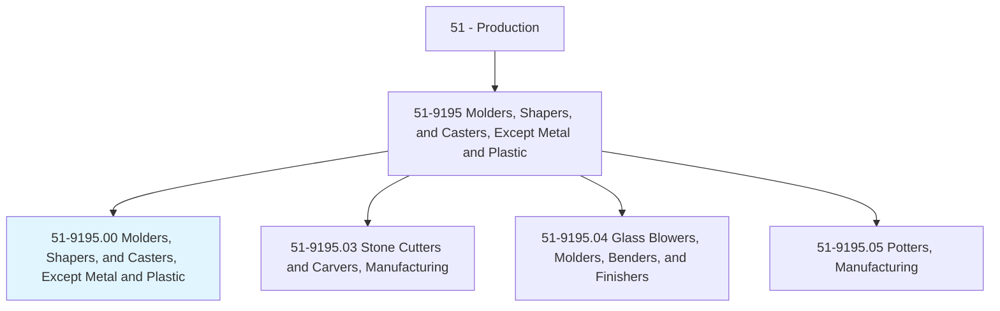
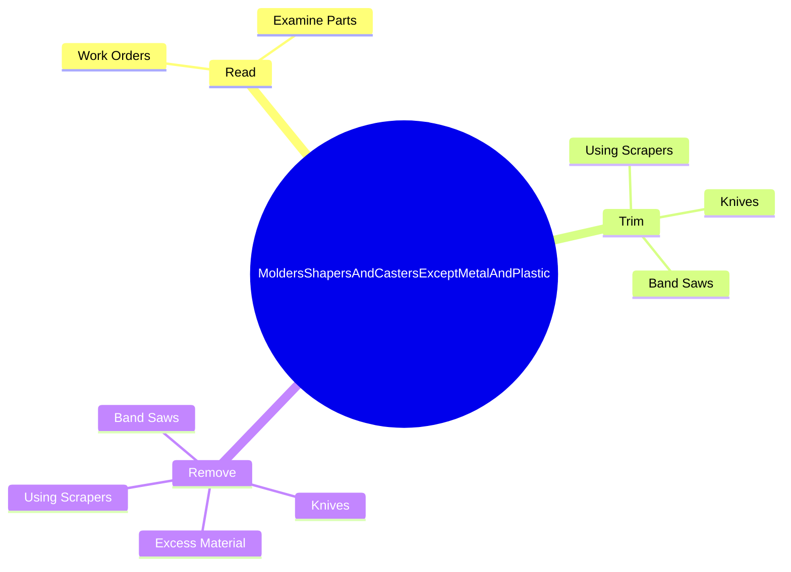

# Molders, Shapers, and Casters, Except Metal and Plastic

> Mold, shape, form, cast, or carve products such as food products, figurines, tile, pipes, and candles consisting of clay, glass, plaster, concrete, stone, or combinations of materials.

## Overview

Molders, Shapers, and Casters, Except Metal and Plastic is classified under Production (SOC 51). Mold, shape, form, cast, or carve products such as food products, figurines, tile, pipes, and candles consisting of clay, glass, plaster, concrete, stone, or combinations of materials.

## Classification Hierarchy

## Key Statistics

| Metric | Value |
|--------|-------|
| SOC Code | 51-9195.00 |
| Category | [Production](/occupations/Production) |
| Task Count | 149 |
| Source | O*NET |

## Core Tasks

### read.WorkOrders

Molders, Shapers, and Casters, Except Metal and Plastic read work orders as part of their core responsibilities.

**Actions:**
- `read.WorkOrders.to.determine.PartsOfProductsToBeProduced`
- `read.WorkOrders.to.SectionsOfProductsToBeProduced`
- `read.ExamineParts.to.determine.PartsOfProductsToBeProduced`
- `read.ExamineParts.to.SectionsOfProductsToBeProduced`

### trim.UsingScrapers

Molders, Shapers, and Casters, Except Metal and Plastic trim using scrapers as part of their core responsibilities.

**Actions:**
- `trim.UsingScrapers`
- `trim.Knives`
- `trim.BandSaws`

### remove.ExcessMaterial

Molders, Shapers, and Casters, Except Metal and Plastic remove excess material as part of their core responsibilities.

**Actions:**
- `remove.ExcessMaterial`
- `remove.UsingScrapers`
- `remove.Knives`
- `remove.BandSaws`

## Skills & Competencies

### Technical Skills
- **Machine Operation** - Advanced
- **Quality Control** - Advanced
- **Production Processes** - Advanced

### Soft Skills
- **Communication** - Essential
- **Problem Solving** - Essential
- **Critical Thinking** - Important
- **Teamwork** - Important
- **Adaptability** - Important

## Related Occupations

## Industries

This occupation is found across multiple industries. See [Industries](/industries) for sector-specific employment data.

## Career Progression

---

*Source: O*NET 51-9195.00 - ONETOccupation*
