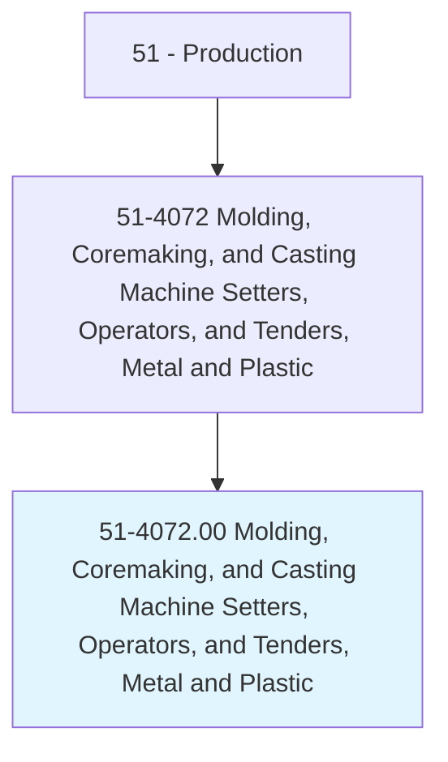
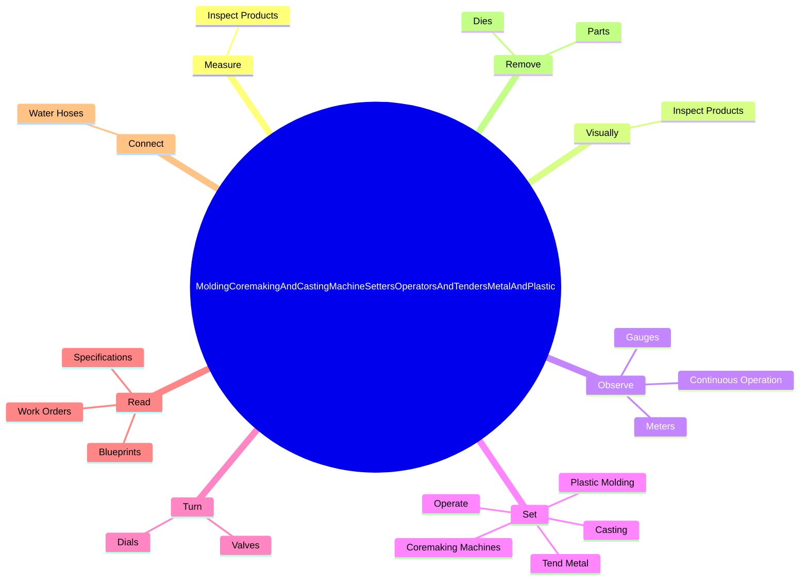

# Molding, Coremaking, and Casting Machine Setters, Operators, and Tenders, Metal and Plastic

> Set up, operate, or tend metal or plastic molding, casting, or coremaking machines to mold or cast metal or thermoplastic parts or products.

## Overview

Molding, Coremaking, and Casting Machine Setters, Operators, and Tenders, Metal and Plastic is classified under Production (SOC 51). Set up, operate, or tend metal or plastic molding, casting, or coremaking machines to mold or cast metal or thermoplastic parts or products.

## Classification Hierarchy

## Key Statistics

| Metric | Value |
|--------|-------|
| SOC Code | 51-4072.00 |
| Category | [Production](/occupations/Production) |
| Task Count | 211 |
| Source | O*NET |

## Core Tasks

### measure.InspectProducts

Molding, Coremaking, and Casting Machine Setters, Operators, and Tenders, Metal and Plastic measure inspect products as part of their core responsibilities.

**Actions:**
- `measure.InspectProducts.for.SurfaceDefects.to.ensure.ConformanceToSpecificationsUsingPrecisionMeasuringInstruments`
- `measure.InspectProducts.for.DimensionDefects.to.ensure.ConformanceToSpecificationsUsingPrecisionMeasuringInstruments`

### visually.InspectProducts

Molding, Coremaking, and Casting Machine Setters, Operators, and Tenders, Metal and Plastic visually inspect products as part of their core responsibilities.

**Actions:**
- `visually.InspectProducts.for.SurfaceDefects.to.ensure.ConformanceToSpecificationsUsingPrecisionMeasuringInstruments`
- `visually.InspectProducts.for.DimensionDefects.to.ensure.ConformanceToSpecificationsUsingPrecisionMeasuringInstruments`

### observe.ContinuousOperation

Molding, Coremaking, and Casting Machine Setters, Operators, and Tenders, Metal and Plastic observe continuous operation as part of their core responsibilities.

**Actions:**
- `observe.ContinuousOperation.of.AutomaticMachines.to.ensure.ProductsMeetSpecificationsDetectJamsMalfunctionsMakingAdjustmentsAsNecessary`
- `observe.ContinuousOperation.of.detect.JamsMalfunctionsMakingAdjustmentsAsNecessary`
- `observe.Meters.to.verify.Temperatures`
- `observe.Meters.to.record.Temperatures`

## Skills & Competencies

### Technical Skills
- **Machine Operation** - Advanced
- **Quality Control** - Advanced
- **Production Processes** - Advanced

### Soft Skills
- **Communication** - Essential
- **Problem Solving** - Essential
- **Critical Thinking** - Important
- **Teamwork** - Important
- **Adaptability** - Important

## Related Occupations

## Industries

This occupation is found across multiple industries. See [Industries](/industries) for sector-specific employment data.

## Career Progression

---

*Source: O*NET 51-4072.00 - ONETOccupation*
