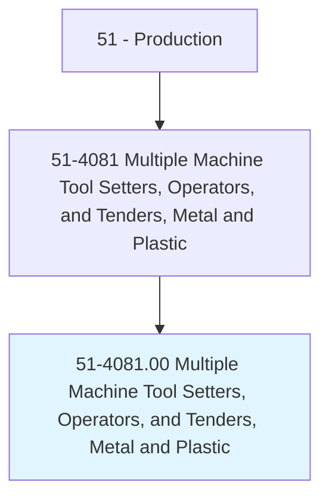
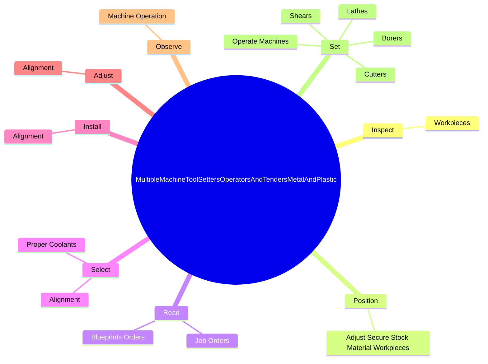

# Multiple Machine Tool Setters, Operators, and Tenders, Metal and Plastic

> Set up, operate, or tend more than one type of cutting or forming machine tool or robot.

## Overview

Multiple Machine Tool Setters, Operators, and Tenders, Metal and Plastic is classified under Production (SOC 51). Set up, operate, or tend more than one type of cutting or forming machine tool or robot.

## Classification Hierarchy

## Key Statistics

| Metric | Value |
|--------|-------|
| SOC Code | 51-4081.00 |
| Category | [Production](/occupations/Production/index) |
| Task Count | 166 |
| Source | O*NET |

## Core Tasks

### inspect.Workpieces

Multiple Machine Tool Setters, Operators, and Tenders, Metal and Plastic inspect workpieces as part of their core responsibilities.

**Actions:**
- `inspect.Workpieces.for.Defects`
- `inspect.Workpieces.for.MeasureWorkpieces.to.determine.AccuracyOfMachineOperation`
- `inspect.Workpieces.for.UsingRules`
- `inspect.Workpieces.for.Templates`

### position.AdjustSecureStockMaterialWorkpieces

Multiple Machine Tool Setters, Operators, and Tenders, Metal and Plastic position adjust secure stock material workpieces as part of their core responsibilities.

**Actions:**
- `position.AdjustSecureStockMaterialWorkpieces.against.Stops.on.ArborsInChucksFixturesAutomaticFeedingMechanismsManuallyUsingHoists`

### read.BlueprintsOrders

Multiple Machine Tool Setters, Operators, and Tenders, Metal and Plastic read blueprints orders as part of their core responsibilities.

**Actions:**
- `read.BlueprintsOrders.to.determine.ProductspecificationsInstructionsToPlanOperationalSequences`
- `read.BlueprintsOrders.to.ToolingInstructionsToPlanOperationalSequences`
- `read.JobOrders.to.determine.ProductspecificationsInstructionsToPlanOperationalSequences`
- `read.JobOrders.to.ToolingInstructionsToPlanOperationalSequences`

## Skills & Competencies

### Technical Skills
- **Machine Operation** - Advanced
- **Quality Control** - Advanced
- **Production Processes** - Advanced

### Soft Skills
- **Communication** - Essential
- **Problem Solving** - Essential
- **Critical Thinking** - Important
- **Teamwork** - Important
- **Adaptability** - Important

## Related Occupations

## Industries

This occupation is found across multiple industries. See [Industries](/industries) for sector-specific employment data.

## Career Progression

---

*Source: O*NET 51-4081.00 - ONETOccupation*
