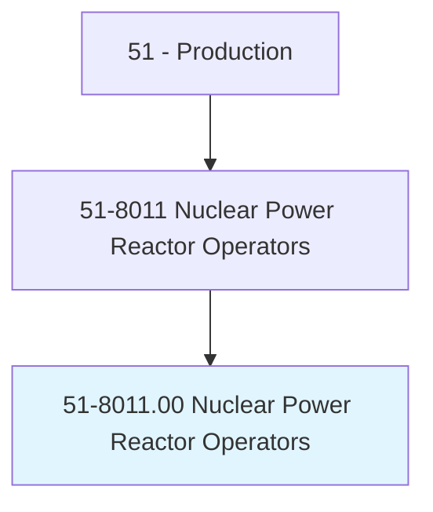
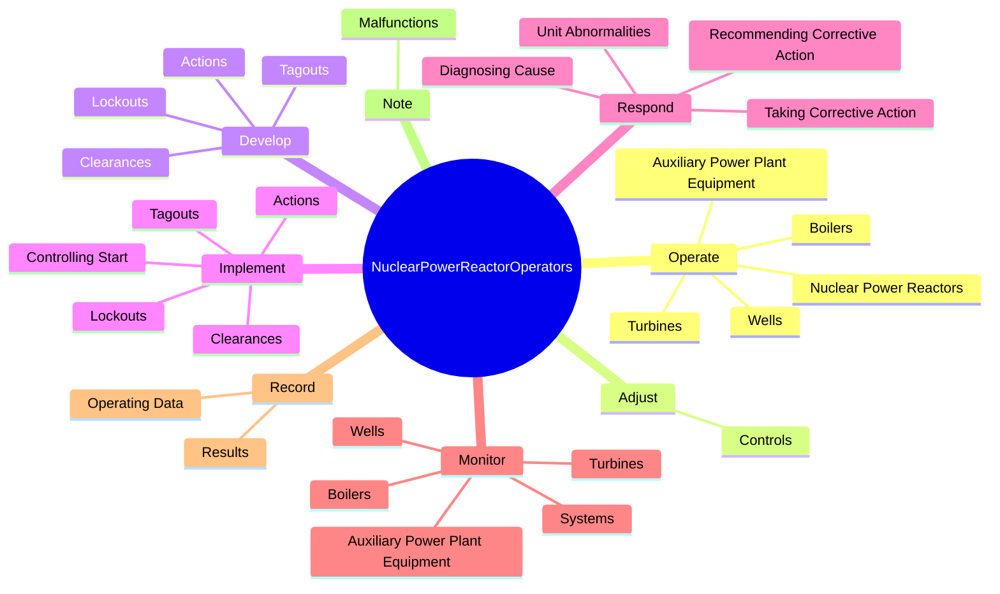
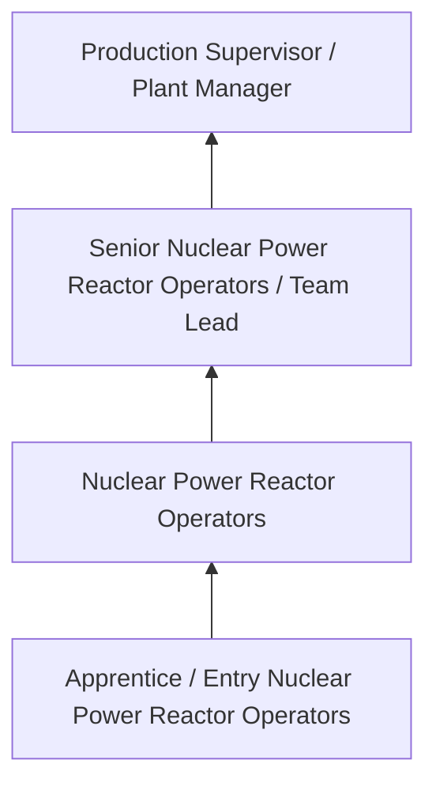
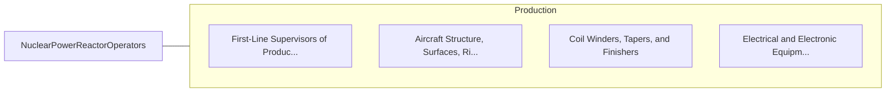

# Nuclear Power Reactor Operators

> Operate or control nuclear reactors. Move control rods, start and stop equipment, monitor and adjust controls, and record data in logs. Implement emergency procedures when needed. May respond to abnormalities, determine cause, and recommend corrective action.

## Overview

Nuclear Power Reactor Operators professionals operate or control nuclear reactors. This occupation falls within the Production category and requires a combination of specialized knowledge, technical skills, and practical experience.

These professionals work across diverse settings and organizational contexts, applying their expertise to meet the demands of their field. They must stay current with industry standards, emerging practices, and regulatory requirements that affect their work. The role demands both independent judgment and collaborative skills, as practitioners regularly interact with colleagues, stakeholders, and the public.

As the field continues to evolve, Nuclear Power Reactor Operators professionals increasingly leverage technology and data-driven approaches to enhance their effectiveness. Career opportunities span the public and private sectors, with demand influenced by economic conditions, demographic shifts, and technological advancement.

## Classification Hierarchy



## Key Statistics

| Metric | Value |
|--------|-------|
| SOC Code | 51-8011.00 |
| Job Zone | N/A |
| Category | [Production](/occupations/Production/index) |
| Core Tasks | 76+ |
| Salary Range | $28,000 - $65,000 |
| Median Salary | $40,000 |
| Growth Outlook | 1% (Little or no change) |
| Source | O*NET |

## Core Tasks



### direct.ReactorOperators

Nuclear Power Reactor Operators direct reactor operators as part of their core responsibilities.

**Actions:**
- `direct.ReactorOperators.in.EmergencySituations` - Direct reactor operators in emergency situations, in accordance with emergenc...
- `direct.ReactorOperators.in.InAccordanceWithEmergencyOperatingProcedures` - Direct reactor operators in emergency situations, in accordance with emergenc...
- `direct.Collection.of.Air` - Direct the collection and testing of air, water, gas, or solid samples to det...
- `direct.Collection.of.Water` - Direct the collection and testing of air, water, gas, or solid samples to det...
- `direct.Collection.of.Gas` - Direct the collection and testing of air, water, gas, or solid samples to det...

### monitor.Systems

Nuclear Power Reactor Operators monitor systems as part of their core responsibilities.

**Actions:**
- `monitor.Systems.for.NormalRunningConditions` - Monitor all systems for normal running conditions, performing activities such...
- `monitor.Systems.for.PerformingActivities` - Monitor all systems for normal running conditions, performing activities such...
- `monitor.Systems.for.CheckingGauges.to.assess.Output` - Monitor all systems for normal running conditions, performing activities such...
- `monitor.Systems.for.Effects.of.GeneratorLoadingOnOtherEquipment` - Monitor all systems for normal running conditions, performing activities such...
- `monitor.Boilers` - Monitor or operate boilers, turbines, wells, or auxiliary power plant equipment.

### adjust.Controls

Nuclear Power Reactor Operators adjust controls as part of their core responsibilities.

**Actions:**
- `adjust.Controls.to.position.RodRegulateFluxLevel` - Adjust controls to position rod and to regulate flux level, reactor period, c...
- `adjust.Controls.to.ToRegulateFluxLevel` - Adjust controls to position rod and to regulate flux level, reactor period, c...
- `adjust.Controls.to.react` - Adjust controls to position rod and to regulate flux level, reactor period, c...
- `adjust.Controls.to.Period` - Adjust controls to position rod and to regulate flux level, reactor period, c...
- `adjust.Controls.to.CoolantTemperature` - Adjust controls to position rod and to regulate flux level, reactor period, c...

### operate.NuclearPowerReactors

Nuclear Power Reactor Operators operate nuclear power reactors as part of their core responsibilities.

**Actions:**
- `operate.NuclearPowerReactors.in.AccordanceWithPolicies.to.protect.WorkersFromRadiationToEnsureEnvironmentalSafety` - Operate nuclear power reactors in accordance with policies and procedures to ...
- `operate.NuclearPowerReactors.in.Procedures.to.protect.WorkersFromRadiationToEnsureEnvironmentalSafety` - Operate nuclear power reactors in accordance with policies and procedures to ...
- `operate.Boilers` - Monitor or operate boilers, turbines, wells, or auxiliary power plant equipment.
- `operate.Turbines` - Monitor or operate boilers, turbines, wells, or auxiliary power plant equipment.
- `operate.Wells` - Monitor or operate boilers, turbines, wells, or auxiliary power plant equipment.


## Skills & Competencies

### Technical Skills
- **Machine Operation** - Advanced
- **Quality Inspection** - Advanced
- **Safety Procedures** - Advanced
- **Blueprint Reading** - Proficient
- **Measurement Tools** - Proficient
- **Process Control** - Proficient

### Soft Skills
- **Attention to Detail** - Critical
- **Reliability** - Critical
- **Physical Dexterity** - Essential
- **Teamwork** - Essential
- **Problem Solving** - Important

## Education & Certifications

| Requirement | Details |
|-------------|---------|
| Typical Education | High school diploma or equivalent; some positions require technical training |
| Work Experience | 0-2 years manufacturing experience |
| On-the-Job Training | Moderate - equipment operation and safety procedures |
| Certifications | OSHA certifications, quality management certifications |

## Career Progression



## Industry Variations

### Discrete Manufacturing
Assembly of distinct products such as automobiles, electronics, or machinery. Nuclear Power Reactor Operators professionals work with precision equipment and quality standards.

### Process Manufacturing
Continuous production of chemicals, food, or materials. Focus on process control and consistency.

### Custom and Job Shop
Small-batch or custom production work. Requires versatility and ability to adapt to varied specifications.

### Automated Manufacturing
Technology-driven production with robotics and advanced systems. Increasing emphasis on programming and monitoring skills.

## Technology & Tools

- **Manufacturing execution systems (MES)**
- **Computer numerical control (CNC) machines**
- **Quality management software**
- **Programmable logic controllers (PLC)**
- **Enterprise resource planning (ERP) systems**

## Related Occupations



## Industries

- [Manufacturing](/industries/Manufacturing) - High Employment
- Food Processing - High Employment
- [Automotive](/industries/Manufacturing) - Moderate Employment
- [Electronics](/industries/Electronics) - Moderate Employment

## Departments

This occupation typically works in:
- [Manufacturing](/departments/Operations)
- Quality Control
- Production Planning

## GraphDL Semantic Structure

```graphdl
Nuclear Power Reactor Operators perform:
- operate.NuclearPowerReactors.in.AccordanceWithPolicies.to.protect.WorkersFromRadiationToEnsureEnvironmentalSafety
- operate.NuclearPowerReactors.in.Procedures.to.protect.WorkersFromRadiationToEnsureEnvironmentalSafety
- adjust.Controls.to.position.RodRegulateFluxLevel
- adjust.Controls.to.ToRegulateFluxLevel
- adjust.Controls.to.react
- adjust.Controls.to.Period
```

---

*Source: O*NET 51-8011.00 - ONETOccupation*
