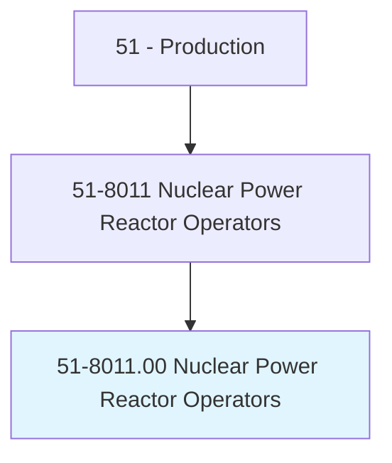
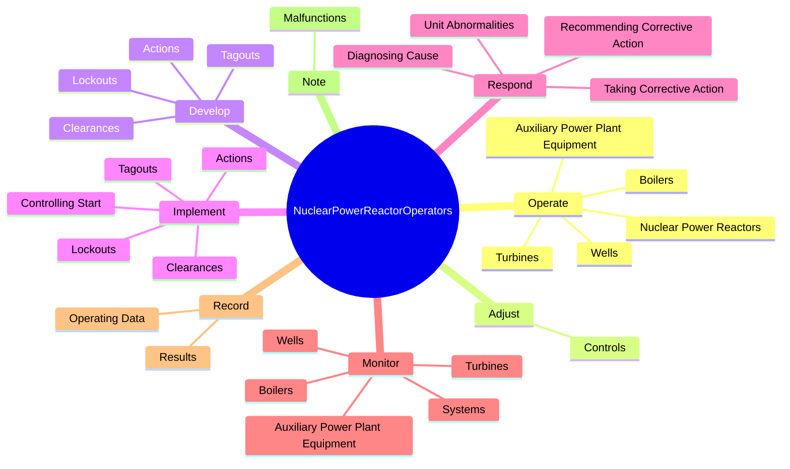
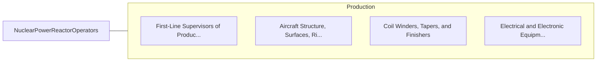

# Nuclear Power Reactor Operators

> Operate or control nuclear reactors. Move control rods, start and stop equipment, monitor and adjust controls, and record data in logs. Implement emergency procedures when needed. May respond to abnormalities, determine cause, and recommend corrective action.

## Overview

Nuclear Power Reactor Operators is an occupation within the Production category. Operate or control nuclear reactors. Move control rods, start and stop equipment, monitor and adjust controls, and record data in logs.

## Classification Hierarchy

## Key Statistics

| Metric | Value |
|--------|-------|
| SOC Code | 51-8011.00 |
| Category | [Production](/occupations/Production) |
| Task Count | 76 |
| Source | O*NET |

## Core Tasks

### operate.NuclearPowerReactors

Nuclear Power Reactor Operators operate nuclear power reactors as part of their core responsibilities.

**Actions:**
- `operate.NuclearPowerReactors.in.AccordanceWithPolicies.to.protect.WorkersFromRadiationToEnsureEnvironmentalSafety`
- `operate.NuclearPowerReactors.in.Procedures.to.protect.WorkersFromRadiationToEnsureEnvironmentalSafety`
- `operate.Boilers`
- `operate.Turbines`

### adjust.Controls

Nuclear Power Reactor Operators adjust controls as part of their core responsibilities.

**Actions:**
- `adjust.Controls.to.position.RodRegulateFluxLevel`
- `adjust.Controls.to.ToRegulateFluxLevel`
- `adjust.Controls.to.react`
- `adjust.Controls.to.Period`

### develop.Actions

Nuclear Power Reactor Operators develop actions as part of their core responsibilities.

**Actions:**
- `develop.Actions.to.allow.EquipmentToBeSafelyRepaired`
- `develop.Lockouts.to.allow.EquipmentToBeSafelyRepaired`
- `develop.Tagouts.to.allow.EquipmentToBeSafelyRepaired`
- `develop.Clearances.to.allow.EquipmentToBeSafelyRepaired`

## Skills & Competencies

### Technical Skills
- **Machine Operation** - Advanced
- **Quality Control** - Advanced
- **Production Processes** - Advanced

### Soft Skills
- **Communication** - Essential
- **Problem Solving** - Essential
- **Critical Thinking** - Important
- **Teamwork** - Important
- **Adaptability** - Important

## Related Occupations

## Industries

This occupation is found across multiple industries. See [Industries](/industries) for sector-specific employment data.

## Career Progression

---

*Source: O*NET 51-8011.00 - ONETOccupation*
