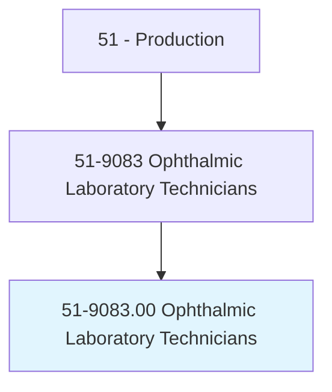
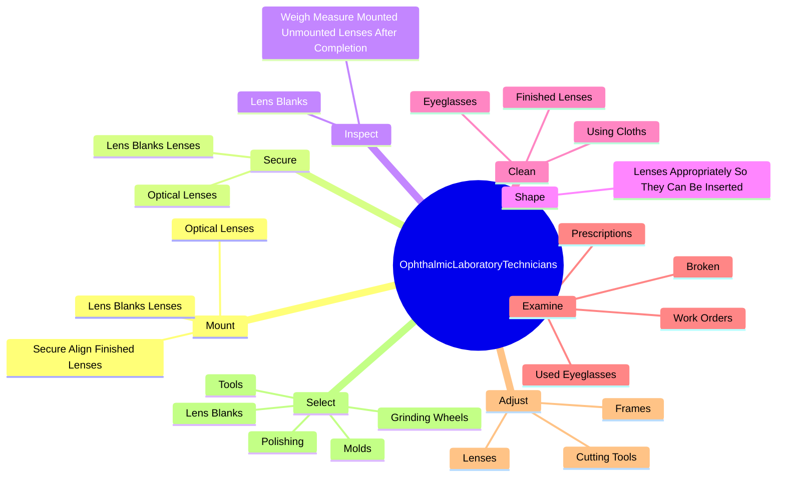
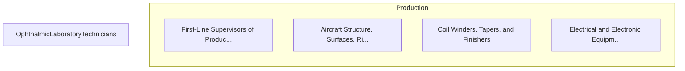

# Ophthalmic Laboratory Technicians

> Cut, grind, and polish eyeglasses, contact lenses, or other precision optical elements. Assemble and mount lenses into frames or process other optical elements. Includes precision lens polishers or grinders, centerer-edgers, and lens mounters.

## Overview

Ophthalmic Laboratory Technicians is an occupation within the Production category. Cut, grind, and polish eyeglasses, contact lenses, or other precision optical elements. Assemble and mount lenses into frames or process other optical elements.

## Classification Hierarchy

## Key Statistics

| Metric | Value |
|--------|-------|
| SOC Code | 51-9083.00 |
| Category | [Production](/occupations/Production) |
| Task Count | 76 |
| Source | O*NET |

## Core Tasks

### mount.LensBlanksLenses

Ophthalmic Laboratory Technicians mount lens blanks lenses as part of their core responsibilities.

**Actions:**
- `mount.LensBlanksLenses.in.HoldingTools`
- `mount.LensBlanksLenses.in.Chucks.of.Cutting`
- `mount.LensBlanksLenses.in.Polishing`
- `mount.LensBlanksLenses.in.Grinding`

### secure.LensBlanksLenses

Ophthalmic Laboratory Technicians secure lens blanks lenses as part of their core responsibilities.

**Actions:**
- `secure.LensBlanksLenses.in.HoldingTools`
- `secure.LensBlanksLenses.in.Chucks.of.Cutting`
- `secure.LensBlanksLenses.in.Polishing`
- `secure.LensBlanksLenses.in.Grinding`

### inspect.LensBlanks

Ophthalmic Laboratory Technicians inspect lens blanks as part of their core responsibilities.

**Actions:**
- `inspect.LensBlanks.to.detect.Flaws`
- `inspect.LensBlanks.to.verify.SmoothnessOfSurface`
- `inspect.LensBlanks.to.ensure.ThicknessOfCoatingOnLenses`
- `inspect.WeighMeasureMountedUnmountedLensesAfterCompletion.to.verify.AlignmentConformanceToSpecificationsUsingPrecisionInstruments`

## Skills & Competencies

### Technical Skills
- **Machine Operation** - Advanced
- **Quality Control** - Advanced
- **Production Processes** - Advanced

### Soft Skills
- **Communication** - Essential
- **Problem Solving** - Essential
- **Critical Thinking** - Important
- **Teamwork** - Important
- **Adaptability** - Important

## Related Occupations

## Industries

This occupation is found across multiple industries. See [Industries](/industries) for sector-specific employment data.

## Career Progression

---

*Source: O*NET 51-9083.00 - ONETOccupation*
