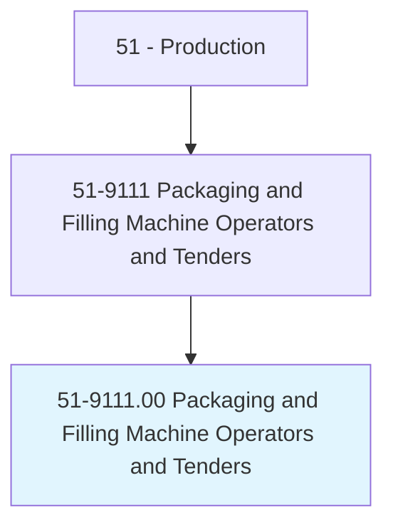
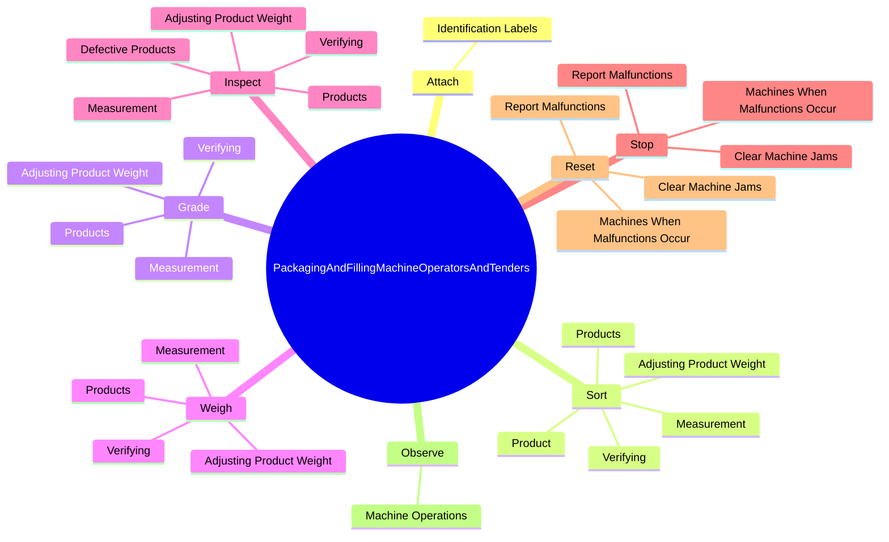
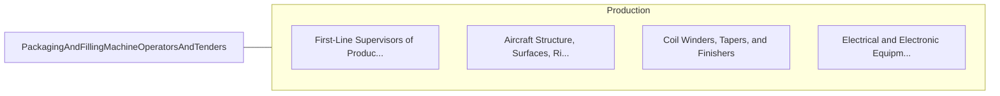

# Packaging and Filling Machine Operators and Tenders

> Operate or tend machines to prepare industrial or consumer products for storage or shipment. Includes cannery workers who pack food products.

## Overview

Packaging and Filling Machine Operators and Tenders is an occupation within the Production category. Operate or tend machines to prepare industrial or consumer products for storage or shipment. 

## Classification Hierarchy

## Key Statistics

| Metric | Value |
|--------|-------|
| SOC Code | 51-9111.00 |
| Category | [Production](/occupations/Production) |
| Task Count | 131 |
| Source | O*NET |

## Core Tasks

### attach.IdentificationLabels

Packaging and Filling Machine Operators and Tenders attach identification labels as part of their core responsibilities.

**Actions:**
- `attach.IdentificationLabels.to.finished.PackagedItems`
- `attach.IdentificationLabels.to.CutStencils`
- `attach.IdentificationLabels.to.stencil.InformationOnContainers`
- `attach.IdentificationLabels.to.LotNumbers`

### sort.Products

Packaging and Filling Machine Operators and Tenders sort products as part of their core responsibilities.

**Actions:**
- `sort.Products.to.meet.Specifications`
- `sort.Verifying.to.meet.Specifications`
- `sort.AdjustingProductWeight.to.meet.Specifications`
- `sort.Measurement.to.meet.Specifications`

### grade.Products

Packaging and Filling Machine Operators and Tenders grade products as part of their core responsibilities.

**Actions:**
- `grade.Products.to.meet.Specifications`
- `grade.Verifying.to.meet.Specifications`
- `grade.AdjustingProductWeight.to.meet.Specifications`
- `grade.Measurement.to.meet.Specifications`

## Skills & Competencies

### Technical Skills
- **Machine Operation** - Advanced
- **Quality Control** - Advanced
- **Production Processes** - Advanced

### Soft Skills
- **Communication** - Essential
- **Problem Solving** - Essential
- **Critical Thinking** - Important
- **Teamwork** - Important
- **Adaptability** - Important

## Related Occupations

## Industries

This occupation is found across multiple industries. See [Industries](/industries) for sector-specific employment data.

## Career Progression

---

*Source: O*NET 51-9111.00 - ONETOccupation*
