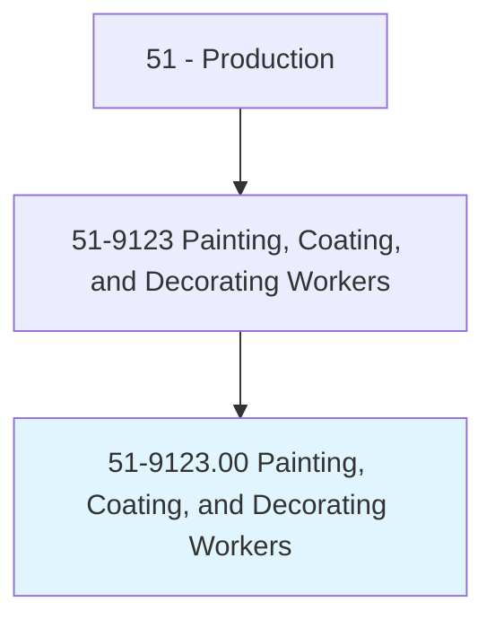
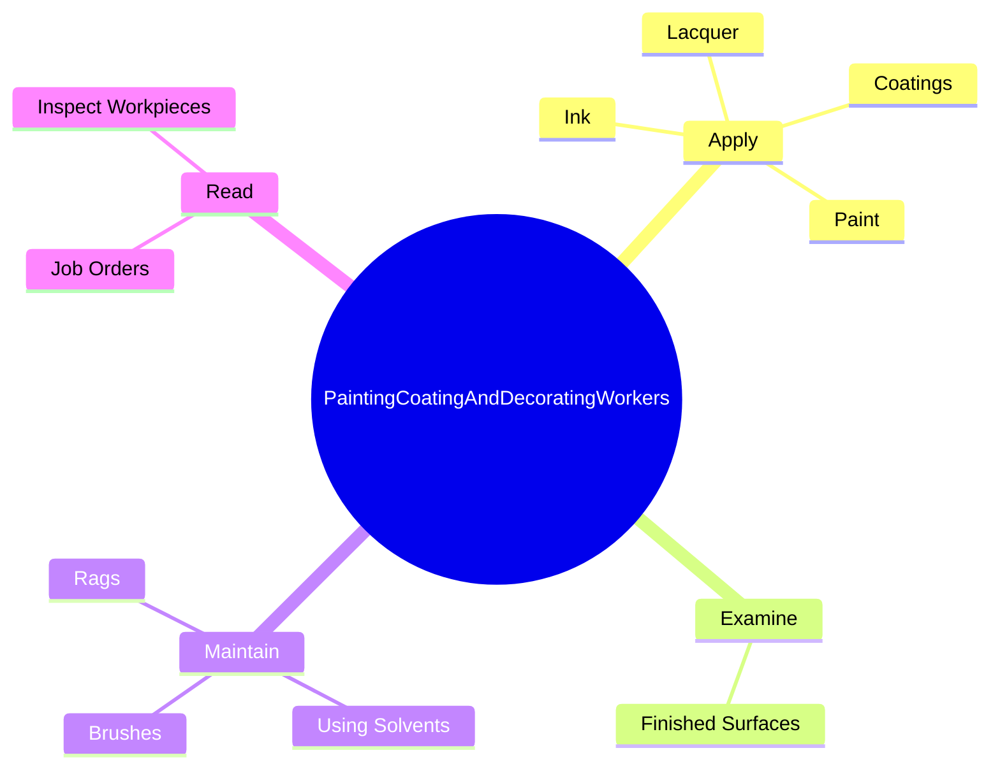
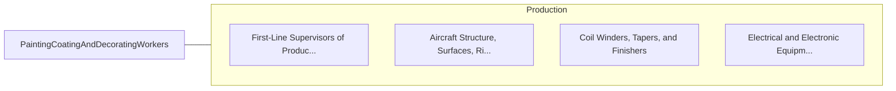

# Painting, Coating, and Decorating Workers

> Paint, coat, or decorate articles, such as furniture, glass, plateware, pottery, jewelry, toys, books, or leather.

## Overview

Painting, Coating, and Decorating Workers is classified under Production (SOC 51). Paint, coat, or decorate articles, such as furniture, glass, plateware, pottery, jewelry, toys, books, or leather.

## Classification Hierarchy

## Key Statistics

| Metric | Value |
|--------|-------|
| SOC Code | 51-9123.00 |
| Category | [Production](/occupations/Production) |
| Task Count | 56 |
| Source | O*NET |

## Core Tasks

### apply.Coatings

Painting, Coating, and Decorating Workers apply coatings as part of their core responsibilities.

**Actions:**
- `apply.Coatings.to.protect.WorkpieceSurfaces`
- `apply.Coatings.to.decorate.WorkpieceSurfaces`
- `apply.Coatings.to.UsingSprayGuns`
- `apply.Coatings.to.Pens`

### examine.FinishedSurfaces

Painting, Coating, and Decorating Workers examine finished surfaces as part of their core responsibilities.

**Actions:**
- `examine.FinishedSurfaces.of.Workpieces.to.verify.ConformanceToSpecifications`
- `examine.FinishedSurfaces.of.RetouchDefectiveAreas`

### maintain.UsingSolvents

Painting, Coating, and Decorating Workers maintain using solvents as part of their core responsibilities.

**Actions:**
- `maintain.UsingSolvents`
- `maintain.Brushes`
- `maintain.Rags`

## Skills & Competencies

### Technical Skills
- **Machine Operation** - Advanced
- **Quality Control** - Advanced
- **Production Processes** - Advanced

### Soft Skills
- **Communication** - Essential
- **Problem Solving** - Essential
- **Critical Thinking** - Important
- **Teamwork** - Important
- **Adaptability** - Important

## Related Occupations

## Industries

This occupation is found across multiple industries. See [Industries](/industries) for sector-specific employment data.

## Career Progression

---

*Source: O*NET 51-9123.00 - ONETOccupation*
