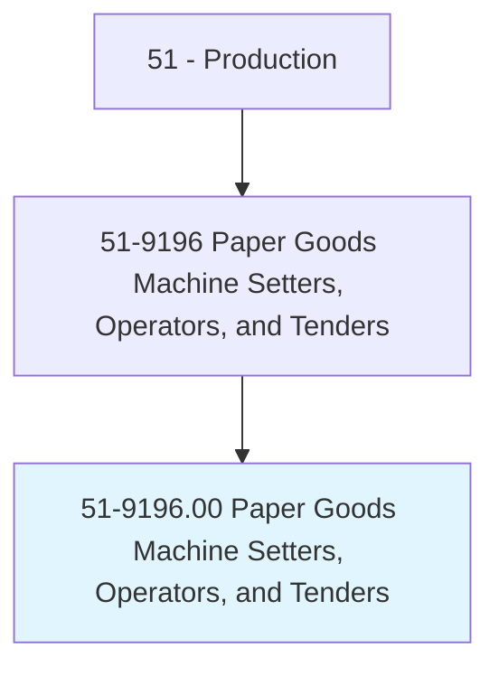
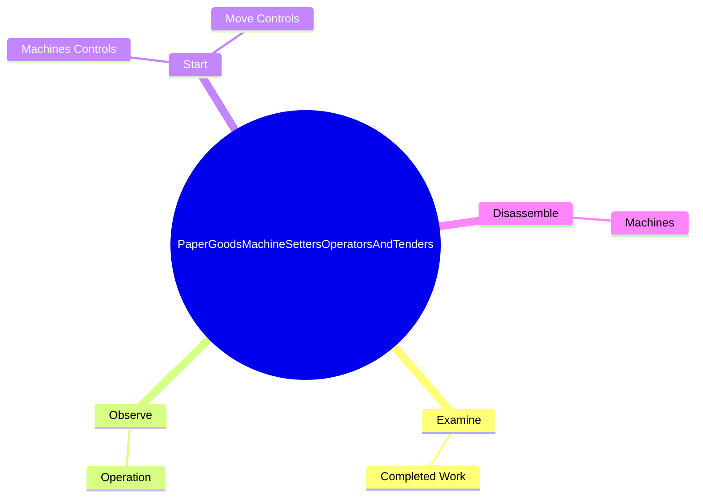
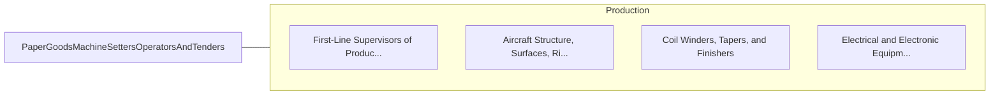

# Paper Goods Machine Setters, Operators, and Tenders

> Set up, operate, or tend paper goods machines that perform a variety of functions, such as converting, sawing, corrugating, banding, wrapping, boxing, stitching, forming, or sealing paper or paperboard sheets into products.

## Overview

Paper Goods Machine Setters, Operators, and Tenders is classified under Production (SOC 51). Set up, operate, or tend paper goods machines that perform a variety of functions, such as converting, sawing, corrugating, banding, wrapping, boxing, stitching, forming, or sealing paper or paperboard sheets into products.

## Classification Hierarchy

## Key Statistics

| Metric | Value |
|--------|-------|
| SOC Code | 51-9196.00 |
| Category | [Production](/occupations/Production/index) |
| Task Count | 56 |
| Source | O*NET |

## Core Tasks

### examine.CompletedWork

Paper Goods Machine Setters, Operators, and Tenders examine completed work as part of their core responsibilities.

**Actions:**
- `examine.CompletedWork.to.detect.Defects`
- `examine.CompletedWork.to.verify.ConformanceToWorkOrders`
- `examine.CompletedWork.to.adjust.MachineryAsNecessaryToCorrectProductionProblems`

### observe.Operation

Paper Goods Machine Setters, Operators, and Tenders observe operation as part of their core responsibilities.

**Actions:**
- `observe.Operation.of.VariousMachines.to.Detect`
- `observe.Operation.of.CorrectMachineMalfunctions`
- `observe.Operation.of.ImproperForming`
- `observe.Operation.of.GlueFlow`

### start.MachinesControls

Paper Goods Machine Setters, Operators, and Tenders start machines controls as part of their core responsibilities.

**Actions:**
- `start.MachinesControls.to.regulate.TensionOnPressureRolls`
- `start.MachinesControls.to.ToSynchronizeSpeedOfMachineComponents`
- `start.MachinesControls.to.ToAdjustTemperaturesOfGlue`
- `start.MachinesControls.to.Paraffin`

## Skills & Competencies

### Technical Skills
- **Machine Operation** - Advanced
- **Quality Control** - Advanced
- **Production Processes** - Advanced

### Soft Skills
- **Communication** - Essential
- **Problem Solving** - Essential
- **Critical Thinking** - Important
- **Teamwork** - Important
- **Adaptability** - Important

## Related Occupations

## Industries

This occupation is found across multiple industries. See [Industries](/industries) for sector-specific employment data.

## Career Progression

---

*Source: O*NET 51-9196.00 - ONETOccupation*
