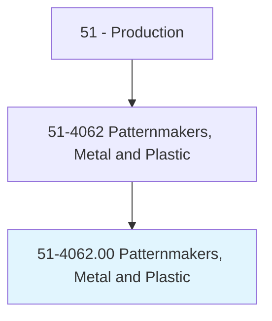
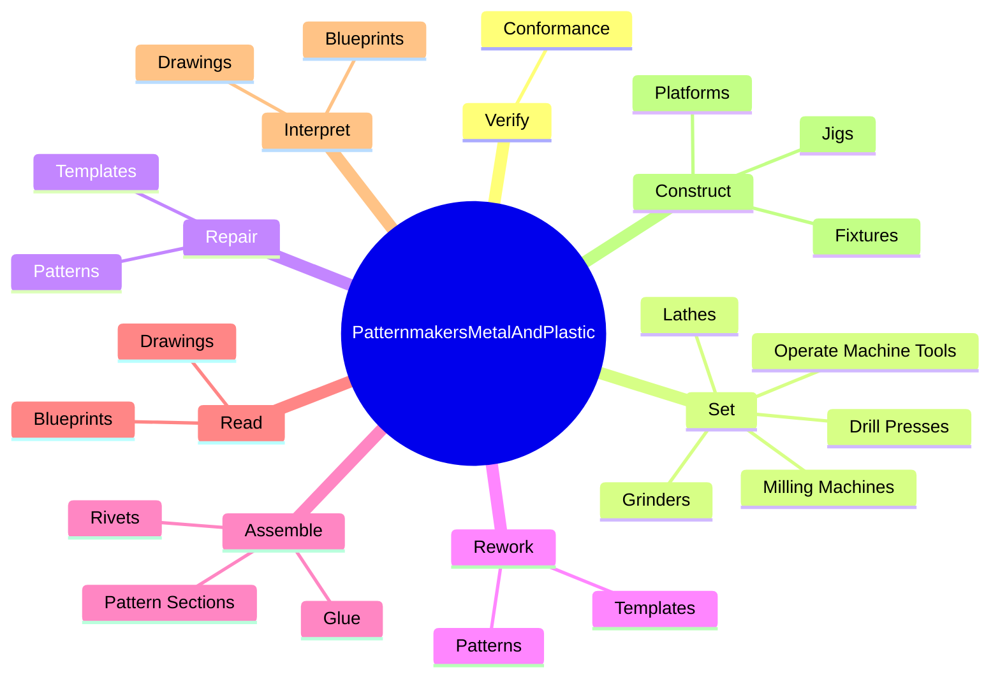

# Patternmakers, Metal and Plastic

> Lay out, machine, fit, and assemble castings and parts to metal or plastic foundry patterns, core boxes, or match plates.

## Overview

Patternmakers, Metal and Plastic is classified under Production (SOC 51). Lay out, machine, fit, and assemble castings and parts to metal or plastic foundry patterns, core boxes, or match plates.

## Classification Hierarchy

## Key Statistics

| Metric | Value |
|--------|-------|
| SOC Code | 51-4062.00 |
| Category | [Production](/occupations/Production) |
| Task Count | 93 |
| Source | O*NET |

## Core Tasks

### verify.Conformance

Patternmakers, Metal and Plastic verify conformance as part of their core responsibilities.

**Actions:**
- `verify.Conformance.of.PatternsDimensionsToSpecificationsUsingMeasuringInstruments`
- `verify.Conformance.of.TemplateDimensionsToSpecificationsUsingMeasuringInstruments`
- `verify.Conformance.of.Scales`

### set.OperateMachineTools

Patternmakers, Metal and Plastic set operate machine tools as part of their core responsibilities.

**Actions:**
- `set.OperateMachineTools.to.machine.Castings`
- `set.OperateMachineTools.to.Patterns`
- `set.MillingMachines.to.machine.Castings`
- `set.MillingMachines.to.Patterns`

### repair.Templates

Patternmakers, Metal and Plastic repair templates as part of their core responsibilities.

**Actions:**
- `repair.Templates`
- `repair.Patterns`

## Skills & Competencies

### Technical Skills
- **Machine Operation** - Advanced
- **Quality Control** - Advanced
- **Production Processes** - Advanced

### Soft Skills
- **Communication** - Essential
- **Problem Solving** - Essential
- **Critical Thinking** - Important
- **Teamwork** - Important
- **Adaptability** - Important

## Related Occupations

## Industries

This occupation is found across multiple industries. See [Industries](/industries) for sector-specific employment data.

## Career Progression

---

*Source: O*NET 51-4062.00 - ONETOccupation*
