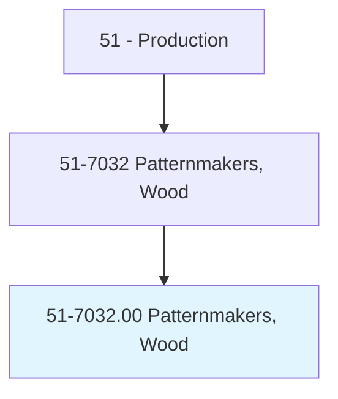
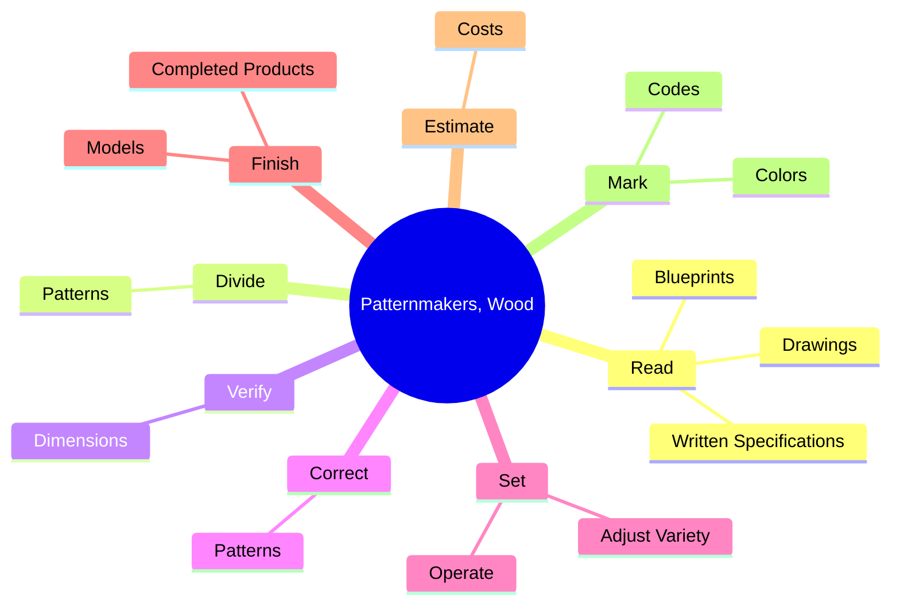

# Patternmakers, Wood

> Plan, lay out, and construct wooden unit or sectional patterns used in forming sand molds for castings.

## Overview

Patternmakers, Wood is classified under Production (SOC 51). Plan, lay out, and construct wooden unit or sectional patterns used in forming sand molds for castings.

## Classification Hierarchy

## Key Statistics

| Metric | Value |
|--------|-------|
| SOC Code | 51-7032.00 |
| Category | [Production](/occupations/Production/index) |
| Task Count | 47 |
| Source | O*NET |

## Core Tasks

### read.Blueprints

Patternmakers, Wood read blueprints as part of their core responsibilities.

**Actions:**
- `read.Blueprints.to.determine.Sizes`
- `read.Blueprints.to.shapes.OfPatternsMachineSetups`
- `read.Blueprints.to.RequiredMachineSetups`
- `read.Drawings.to.determine.Sizes`

### divide.Patterns

Patternmakers, Wood divide patterns as part of their core responsibilities.

**Actions:**
- `divide.Patterns.into.SectionsAccording.to.shapes.OfCastingsToFacilitateRemovalOfPatternsFromMolds`

### verify.Dimensions

Patternmakers, Wood verify dimensions as part of their core responsibilities.

**Actions:**
- `verify.Dimensions.of.CompletedPatterns`
- `verify.Dimensions.of.Straightedges`
- `verify.Dimensions.of.Protractors`

## Skills & Competencies

### Technical Skills
- **Machine Operation** - Advanced
- **Quality Control** - Advanced
- **Production Processes** - Advanced

### Soft Skills
- **Communication** - Essential
- **Problem Solving** - Essential
- **Critical Thinking** - Important
- **Teamwork** - Important
- **Adaptability** - Important

## Related Occupations

## Industries

This occupation is found across multiple industries. See [Industries](/industries) for sector-specific employment data.

## Career Progression

---

*Source: O*NET 51-7032.00 - ONETOccupation*
