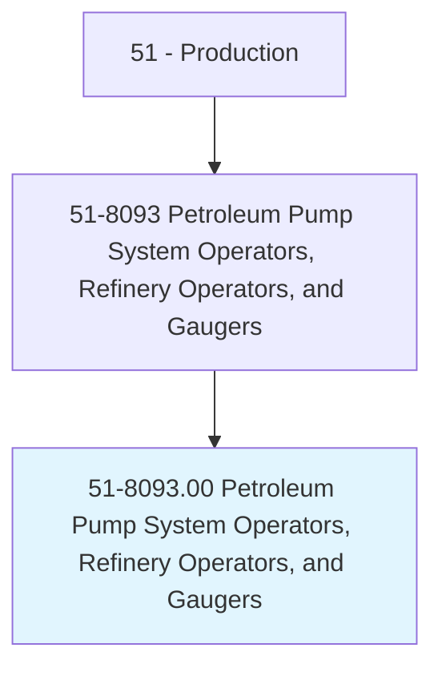
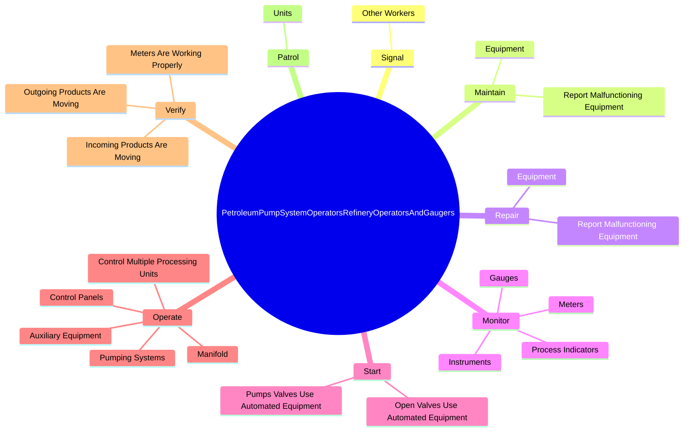

# Petroleum Pump System Operators, Refinery Operators, and Gaugers

> Operate or control petroleum refining or processing units. May specialize in controlling manifold and pumping systems, gauging or testing oil in storage tanks, or regulating the flow of oil into pipelines.

## Overview

Petroleum Pump System Operators, Refinery Operators, and Gaugers is an occupation within the Production category. Operate or control petroleum refining or processing units. 

## Classification Hierarchy

## Key Statistics

| Metric | Value |
|--------|-------|
| SOC Code | 51-8093.00 |
| Category | [Production](/occupations/Production) |
| Task Count | 105 |
| Source | O*NET |

## Core Tasks

### signal.OtherWorkers

Petroleum Pump System Operators, Refinery Operators, and Gaugers signal other workers as part of their core responsibilities.

**Actions:**
- `signal.OtherWorkers.by.Telephone.to.operate.Pumps`
- `signal.OtherWorkers.by.Radio.to.operate.Pumps`
- `signal.OtherWorkers.by.Open`
- `signal.OtherWorkers.by.CloseValves`

### maintain.Equipment

Petroleum Pump System Operators, Refinery Operators, and Gaugers maintain equipment as part of their core responsibilities.

**Actions:**
- `maintain.Equipment.to.SupervisorsSoRepairsCanBeScheduled`
- `maintain.ReportMalfunctioningEquipment.to.SupervisorsSoRepairsCanBeScheduled`

### repair.Equipment

Petroleum Pump System Operators, Refinery Operators, and Gaugers repair equipment as part of their core responsibilities.

**Actions:**
- `repair.Equipment.to.SupervisorsSoRepairsCanBeScheduled`
- `repair.ReportMalfunctioningEquipment.to.SupervisorsSoRepairsCanBeScheduled`

## Skills & Competencies

### Technical Skills
- **Machine Operation** - Advanced
- **Quality Control** - Advanced
- **Production Processes** - Advanced

### Soft Skills
- **Communication** - Essential
- **Problem Solving** - Essential
- **Critical Thinking** - Important
- **Teamwork** - Important
- **Adaptability** - Important

## Related Occupations

## Industries

This occupation is found across multiple industries. See [Industries](/industries) for sector-specific employment data.

## Career Progression

---

*Source: O*NET 51-8093.00 - ONETOccupation*
