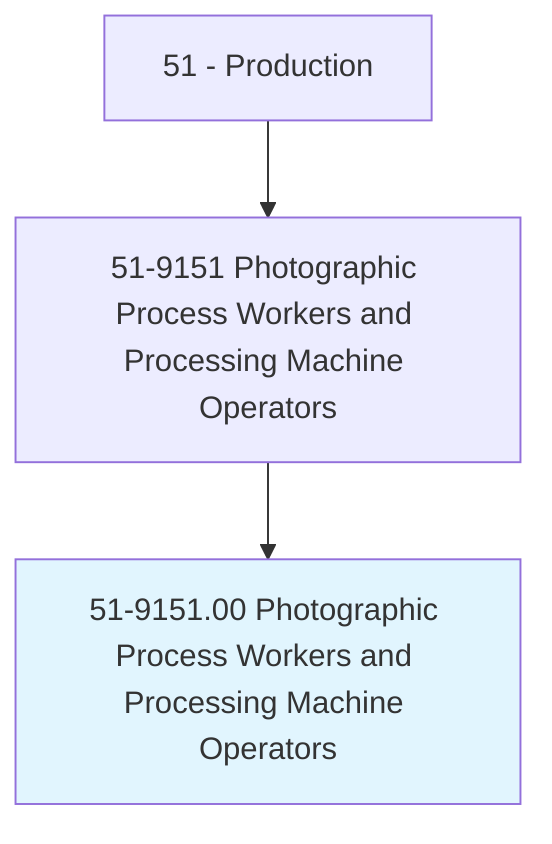
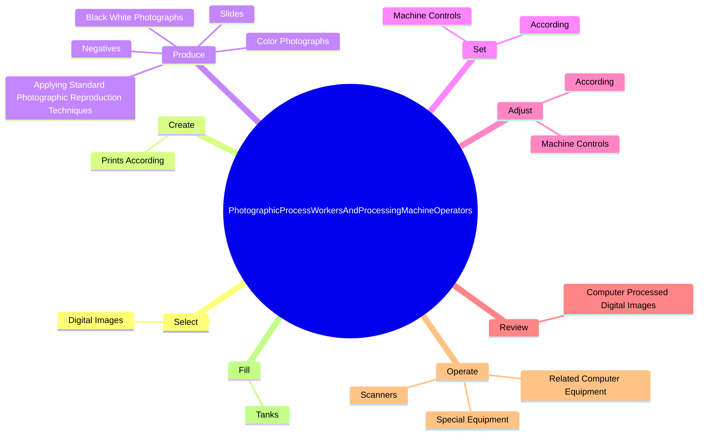

# Photographic Process Workers and Processing Machine Operators

> Perform work involved in developing and processing photographic images from film or digital media. May perform precision tasks such as editing photographic negatives and prints.

## Overview

Photographic Process Workers and Processing Machine Operators is an occupation within the Production category. Perform work involved in developing and processing photographic images from film or digital media. 

## Classification Hierarchy

## Key Statistics

| Metric | Value |
|--------|-------|
| SOC Code | 51-9151.00 |
| Category | [Production](/occupations/Production) |
| Task Count | 138 |
| Source | O*NET |

## Core Tasks

### select.DigitalImages

Photographic Process Workers and Processing Machine Operators select digital images as part of their core responsibilities.

**Actions:**
- `select.DigitalImages.for.Printing`
- `select.DigitalImages.for.SpecifyNumberOfImagesToBePrinted`
- `select.DigitalImages.for.Direct.to.Printer`
- `select.DigitalImages.for.UsingComputerSoftware`

### create.PrintsAccording

Photographic Process Workers and Processing Machine Operators create prints according as part of their core responsibilities.

**Actions:**
- `create.PrintsAccording.to.CustomerSpecificationsProtocols`
- `create.PrintsAccording.to.LaboratoryProtocols`

### produce.ColorPhotographs

Photographic Process Workers and Processing Machine Operators produce color photographs as part of their core responsibilities.

**Actions:**
- `produce.ColorPhotographs`
- `produce.BlackWhitePhotographs`
- `produce.Negatives`
- `produce.Slides`

## Skills & Competencies

### Technical Skills
- **Machine Operation** - Advanced
- **Quality Control** - Advanced
- **Production Processes** - Advanced

### Soft Skills
- **Communication** - Essential
- **Problem Solving** - Essential
- **Critical Thinking** - Important
- **Teamwork** - Important
- **Adaptability** - Important

## Related Occupations

## Industries

This occupation is found across multiple industries. See [Industries](/industries) for sector-specific employment data.

## Career Progression

---

*Source: O*NET 51-9151.00 - ONETOccupation*
