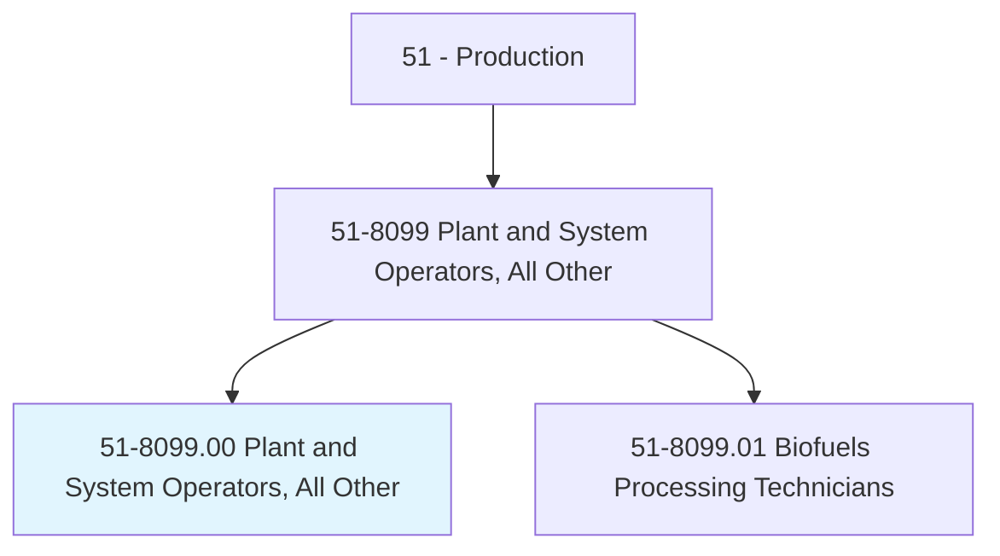
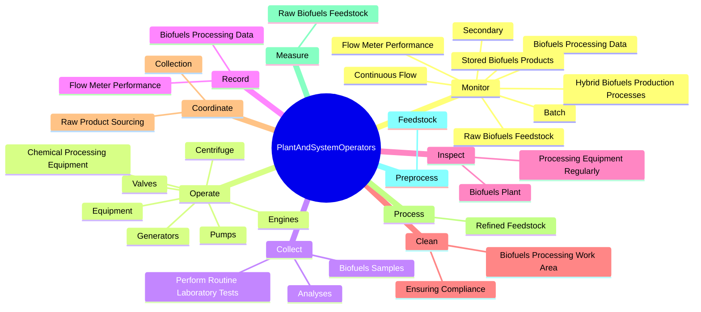
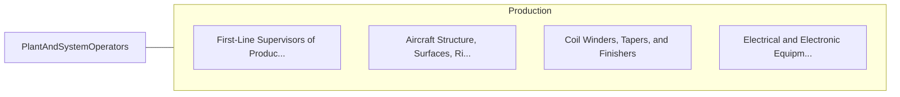

# Plant and System Operators, All Other

> All plant and system operators not listed separately.

## Overview

Plant and System Operators, All Other is classified under Production (SOC 51). All plant and system operators not listed separately.

## Classification Hierarchy

## Key Statistics

| Metric | Value |
|--------|-------|
| SOC Code | 51-8099.00 |
| Category | [Production](/occupations/Production) |
| Task Count | 47 |
| Source | O*NET |

## Core Tasks

### monitor.Batch

Plant and System Operators, All Other monitor batch as part of their core responsibilities.

**Actions:**
- `monitor.Batch`
- `monitor.ContinuousFlow`
- `monitor.HybridBiofuelsProductionProcesses`
- `monitor.BiofuelsProcessingData`

### operate.Valves

Plant and System Operators, All Other operate valves as part of their core responsibilities.

**Actions:**
- `operate.Valves.to.ControlBiofuelsProduction`
- `operate.Valves.to.AdjustBiofuelsProduction`
- `operate.Pumps.to.ControlBiofuelsProduction`
- `operate.Pumps.to.AdjustBiofuelsProduction`

### collect.BiofuelsSamples

Plant and System Operators, All Other collect biofuels samples as part of their core responsibilities.

**Actions:**
- `collect.BiofuelsSamples.to.BiofuelsQuality`
- `collect.PerformRoutineLaboratoryTests.to.BiofuelsQuality`
- `collect.Analyses.to.BiofuelsQuality`

## Skills & Competencies

### Technical Skills
- **Machine Operation** - Advanced
- **Quality Control** - Advanced
- **Production Processes** - Advanced

### Soft Skills
- **Communication** - Essential
- **Problem Solving** - Essential
- **Critical Thinking** - Important
- **Teamwork** - Important
- **Adaptability** - Important

## Related Occupations

## Industries

This occupation is found across multiple industries. See [Industries](/industries) for sector-specific employment data.

## Career Progression

---

*Source: O*NET 51-8099.00 - ONETOccupation*
