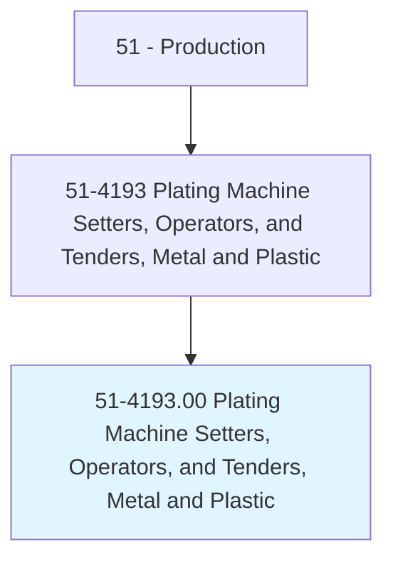
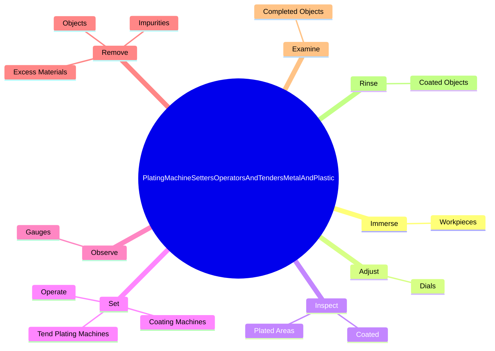

# Plating Machine Setters, Operators, and Tenders, Metal and Plastic

> Set up, operate, or tend plating machines to coat metal or plastic products with chromium, zinc, copper, cadmium, nickel, or other metal to protect or decorate surfaces. Typically, the product being coated is immersed in molten metal or an electrolytic solution.

## Overview

Plating Machine Setters, Operators, and Tenders, Metal and Plastic is an occupation within the Production category. Set up, operate, or tend plating machines to coat metal or plastic products with chromium, zinc, copper, cadmium, nickel, or other metal to protect or decorate surfaces. 

## Classification Hierarchy

## Key Statistics

| Metric | Value |
|--------|-------|
| SOC Code | 51-4193.00 |
| Category | [Production](/occupations/Production) |
| Task Count | 175 |
| Source | O*NET |

## Core Tasks

### immerse.Workpieces

Plating Machine Setters, Operators, and Tenders, Metal and Plastic immerse workpieces as part of their core responsibilities.

**Actions:**
- `immerse.Workpieces.in.CoatingSolutionsMetalPlastic.for.SpecifiedTimes`
- `immerse.Workpieces.in.LiquidMetalPlastic.for.SpecifiedTimes`

### adjust.Dials

Plating Machine Setters, Operators, and Tenders, Metal and Plastic adjust dials as part of their core responsibilities.

**Actions:**
- `adjust.Dials.to.regulate.FlowOfCurrentSuppliedToTerminalsToControlPlatingProcesses`
- `adjust.Dials.to.VoltageSuppliedToTerminalsToControlPlatingProcesses`

### inspect.Coated

Plating Machine Setters, Operators, and Tenders, Metal and Plastic inspect coated as part of their core responsibilities.

**Actions:**
- `inspect.Coated.for.Defects`
- `inspect.Coated.for.AirBubbles`
- `inspect.Coated.for.UnevenCoverage`
- `inspect.PlatedAreas.for.Defects`

## Skills & Competencies

### Technical Skills
- **Machine Operation** - Advanced
- **Quality Control** - Advanced
- **Production Processes** - Advanced

### Soft Skills
- **Communication** - Essential
- **Problem Solving** - Essential
- **Critical Thinking** - Important
- **Teamwork** - Important
- **Adaptability** - Important

## Related Occupations

## Industries

This occupation is found across multiple industries. See [Industries](/industries) for sector-specific employment data.

## Career Progression

---

*Source: O*NET 51-4193.00 - ONETOccupation*
